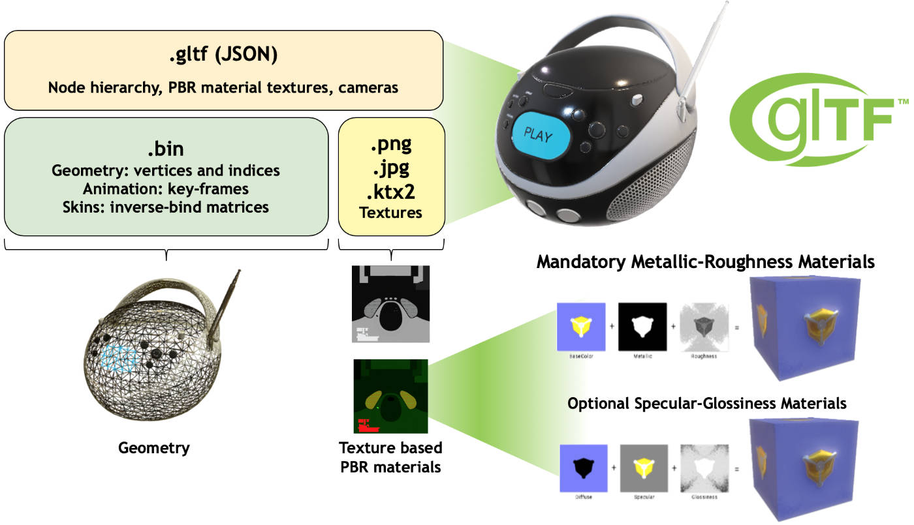

# 3D Model File Formats

## 1. 3D File Formats: Encoding Geometry of the 3D Model

Every 3D model has a unique geometry and the capability of encoding this geometry can be considered to be the most basic feature of a 3D file format.

There are three distinct ways of encoding surface geometry, each with their corresponding strengths and weaknesses. They are called approximate mesh, precise mesh and constructive solid geometry (CSG).

#### approximate mesh

The process of covering a surface with non-overlapping geometric shapes is also known as “tessellation”. Triangles are most commonly used shape.

The triangles approximate the smooth geometry of the surface. The approximation gets better as the triangles get smaller. However, the smaller the triangles, the larger the number of triangles you need to tile the surface. Thus better approximations come at the cost of increasing file size.

#### precise mesh

Precise mesh use Non-Uniform Rational B-Spline patches (or NURBS) instead of polygons.

These parametric surfaces are made up of a small number of weighted control points and a set of parameters called knots. From knots, a surface can be computed mathematically by smoothly interpolating over the control points.

These surfaces look smooth in any scale and can replicate the surface geometry of a small part of a 3D model in exact detail. While the precise mesh is exact at any resolution, they render slower and should be avoided in applications where speedy rendering is important.

#### constructive solid geometry

In this format, 3D shapes are built by performing boolean operations (addition or subtraction) of primitive shapes like cubes, spheres etc.

Constructive solid geometry is great for designing 3D models and is very user-friendly. Another big advantage is that each individual editing step (addition, subtraction, transformations of primitive shapes) is stored in this 3D file format. Therefore, one can undo and redo any step at any time.

Clearly, if you convert this format to a mesh-based format,  you will lose the information about the individual editing steps.

## 2. 3D File Formats: Appearance

The second important feature of 3D file formats is the ability to store appearance related information. In simple terms, appearance describes surface properties such as material type, texture, color etc. This decides how the model looks like when it is rendered.

Information about appearance can be encoded in two different ways.

#### texture mapping

Every point in the 3D model’s surface (or the polygonal mesh)  is mapped to a 2-dimensional image. The coordinates of the 2D image have attributes like color and texture.

When rendering the 3D model, the vertices of the mesh are mapped first. The other points are then assigned coordinates by interpolating between the coordinates of the vertices.

#### face attributes

Assign each face of the mesh a set of attributes. Common attributes include color, texture and material type.

In addition, a surface can have a specular component indicating the color and intensity of true mirror reflections of light sources and other nearby surfaces. Surfaces can be transparent or semi transparent. This is encoded by a transmissive component describing the color and intensity of light that passes through the surface. Transparent surfaces usually distort light passing through them. This distortion is represented by an index of refraction property, associated with the model’s material type.

## 3.3D File Formats: Scene information

The scene describes the layout of the 3D model in terms of cameras, light sources, and other nearby 3D models.

## 4. 3D File Formats: Animation

The most popular way of animating a 3D model is called “skeletal animation”. In skeletal animation, each model is associated with an underlying skeleton. The skeleton is made out of a hierarchy of virtual “bones”. The movement of bones higher in the hierarchy (parent bones) affect the bones lower in the hierarchy (child bones). 

There are many different techniques of storing animations of skeletal structures. The most important techniques are forward kinematics, inverse kinematics, and keyframes.

Every 3D modeling software allows exporting into many different 3D file formats. However, which one you choose for your application depends a lot on which features you need for your work and the software you are going to use.

### STL (Stereo Lithographic)

3DSystem 公司的stereolithography CAD软件的3D 模型文件格式。
采用三角形离散地近似表示三维模型，通过增加三角形的数量来提高精度。
由一系列的三角形无序排列组合在一起的，没有反映三角形之间的拓扑关系，很难二次编辑。
不含色彩和贴图信息，适用于3D打印。
STL 文件格式有二进制和 ASCII 两种格式。

### OBJ (Wavefront)

由 Alias|Wavefront 公司开发的一种开放格式，适合用于 3D 软件模型之间的互导。
OBJ 文件是一种 ASCII 文件，另外有一种与此相关的二进制文件格式 MOD，其作为专利未公开。

OBJ 文件的每一行，都有极其相似的格式：

前缀  参数1  参数2  参数3  ……

其中，前缀标识了这一行所存储的信息类型，参数则是具体的数据。常用的前缀有：
```
# Comment
v Vertex
l Line
f Face
vt Texture Coordinate
vn Normal
o Object
g Group
```
The obj file format supports: geometry in form of vertices/edges/faces and parametric surfaces, vertex normals, textures, material properties, and groups.

### ply (polygon file format)

- flexible and portable 3D file format
- both an ASCII and a binary version

The ply file format supports: geometry in the form of vertices/edges/faces, vertex colors, textures and materials.

ply format also supports user defined types, which is only understandable by specific software. 

### IGS/IGES (Initial 2D/3D Graphics Exchange Specification)

IGS 是美国信息管理委员会规定的一种文件格式, 主要用于不同三维软件系统的文件转换。

- published by the National Bureau of Standards in 1980 (NBSIR 80-1978)
- designed to store both 2D and 3D data

The igs format supports: vertices, lines, polylines, arcs, curves, parametric surfaces, CSG and B-Rep Objects. 

### stp, step (Standard for the Exchange for Product Data)

- developed as a successor to the iges format
- plain text format for named objects rather than just raw geometric information

### glTF (Graphics Library Transmission Format or GL Transmission Format)

https://www.khronos.org/gltf/

- 2015-10-19 glTF 1.0 specification was announced
- 2017-06-05 glTF 2.0 was published at the Web3D 2017 Conference
- royalty-free file format for 3D scenes and models using the JSON standard
- API-neutral runtime asset delivery format developed by the Khronos Group

In comparison to the older OBJ format, which supports only vertices, normals, texture coordinates, and basic materials, glTF provides a more powerful set of features. In addition to all of the above, glTF offers:

- Hierarchical objects
- Scene information (light sources, cameras)
- Skeletal structure and animation
- More robust materials and shaders

Advantages of glTF 2.0 format
- Combine all geometries, meshes, vertices, material textures and shading in a single file, reducing network overhead for downloading multiple asset files
- Supports Draco mesh compression algorithm by Google for smaller file size, quicker download
- Binary format supports direct loading into GPU buffer
- Support Physically Based Rendering (PBR) for realistic shading and light (metallic roughness and specular-glossiness material model)
- Animation support, key frames and skin inverse bind matrices
- Support morph targets for facial animations

For simple models with no animation, OBJ is nevertheless a common and reliable choice.

In comparison to COLLADA or FBX, the supported features are very similar. However, because glTF focuses on providing a “transmission format” rather than an editor format, it is more interoperable with web technologies. glTF is the "JPEG of 3D".

Geometry in a glTF model may be compressed using the Draco library. For models containing primarily geometry, with simple untextured materials or vertex colors, compression can often reduce file size by 90–95%.



GLB file format is a binary form of glTF that includes textures instead of referencing them as external images.

The glTF JSON may contain scenes (with an optional default scene). Each scene can contain an array of indices of nodes.
Each node may refer to a mesh or a camera, using indices that point into the meshes and cameras arrays.
Each of the nodes can contain an array of indices of its children.
A node may contain a local transform. The global transform of a node is given by the product of all local transforms on the path from the root to the respective node.

A transform can be given as a column-major matrix array, or with separate translation, rotation and scale properties, where the rotation is given as a quaternion.

The meshes may contain multiple mesh primitives.
Each mesh primitive has a rendering mode, which is a constant indicating whether it should be rendered as POINTS, LINES, or TRIANGLES.
The primitive also refers to indices and the attributes of the vertices, using the indices of the accessors for this data.
The material that should be used for rendering is also given, by the index of the material.

The buffers contain the data that is used for the geometry of 3D models, animations, and skinning.
The bufferViews add structural information to this data.
The accessors define the exact type and layout of the data.

mesh primitive "mode":

    - 0: "POINTS"
    - 1: "LINES"
    - 2: "LINE_LOOP"
    - 3: "LINE_STRIP"
    - 4: "TRIANGLES" // default value
    - 5: "TRIANGLE_STRIP"
    - 6: "TRIANGLE_FAN"

accessor data item "type":

    - "SCALAR"
    - "VEC2"
    - "VEC3"
    - "VEC4"
    - "MAT2"
    - "MAT3"
    - "MAT4"
    
"componentType": 

    - 5120: "BYTE"
    - 5121: "UNSIGNED_BYTE"
    - 5122: "SHORT"
    - 5123: "UNSIGNED_SHORT"
    - 5125: "UNSIGNED_INT"
    - 5126: "FLOAT"

## UV mapping

UV mapping is the 3D modeling process of projecting a 2D image to a 3D model's surface for texture mapping. The letters "U" and "V" denote the axes of the 2D texture because "X", "Y", and "Z" are already used to denote the axes of the 3D object in model space,

UV texturing permits polygons that make up a 3D object to be painted with color (and other surface attributes) from an ordinary image. The image is called a UV texture map.

## UV unwrapping

UV coordinates (also known as texture coordinates) can be generated for each vertex in the mesh. The operation of generating these UV maps is also called “unwrap”, since it is as if the mesh were unfolded onto a 2D plane.

A UV map can either be generated automatically by the software application, made manually by the artist, or some combination of both. Often a UV map will be generated, and then the artist will adjust and optimize it to minimize seams and overlaps. If the model is symmetric, the artist might overlap opposite triangles to allow painting both sides simultaneously.

The UV mapping process at its simplest requires three steps: unwrapping the mesh, creating the texture, and applying the texture to a respective face of the mesh.

UV mapping may use repeating textures, or an injective 'unique' mapping as a prerequisite for baking.

If a 3D object has a UV map, then, in addition to the 3D coordinates X, Y, and Z, each point on the object will have corresponding U and V coordinates.

