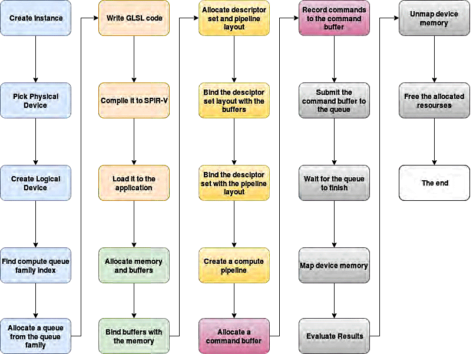

## Vulkan

Vulkan is a low level API with an abstraction closer to the behavior of the actual hardware.

Vulkan is supported by all major GPU vendors and considers non-desktop GPUs as first class citizens. Vulkan provides better platform support on mobile devices and can be regarded as a good crossplatform GPGPU framework.

Vulkan offers comparable performance and with some low-level optimizations it can offer average speedups of 1.53x and 1.66x compared to CUDA and OpenCL respectively on desktop platforms and 1.59x average speedup compared to OpenCL on mobile platforms.

Vulkan can be viewed as a pipeline with some programmable stages that are invoked by a set of operations.

### Execution Model

A Vulkan-capable system exposes one or more devices, each of theses physical devices exposes one or more queues. These queues are partitioned into queue families and can process work asynchronously to one another.

There are four types of queue functionalities defined in Vulkan: graphics, compute, transfer, and sparse memory management.

A queue is considered as the interface between the application and the execution engines of a device.

Commands for these execution engines are recorded into command buffers ahead of execution time. Once recorded, a command buffer can be cached and submitted to a queue for execution as many times as required.

Command buffer construction is expensive and the application may employ multiple threads to construct multiple command buffers in parallel.

Once submitted to a queue, the commands within a command buffer begin and complete execution without further application intervention.

Command buffers submitted to different queues may execute in parallel or even out of order with respect to one another. Command buffers submitted to a single queue though
respect submission order.

### Compute Model

Queue execution starts according to the currently bound compute pipeline. Compute pipelines consist of a single compute shader stage, describing the kernel to be executed and a pipeline layout, describing the input and output resources to that kernel.

Dispatching commands take three input parameters: groupCountX, groupCountY and groupCountZ defining the total number of workgroups or the so called global workgroup size in the X, Y and Z directions respectively.

A workgroup is the smallest amount of compute operations that an application can execute. Within a single workgroup, there may be many workitems or compute shader invocations.

The number of work groups that a compute operation is executed with is defined by the user when they invoke the compute operation. The space of these groups is three dimensional, so it has a number of "X", "Y", and "Z" groups. Your compute shader should not rely on the order in which individual groups are processed.

Every compute shader has a three-dimensional local size (sizes can be 1 to allow 2D or 1D local processing). This defines the number of invocations of the shader that will take place within each work group.

```
local_invocation_index = i + (j * workgroup_size_x) + (k * workgroup_size_x * workgroup_size_y)
global_invocation_index = x + (y * workgroup_count_x) + (z * workgroup_count_x * workgroup_count_y)
```

Therefore, if the local size of a compute shader is (128, 1, 1), and you execute it with a work group count of (16, 8, 64), then you will get 1,048,576 separate shader invocations. Each invocation will have a set of inputs that uniquely identifies that specific invocation.

This distinction is useful for doing various forms of image processing; the local size would be the size of a block of image data (8x8, for example), while the group count will be the image size divided by the block size. Each block is processed as a single work group.

Compute shader invocations within a work group can communicate through a set of shared variables and special functions. Invocations in different work groups (within the same compute shader dispatch) cannot effectively communicate.

A Compute Shader is a Shader Stage that is used entirely for computing arbitrary information. All of the other shader stages have a well-defined set of input values, some built-in and some user-defined, compute shaders have no user-defined inputs and no outputs at all.

If a compute shader wants to take some values as input, it is up to the shader itself to fetch that data, via texture access, arbitrary image load, shader storage blocks, or other forms of interface. Similarly, if a compute shader is to actually compute anything, it must explicitly write to an image or shader storage block.

Compute shaders cannot have any user-defined input variables. If you wish to provide input to a compute shader, you must use the implementation-defined inputs coupled with resources like storage buffers or Textures. You can use the shader's invocation and work group indices to decide which data to fetch and process.
Compute Shaders have the following built-in input variables.

```
in uvec3 gl_NumWorkGroups;
in uvec3 gl_WorkGroupID;
in uvec3 gl_LocalInvocationID;
in uvec3 gl_GlobalInvocationID;
in uint  gl_LocalInvocationIndex;
```

### SPIR-V

All shaders and compute kernels in Vulkan are defined using the Standard Portable Intermediate Representation (SPIR-V), which is a platform-independent intermediate language for describing graphical shaders and compute kernels.



Vulkan uses completely different abstractions from CUDA and OpenCL. In Vulkan, the programmer is not dealing with kernels, kernel arguments and kernel launches but they are dealing with low level command buffers, recording commands in these buffers such as binding compute pipelines, setting descriptor sets and binding buffers to descriptor sets.

Vulkan’s low-level nature makes it very verbose with a high programming effort. Vulkan’s principle of explicit control pushes a lot of responsibility onto the programmer. Programmers have to deal with issues such as memory allocation, resources tracking, object creation and destruction and so on.

Indeed, Vulkan’s low-level control over the underlying hardware offers opportunities for better performance.

- For iterative algorithms, use one single command buffer and synchronize using memory barriers.
- Try to minimize going back to the CPU for control and leverage Vulkan’s synchronization primitives to stay as much as possible on the GPU.
- For large memory transfers use transfer queues as they are usually tied to DMAs inside the hardware.
- For better workload balancing, make use of multiple compute queues whenever possible.

## WebGPU

2017 Apple established the WebGPU Community Group inside the W3C to standardize a new 3D graphics API. This new Web API is implementable on top of Metal, Direct3D, and Vulkan. All of the major browser vendors are participating and contributing to the standardization effort.

Shaders are programs that take advantage of the specialized architecture of GPUs.

Apps designed for Metal use the Metal Shading Language, apps designed for Direct3D 12 use HLSL, and apps designed for Vulkan use SPIR-V or GLSL. WebGPU is designed to work on top of Metal, Direct3D 12, and Vulkan, so the shaders need to be able to be represented in a form that each of those APIs can accept.

WebGPU platform consists of the following layers:

1. User agent implementing the specification.
2. Operating system with low-level native API drivers for this device.
3. Actual CPU and GPU hardware.

Entry point to WebGPU.

```rust
Instance {
    pub fn new(backends: BackendBit) -> Self;
    pub fn enumerate_adapters(&self, backends: BackendBit) -> impl Iterator<Item = Adapter>;
    pub fn request_adapter(&self, options: &RequestAdapterOptions<'_>) -> impl Future<Output = Option<Adapter>> + Send;
    pub unsafe fn create_surface<W: HasRawWindowHandle>(&self, window: &W) -> Surface;
}
```

An adapter represents an implementation of WebGPU on the system.
An adapter may be a physical display adapter (GPU), but it could also be a software renderer. Applications can hold onto multiple adapters at once.

```rust
Adapter {
    fn get_info(&self) -> AdapterInfo;
    fn features(&self) -> Features;
    fn limits(&self) -> Limits;
    fn request_device(&self, desc: &DeviceDescriptor, trace_path: Option<&Path>) -> Impl Future<Output = Result<(Device, Queue), RequestDeviceError>> + Send
}
```

A device is the logical instantiation of an adapter, through which internal objects are created.

```rust
Device {
    pub fn poll(&self, maintain: Maintain);
    pub fn features(&self) -> Features;
    pub fn limits(&self) -> Limits;

    pub fn create_buffer(&self, desc: &BufferDescriptor<'_>) -> Buffer;
    pub fn create_texture(&self, desc: &TextureDescriptor<'_>) -> Texture;
    pub fn create_sampler(&self, desc: &SamplerDescriptor<'_>) -> Sampler;

    pub fn create_bind_group(&self, desc: &BindGroupDescriptor<'_>) -> BindGroup;
    pub fn create_bind_group_layout(&self, desc: &BindGroupLayoutDescriptor<'_>) -> BindGroupLayout;

    pub fn create_shader_module(&self, source: ShaderModuleSource<'_>) -> ShaderModule;
    pub fn create_pipeline_layout(&self, desc: &PipelineLayoutDescriptor<'_>) -> PipelineLayout;
    pub fn create_render_pipeline(&self, desc: &RenderPipelineDescriptor<'_>) -> RenderPipeline;
    pub fn create_compute_pipeline(&self, desc: &ComputePipelineDescriptor<'_>) -> ComputePipeline;

    pub fn create_swap_chain(&self, surface: &Surface, desc: &SwapChainDescriptor) -> SwapChain;

    pub fn create_command_encoder(&self, desc: &CommandEncoderDescriptor<'_>) -> CommandEncoder;
    pub fn create_render_bundle_encoder(&self, desc: &RenderBundleEncoderDescriptor<'_>) -> RenderBundleEncoder<'_>;
}
```

A Buffer represents a block of memory that can be used in GPU operations. Data is stored in linear layout, meaning that each byte of the allocation can be addressed by its offset from the start of the Buffer, subject to alignment restrictions depending on the operation.

A BindGroup defines a set of resources to be bound together in a group and how the resources are used in shader stages.

A PipelineLayout defines the mapping between resources of all BindGroup objects set up during command encoding in setBindGroup, and the shaders of the pipeline.

#### Separation of concerns

In WebGL, a single context object is responsible for everything, and it contains a lot of associated state.
In contrast, WebGPU separates these into multiple different contexts:

- GPUDevice creates resources, such as textures and buffers.
- GPUCommandEncoder allows encoding individual commands, including render and compute passes.
- Once done, it turns into GPUCommandBuffer object, which can be submitted to a GPUQueue for execution on the GPU.
- We can present the result of rendering to the HTML canvas. Or multiple canvases. Or no canvas at all – using a purely computational workflow.

Overall, this separation will allow for complex applications on the web to stream data in one or more workers and create any associated GPU resources for it on the fly. Meanwhile, the same application could be recording work on multiple workers, and eventually submit it all together to GPUQueue. This matches multi-threading scenarios of native graphics-intensive applications and allows for high utilization of multi-core processors.

### Pipeline state

In WebGL, the user would create a shader program at program initialization. Later when the user attempts to use this shader program, the driver takes into consideration all the other states currently set, and may need to internally recompile the shader program. If the driver does recompile the shader program, this could introduce CPU stalls.

In contrast, WebGPU has the concept of a pipeline state object (namely, GPURenderPipeline and GPUComputePipeline). A pipeline state object is a combination of various states that the user creates in advance on the device – just like in native APIs. The user provides all this state upfront, which allows the browsers and hardware drivers to avoid extra work (such as shader recompilation) when it’s used later in GPU operations.

From the developer perspective, it’s easier to manage these coarse state objects as well. They don’t have to think as much about which of the fine-grained states to change, and which ones to preserve.

The pipeline state includes:

- Shaders
- Layouts of vertex buffers and attributes
- Layouts of bind groups
- Blending, depth, and stencil states
- Formats of the output render targets

### Binding model

A third difference between WebGPU and WebGL is the binding model. The WebGPU binding model allows resources to be grouped together into a BindGroup object. Then we bind GPUBindGroups during command recording in order to use the resources within shaders.

By creating these bind groups upfront, the graphics driver can perform any necessary preparations in advance. This allows the browser to change resource bindings much faster between draw calls.

Most importantly, the user has to describe the layout of resource bindings ahead of time, baking it into a GPUBindGroupLayout object. Both pipeline states and concrete bind groups know about the bind group layout as well. This knowledge serves as a contract between the shader and the API. It allows the browser or the driver to lay out resources in a way that allows faster binding.

Each bind group is marked by a u32 set number, each bind group has a set of bindings (marked by a u32 binding number) and a set of offsets. The set number and binding number are used in GLSL code. In practice, there will usually just be one bind group and offsets = &[].

Push constants is a way to quickly provide a small amount of uniform data to shaders. It should be much quicker than UBOs but a huge limitation is the size of data - spec requires 128 bytes to be available for a push constant range.

Because push constants are much quicker than other descriptors (resources through which we provide data to shaders), they are convenient to use for data that changes between draw calls, like for example transformation matrices.
