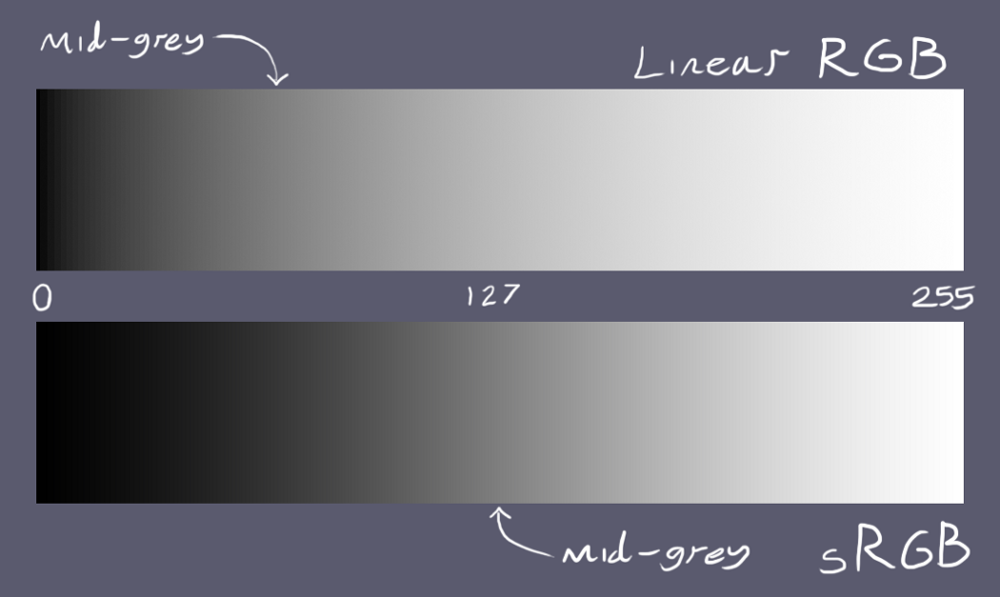

# Color Space

In the 1930s, the Commission Internationale d’Eclairage (CIE) standardized the RGB representation by performing such color matching experiments using the primary colors of red (700.0nm wavelength), green (546.1nm), and blue (435.8nm).

### RGB (linear RGB)

If you're doing any kind of 2D blending or 3D shading, or almost any image processing, then you want your intensities in a linear color-space, so you can just add, subtract, multiply, and divide numbers to have the same effect on the intensities. Most color-processing and rendering algorithms only give correct results with linear RGB.

### sRGB (standard RGB)

The human eye's sensitivity to light is finer at low intensities than high intensities. For survival, it’s much more useful to see well at night than during the day, so we see many more shades of grey near the dark end of the spectrum than the bright end.


The sRGB standard tells you a curve to use, to make your colors non-linear. The curve is shallower at the bottom, so you can have more dark grays, and steeper at the top, so you have fewer light grays.

The monitor interprets its input data as encoded in sRGB color space. So, when you're putting a color on the screen, or storing it in an 8-bit-per-channel texture, store it as sRGB, so you make the best use of those 8 bits.

It's becoming conventional to follow the rule that 8-bit colors are always sRGB. sRGB is the color space for images and graphics on the web.

We want our colors processed in linear space, but stored in sRGB. This means you end up doing sRGB-to-linear conversion on read, and linear-to-sRGB conversion on write. If you follow these rules, you never have to worry about gamma correction.

GPUs also follow the above convention: when you're storing an 8-bit intensity in a texture or framebuffer, it's sRGB, and when you're processing colors, it's linear.

```rust
pub trait SrgbColorSpace {
    fn linear_to_nonlinear_srgb(self) -> Self;
    fn nonlinear_to_linear_srgb(self) -> Self;
}

//source: https://entropymine.com/imageworsener/srgbformula/
impl SrgbColorSpace for f32 {
    fn linear_to_nonlinear_srgb(self) -> f32 {
        if self <= 0.0 {
            return self;
        }

        if self <= 0.0031308 {
            self * 12.92 // linear falloff in dark values
        } else {
            (1.055 * self.powf(1.0 / 2.4)) - 0.055 //gamma curve in other area
        }
    }

    fn nonlinear_to_linear_srgb(self) -> f32 {
        if self <= 0.0 {
            return self;
        }
        if self <= 0.04045 {
            self / 12.92 // linear falloff in dark values
        } else {
            ((self + 0.055) / 1.055).powf(2.4) //gamma curve in other area
        }
    }
}
```

The floating-point value ranges from 0 to 1, so if you're reading 8-bit integers you need to divide by 255 first, and if you're writing 8-bit integers you need to multiply by 255 last.

### YUV and Y′UV

The Y′UV model defines a color space in terms of one luma component (Y′) and two chrominance components, called U (blue projection) and V (red projection) respectively.

Y′ stands for the luma component (the brightness) and U and V are the chrominance (color) components; luminance is denoted by Y and luma by Y′ – the prime symbols (') denote gamma correction, with "luminance" meaning physical linear-space brightness, while "luma" is (nonlinear) perceptual brightness.

The Y channel is the overall lightness of the color, and uses more bits (or has more spatial resolution) than the other two channels. This way, you don't (always) need to apply a curve like you do with RGB intensities.

YUV is a linear color-space, so if you double the number in the Y channel, you double the lightness of the color, but you can't add or multiply YUV colors together like you can with RGB colors, so it's not used for image processing, only for storage and transmission.

### HSL (hue, saturation, lightness) color space

HSL lightness resembles the amount of black or white added to a pure color.
HSL saturation saturation has a fixed range from 0 (gray) to 100 (purest).

### LCH (Lightness, Chroma, Hue) color space

LCH is a color space designed to represent colors in a way that is more similar to how the human eye perceives them.
sRGB was designed based on how displays work, rather than how our eyes perceive color.

LCH (like Lab) is designed to be able to represent the entire spectrum of human vision, and not all of these colors can be displayed by a screen, even a P3 screen.
Today, the gamut (range of possible colors displayed) of most monitors is closer to P3, which has a 50% larger volume than sRGB.
LCH provides access to about 50% more colors over sRGB. sRGB is limited to 16.7 million colors.

LCH lightness describes the relative brightness of a color compared to a similarly illuminated white.
LCH chroma has a range from 0 to approximately 131, although not all colors can reach this maximum value due to the limitations of our screens.

LCH are slightly shifted compared to those in HSL. the hue value of 0 in HSL is pure red, while in LCH it is a pinkish red.
In LCH, the same numerical change in coordinates produces the same perceptual color difference. This property of a color space is called “perceptual uniformity”.
RGB or HSL are not perceptually uniform.

LCH is currently the best color space for creating UI color palettes.
