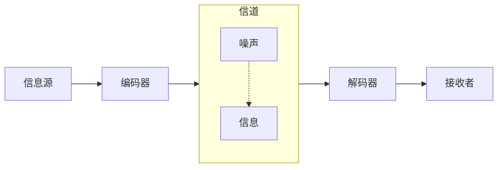

一、通信的本质

通信的本质是在一个地点精确或近似地重现另一个地点所选择的信息。

二、香农通信模型

三、信息的度量：比特与熵

香农的核心洞见是：信息与不确定性相关。当我们得知某个不确定事件的结果时，就获得了信息。获得的信息量等于被消除的不确定性。

对于有 N 种等可能结果的情况，确定结果所需的信息量为：$I = log_2N$ 比特

对于一个具有 n 个可能结果的离散随机变量 X，其概率分布为 $P = (p_1, p_2, ..., p_n)$，其中 $p_i$ 是 X 取第 i 个可能结果的概率。香农熵的定义为：

$$
H(X) = -\sum_{i=1}^{n} p_i \log_b p_i
$$

H(X)的取值范围:
$$
0 \leq H(X) \leq \log_b n
$$

当且仅当随机变量 X 是确定的，H(X) = 0。
当且仅当随机变量 X 的所有 n 个结果均匀分布时，H(X) 达到最大值 $\log_b n$。
对于连续随机变量，微分熵的定义不同，其取值范围可以是负无穷到正无穷，这与离散熵有本质区别。上述范围仅针对离散熵。

讨论信息熵的单位时，通常依赖于对数的底。

单位定义：
比特（bit）：当底数 b=2 时，熵的单位是比特。表示用二进制数字（0 或 1）来编码信息时所需的最小平均位数。

特里特（trit）：当底数 b=3 时，熵的单位是特里特。表示用三进制数字（0、1 或 2）来编码信息时所需的最小平均位数。

奈特（nat）：当底数 b=e（自然对数）时，熵的单位是奈特。在理论推导中常用。

哈特利（hartley）：当底数 b=10 时，熵的单位是哈特利。以纪念拉尔夫・哈特利。

不同单位间可通过换底公式转换。对于同一随机变量 X，其熵值在不同单位下的关系为：
$$
H_b(X) = \frac{H_a(X)}{\log_a b}
$$

四、源编码定理：压缩的极限

对于任何信息源，其输出可以被编码压缩，但存在一个理论下限，即信息源的熵率 $H(X)$。

不存在任何编码方案能使平均码长小于 $H(X)$，但总可以设计编码方案，使平均码长无限接近 $H(X)$。

信息熵给出了在无损编码下，表示每个符号（或事件）所需的平均编码位数的理论下限。
所有高效编码算法（如霍夫曼编码、算术编码）的基本原理就是使用“按概率分配码长”的最优策略：
用短码表示高频事件，用长码表示低频事件。

五、信道编码定理：噪声中的可靠传输
信道编码定理（Channel Coding Theorem）：
> 每个信道都存在一个"容量"C。只要传输速率低于C，就存在某种编码方案，使错误率可以任意接近零。

对于最重要的加性高斯白噪声（AWGN）信道，香农给出了容量的精确公式：
$$
C = B\log_2(1 + \frac{S}{N})
$$
其中：
- C为信道容量，单位为比特/秒 
- B为信道带宽，单位为赫兹 
- S为信号功率 
- N为噪声功率 
- S/N即信噪比

这个公式揭示了通信系统设计的基本权衡：要提高容量，可以增加带宽或提高信噪比。它成为所有现代通信系统设计的理论指南。今天的5G通信标准中使用的LDPC码和Polar码，已经能够达到香农极限的99%以上。

LDPC 码 (低密度奇偶校验码)发现于 1960 年代，基于稀疏矩阵和迭代概率译码。擅长处理大数据块，性能稳定，实现复杂度相对较低，适合高速数据流。
Polar 码 (极化码)发明于 2008 年，是首个被严格证明能达到香农极限的编码方案。在中短码长（尤其是小数据包）场景下纠错性能优异。解码延迟略高，可靠性也更高。

六、数字化的必然
香农理论还有一个深刻的推论：无论原始信息是何种形态，将其转换为比特后再传输，总是最高效的方式。
这意味着，语音、音乐、图像、视频，最优策略都是先数字化为0和1的比特流，然后通过统一的方式传输。这一结论从理论上解释了为什么数字化是不可阻挡的趋势——它不是工程师的偶然选择，而是数学的必然结果。