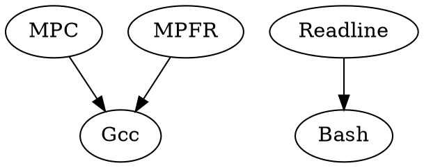

## Linux From Scratch

http://www.linuxfromscratch.org/

There are always many ways to accomplish a single task. It is not a matter of right and wrong, but a matter of personal taste.

With all the choices available, if you didn't like something, you were free, even encouraged, to change it.

LFS can help you learn how a Linux system works from the inside out. Building an LFS system helps demonstrate what makes Linux tick, and how things work together and depend on each other. One of the best things that this learning experience can provide is the ability to customize a Linux system to suit your own unique needs.

LFS allows you to create very compact Linux systems. When installing regular distributions, you are often forced to install a great many programs which are probably never used or understood. These programs waste resources.

Education is by far the most powerful of reasons. As you continue in your LFS experience, you will discover the power that information and knowledge truly bring.

### Pre-reading List

- http://www.tldp.org/HOWTO/Software-Building-HOWTO.html
- http://moi.vonos.net/linux/beginners-installing-from-source/

### kernel mode-setting (KMS)

Set video display mode (screen resolution, color depth, and refresh rate) by the kernel.

This makes fancy graphics during bootup, virtual console and X fast switching possible, among other things.

### Display Server

A display server takes care of compositing, which is the task of combining the images provided by applications into the one that ends up on the display, and then putting that composited image on the screen.

In order to communicate with the display server, applications use one of several protocols; most widely used on Linux and BSD are X11 and the newer Wayland.

For X11 the main implementation is called the X.org server, often called “X” for short. X handles many things like input, window focus, basic compositing, presentation of images on the display, allocating graphics memory for applications and much more. It doesn’t handle everything though, there is two programs that extend the functionality of X:

There is the effectively mandatory window manager, which takes care of the stacking order (which windows are over which), focus changes and basic window movement and resizing. The other extension, which is optional, is X11 compositors, that can do more advanced compositing than the X server itself is capable of, like transparency, blur and a variety of other possible effects. These two programs are usually combined into a single one that does both window management and compositing.

On Wayland the display server is called the Wayland compositor, of which there are a few widely used implementations, for example KWin (KDE), Mutter (GNOME) and Sway. Essentially Wayland compositors take care of everything the X server, a window manager and X11 compositor would do together. In order to allow X11 applications to still function on Wayland there’s also a compatibility layer called Xwayland, which is what most games currently run with if you’re using Wayland.
