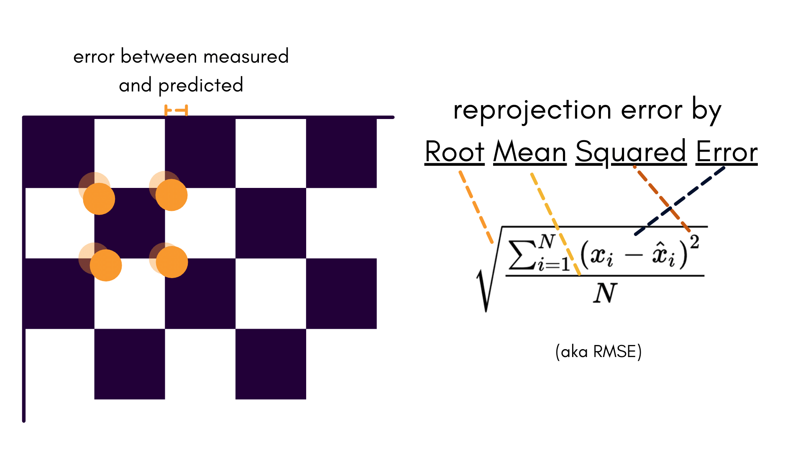

# Computer Vision

Computer vision is a key branch of artificial intelligence, aiming at understanding the surrounding environment from the visual information captured by cameras.

Vision is a process of seeing what is where.

Vision can be studied at three different levels: computational theory level, algorithm level and implementation level.

Each computation task is independent of specific algorithms, algorithms can be independent of the software or hardware platform on which they are implemented.

Estimate the values of unknown parameters (robot posture, camera orientation, etc.), given a number of measurements (sensory data, images, feature points, etc.). These kinds of problems are called inverse problem because they involve in estimating unknown model parameters instead of simulating the forward formation equations.

A multiple view problem is inherently a vision problem involving more than one view of the same scene.

Many of the visual problems are generally ill-posed, that is, solutions are not unique.

## Image Formation
像素值是没有单位的，它取决于曝光时间、增益和硬件本身，因此我们实际上关注的是图像上的相对值，而非绝对值。
传感器本身的噪声会随着温度的变化而改变，使用高斯模糊来减小噪声的影响。
黑光减法（Black light subtraction）是通过黑屏设置一系列无光的像素，得到光学黑的信号，再从整体中减去，消减底噪。
缺陷像素遮蔽（Defective pixel mask）是为了处理CMOS传感器中的坏点，周围点的插值代替。
平场矫正（Flat-field correction）是由于均匀落在传感器上的光在图像中可能并不均匀，这可能是由镜头、传感器在相机中位置误差等原因引起的，提前记录这一变化并予以矫正，从而得到一个“平”的图像。

集成信号处理器（Integrated signal processor, ISP）指的是专门用来处理感光件信号并生成最终图像的硬件，通常会作为一个模块集成到片上系统。
对于工业/机器视觉相机，其ISP往往提供的是最小程度的处理，如有的只会进行白平衡，再在raw RGB空间上进行伽马变换，因此很多时候输出的图像仍然在设备的色彩空间内。

A camera is essentially a device that converts rays of light into pixel coordinates, “projecting” out the distance information in the process.

A geometrically correct projection model should map object points to world rays, world rays to camera rays and camera rays to pixels.
With this model, it is possible to mapping pixels back to real-world rays.
We describe the scene as a set of 3D points, and a set of 3D circles.

A camera ray is a directed line that pass through the normalized image plane where Z=1, and we don’t regard points “behind the camera” as being on this line.
This is the traditional computer vision way of modeling rays, and it gives rise to the pinhole projection model.

## Camera Pinhole Model

Vision system starts its work by acquiring an image or a set of images from cameras or data storage devices.

The pinhole perspective (also called central perspective) projection model, first proposed by Brunelleschi at the beginning of the fifteenth century, is mathematically convenient and, despite its simplicity, it often provides an acceptable approximation of the imaging process.

A thin lens produces the same projection as the pinhole. A camera is modeled as a pinhole, which performs a perspective projection. The perspective projection is a nonlinear mapping.

A 3D point is denoted by $M = [X,Y,Z]^T$ in world coordinates and $M' = [X',Y',Z']^T$ in camera coordinates.

$$ M' = RM + t $$

$(R, t)$, called the extrinsic parameters, is the rotation and translation which relates the world coordinate system to the camera coordinate system.

The projected 2D point on imaging plane is denoted by $m = [u,v]^T$ in pixel image coordinates and $m' = [x',y']^T$ in physical image coordinates.

Based on similar triangle theory, we obtain:

$$ \frac{f}{Z'} = \frac{x'}{X'} = \frac{y'}{Y'} $$

Image pixel and physical coordinate is related by:

$$
\begin{cases}
   u = αx'+c_x \\
   v = βy'+c_y
\end{cases}
$$

$(c_x,c_y)$ the pixel coordinates of the principal point. So

$$
\begin{cases}
u = αf\dfrac{X'}{Z'}+c_x = f_x\dfrac{X'}{Z'}+c_x \\\\
v = βf\dfrac{Y'}{Z'}+c_y = f_y\dfrac{Y'}{Z'}+c_y
\end{cases}
$$

$(f_x,f_y)$ is the focal lengths in image x and y axes expressed in pixel units. The above equation can be written in matrix form:

$$
\begin{bmatrix}
   u \\
   v \\
   1
\end{bmatrix} = \dfrac{1}{Z'}\begin{bmatrix}
   f_x & 0 & c_x \\
   0 & f_y & c_y\\
   0 & 0 & 1
\end{bmatrix}\begin{bmatrix}
   X' \\
   Y' \\
   Z'
\end{bmatrix} = \dfrac{1}{Z'}KM' = \dfrac{1}{Z'}K(RM + t)
$$

K is called camera intrinsic matrix:

$$
K=\begin{bmatrix}
   f_x & 0 & c_x  \\
   0 & f_y & c_y  \\
   0 & 0 & 1
\end{bmatrix}
$$

We use $\tilde x$ to denote the augmented vector by adding 1 as the last element: $\tilde m = [u,v,1]^T$ and $\tilde M= [X,Y,Z,1]^T$.

The relationship between a 3D point M and its image projection m is given by
$$ s\tilde m = K [R\ t] \tilde M = P \tilde M $$

where s is the z component of (RM + t), P is called projection matrix.

成像公式的本质上是把投影中心放到坐标原点，$f_x,f_y,c_x,c_y$决定了像点的三维坐标，$R,t$决定了物点的三维坐标，原点、像点、物点三点共线，根据这样的一组共线方程，可以解出相机的参数值。

### Reprojection

Given P and M, compute $[x,y,w]ᵀ=P\tilde M$, then u=x/w, v=y/w.

### Reconstruction

Given projection matrice of two cameras $P_1, P_2$ and two image points $m_1, m_2$.

### Camera matrix 相机内参矩阵，相机外参矩阵

影像坐标系是以二维影像为基本建立的坐标系，描述像素点在影像上的位置，分为以像素为单位的 uv 坐标系以及以物理尺寸为单位的 xy 坐标系。uv 坐标系以图像左上角为原点，u 轴和 v 轴分别平行于图像平面的两条垂直边（u 轴朝右，v 轴朝下）；xy 坐标系以相机主光轴与像平面的交点（主点）为原点，x 轴和 y 轴分别与 u 轴和 v 轴平行且方向一致。
相机坐标系从相机的视角来描述物体在三维空间中的坐标。以相机光学中心为原点，X 轴与 Y 轴分别与影像坐标系的 x 轴与 y 轴平行，且方向一致，根据右手坐标系规则得到 Z 方向。相机坐标系是物理尺寸单位。

## Camera Calibration

Accurate calibration is of key importance for performance most machine and computer vision tasks.

Camera calibration is a necessary step in 3D computer vision in order to extract metric information from 2D images.

Camera calibration is the process of estimating the intrinsic and extrinsic parameters of a camera.

In applications based on triangulation, such as stereo vision or structure light vision, the over all performance of the machine vision system strongly depends on the accuracy of the camera calibration.

Main factors that influence the calibration accuracy:

- the extraction of feature points in the image plane
- the geometric accuracy of the calibration target
- the lens distortion model conformity with the actual lens
- the optimization algorithms used to converge on the camera parameters
- the operational conditions of the experiments

Generally, camera calibration methods can be classified into two categories: self-calibration and object-based calibration.

Self-calibration estimates the camera’s parameters by using multi-view images without calibration targets. As such, it is the appropriate solution for on-line implementation in which accuracy is not highly demanded.

The object-based camera calibration is performed by employing an object, such as 3D object, 2D pattern or 1D pattern with known coordinates, which is commonly used in off-line calibration for highperformance applications.

- **用平面上的圆点阵列标定相机时，相机较远的位置搭配较长的焦距 与 相机较近的位置搭配较端的焦距是等价的，用哪些方法或怎样改进标定算法可以约束相机的参数？**

【DeepSeek】在相机标定中，当使用平面圆点阵列（如棋盘格或圆点网格）时，确实存在“相机较远位置 + 较长焦距”与“相机较近位置 + 较短焦距”在投影图像上产生**几乎相同**的点阵图像的现象。这本质上是由于透视投影模型中**物距 `d`** 和**焦距 `f`** 在成像公式 `(f/d) * 物体尺寸` 中具有**相似性**（或称为耦合性、歧义性）。

这种相似性会导致标定算法在优化相机参数（尤其是焦距 `f` 和主点 `(cx, cy)`）时，可能收敛到不同的局部最优解，这些解在重投影误差上都表现得很好，但物理意义却不同（即估算出的 `f` 和实际物距 `d` 可能不准确）。

**解决或约束这种参数相似性的方法：**

为了打破这种相似性，得到物理上更可信的参数估计，可以采取以下方法改进标定过程或算法：

1.  **多距离/多视图约束（最常用且有效）：**
    *   **核心思想：** 固定焦距 `f`（确保相机在整个标定过程中焦距不变，即非变焦镜头或锁定焦距），在**多个显著不同的距离**上拍摄标定板的图片。
    *   **为什么有效：** 焦距 `f` 是相机固有属性，在整个标定过程中是**常量**。物距 `d` 对于不同位置的图片是**变量**。通过在多个不同 `d` 下观察同一个标定板，优化算法可以利用 `f` 是常量的约束来同时精确求解 `f` 和每个位置对应的 `d`（或更精确地说，求解相机相对于标定板的外参中的平移向量 `t`，其 Z 分量与 `d` 相关）。
    *   **如何实施：** 在标定数据集中，确保包含从很近（标定板几乎充满视野）到较远（标定板在视野中明显变小）拍摄的图片。距离范围越大，约束效果越好。通常建议包含至少 10-20 张不同距离和姿态的图片。
    *   **改进算法：** 标准的束调整算法本身就能处理这种多视图约束。关键在于输入数据要包含足够距离变化的视图。

2.  **使用具有已知尺寸的标定板：**
    *   **核心思想：** 明确利用标定板上特征点之间的**绝对物理尺寸**。
    *   **为什么有效：** 虽然相似性 `(f/d)` 影响成像大小，但标定板上点与点之间的**绝对像素距离**不仅与 `(f/d)` 有关，还与其物理距离 `S` 有关（像素距离 ≈ `(f/d) * S`）。当 `d` 变化时，`S` 是固定的已知量。在多个距离下，算法需要找到一个固定的 `f` 和变化的 `d` 来同时满足所有视图中的 `(f/d) * S ≈ 观测到的像素距离`。
    *   **如何实施：** 精确测量并输入标定板特征点的真实世界坐标（例如，圆点中心间距为 30mm）。所有主流的相机标定工具（如 OpenCV 的 `calibrateCamera`）都要求输入这些物理尺寸。
    *   **改进算法：** 标准的标定算法已经包含了物理尺寸约束。确保物理尺寸测量精确非常重要。

3.  **引入三维标定物（非平面）：**
    *   **核心思想：** 使用在深度方向（Z轴）上也有特征点的标定物（例如，两个不同距离的平面组成的角标，或精确制造的 3D 支架上的点阵）。
    *   **为什么有效：** 平面标定板的所有点 Z 坐标相同（或非常接近），这是导致 `f/d` 相似性的一个重要因素。3D 标定物上不同点的 `Z` 坐标不同。成像公式中点的深度 `Z` 是独立的变量，不再是近似等于物距 `d`。这直接打破了平面带来的 `f/d` 耦合。一个视图就可能提供足够约束来唯一确定 `f`。
    *   **如何实施：** 制造或购买已知精确几何形状的 3D 标定物（如 Charuco 立方体）。
    *   **改进算法：** 标定算法需要支持 3D 特征点输入。OpenCV 等库支持。

4.  **约束主点 `(cx, cy)`：**
    *   **核心思想：** 利用主点通常位于图像中心附近或遵循特定先验知识这一事实。
    *   **为什么有效：** 在 `f/d` 相似的情况下，主点估计也可能存在一定歧义。对主点施加合理的约束（例如，固定其在图像中心，或添加一个很强的先验使其非常接近中心），可以减少优化变量的自由度，间接帮助打破 `f/d` 的相似性。但这种方法效果有限，尤其是在主点偏移较大或图像畸变较大的情况下。
    *   **如何实施：**
        *   在标定函数（如 OpenCV 的 `calibrateCamera`）中设置 `CALIB_FIX_PRINCIPAL_POINT` 标志固定主点在图像中心。
        *   在优化目标函数中添加关于主点位置的正则化项（惩罚其偏离图像中心）。
    *   **改进算法：** 在优化目标函数中加入主点位置的约束项（如 `λ * (cx - img_width/2)^2 + λ * (cy - img_height/2)^2`）。

5.  **使用镜头畸变模型：**
    *   **核心思想：** 精确建模径向和切向畸变。
    *   **为什么有效：** 镜头畸变（尤其是径向畸变）在图像边缘最明显。当相机距离不同时，标定板在图像中的覆盖区域不同，畸变效应也不同。精确的畸变模型有助于更准确地拟合不同区域的数据，从而提供额外的约束来区分不同的 `f/d` 组合。
    *   **如何实施：** 在标定时使用合适的畸变模型（如 OpenCV 常用的 `(k1, k2, p1, p2, [k3])`）。确保标定板在图像中覆盖足够的区域（尤其是角落）。
    *   **改进算法：** 所有现代标定算法都包含畸变参数估计。选择阶数合适的模型很重要。

6.  **利用相机运动信息（如果已知）：**
    *   **核心思想：** 如果相机是在一个已知运动轨迹（如精确的平移台或转台）上移动拍摄标定板图片，可以将这些运动的先验信息（如平移量、旋转量）作为约束加入优化过程。
    *   **为什么有效：** 相机外参之间的相对运动关系是已知的，这提供了强大的额外约束，可以极大地帮助确定绝对尺度和焦距。
    *   **如何实施：** 需要精确测量或控制相机的运动，并将这些运动约束建模到束调整的目标函数中。
    *   **改进算法：** 需要在标准束调整框架中加入相机运动约束项。

**总结与建议：**

*   **最实用、最有效的方法：** **方法 1（多距离/多视图）** 和 **方法 2（使用已知尺寸标定板）** 的结合是标准实践的基石。确保在**不同且变化显著的距离**上拍摄**足够数量**的标定板图像，并**精确输入标定板的物理尺寸**，这通常足以很好地约束焦距 `f` 和物距 `d`，解决它们的相似性问题。
*   **进阶方法：** 如果精度要求极高或平面标定板约束不足，考虑 **方法 3（使用 3D 标定物）**。这在某些工业或测量应用中很常见。
*   **辅助方法：** **方法 4（约束主点）** 和 **方法 5（精确畸变建模）** 可以作为补充手段，提高整体标定精度和稳定性，但它们单独解决 `f/d` 相似性的能力相对较弱。
*   **特殊场景方法：** **方法 6（利用已知运动）** 在特定受控环境下（如机器人视觉、精密测量）非常强大。

【Qwen】在使用平面上的圆点阵列（如圆点网格或棋盘格）进行相机标定时，您描述的现象（即“相机较远的位置搭配较长的焦距”与“相机较近的位置搭配较短的焦距”在投影效果上等价）确实存在。这源于针孔相机模型中的**尺度模糊性**（scale ambiguity）：在仅改变相机到标定板的距离（深度 \(d\)）而无旋转的情况下，图像投影仅依赖于焦距 \(f\) 与深度 \(d\) 的比值 \(f/d\)，而非 \(f\) 和 \(d\) 的单独值。具体来说，对于标定板上的点 \((X, Y, 0)\)（世界坐标系，标定板平面为 \(Z=0\)），图像坐标 \((u, v)\) 满足：
\[
u = f \cdot \frac{X}{d} + c_x, \quad v = f \cdot \frac{Y}{d} + c_y
\]
其中 \(f\) 是焦距（像素单位），\(d\) 是相机到标定板的深度（物理单位），\(c_x, c_y\) 是主点坐标。当 \(f/d\) 恒定时，不同 \((f, d)\) 组合会产生相同的图像点，导致标定算法无法唯一确定 \(f\) 和 \(d\)。

这种歧义在以下条件下容易发生：
- **标定板始终正对相机**（光轴垂直于标定板平面，无旋转），仅通过改变距离采集图像。
- **视图多样性不足**：所有标定图像的旋转角度过小（接近 fronto-parallel 视图），使得单应性矩阵（homography）退化，无法提供足够的约束来解耦 \(f\) 和 \(d\)。

在标准标定方法（如 Zhang 的平面标定法）中，这种歧义通常通过**引入旋转**来避免，因为旋转会打破 \(f/d\) 的简单比例关系（分母中引入 \(X\) 和 \(Y\) 项）。然而，如果标定过程未充分考虑视图多样性，歧义仍可能发生。以下是针对此问题的解决方案，包括**实践方法**和**标定算法改进**，旨在约束相机参数（特别是内参焦距 \(f\) 和外参深度 \(d\)），确保标定结果唯一且准确。

---

### 一、实践方法：预防歧义的发生
这些方法侧重于标定过程的前期控制，避免退化情况。它们简单易行，推荐作为首选策略。

1. **强制标定板倾斜（关键措施）**：
   - **原理**：当标定板倾斜时，旋转矩阵 \(R\) 的元素 \(R_{31}, R_{32} \neq 0\)，投影方程分母变为 \(R_{31}X + R_{32}Y + t_z\)（其中 \(t_z\) 是深度相关项）。这引入了 \(X\) 和 \(Y\) 的依赖，使 \(f\) 和 \(d\) 可解耦。
   - **实施建议**：
     - 在标定指南中明确要求：**至少 50% 的图像应包含显著倾斜**（例如，标定板与相机光轴的夹角 > 10°–20°）。避免所有图像均为正面视图。
     - 使用可视化反馈：在标定软件中实时显示标定板的估计姿态（如旋转角度），若角度过小（e.g., < 5°），则提示用户重新拍摄。
   - **为什么有效**：倾斜视图提供额外的几何约束，使标定算法能唯一求解 \(f\) 和 \(d\)。实验证明，即使少量倾斜视图（如 2–3 个）也能显著改善结果。

2. **使用已知物理尺寸的标定板，并确保精度**：
   - **原理**：标定板的物理尺寸（如圆点间距）必须准确已知（单位：米）。这为世界坐标系提供绝对尺度，约束 \(f\) 的像素单位（因为 \(f\) 与传感器尺寸隐含关联）。
   - **实施建议**：
     - 用高精度工具（如卡尺）测量标定板尺寸，误差应 < 0.1%。
     - 在标定软件中，明确输入尺寸值（避免假设默认值）。
     - **注意**：如果尺寸输入错误，会引入系统误差，但正确尺寸可防止 \(f\) 和 \(d\) 的比例缩放歧义（因为世界坐标 \(X, Y\) 固定）。

3. **增加视图数量和多样性**：
   - **原理**：更多视图（尤其不同方向）提供更多方程，使优化问题非退化。
   - **实施建议**：
     - 采集 **10–20 个图像**，覆盖标定板的全范围姿态（俯仰、偏航、滚转）。
     - 优先选择 **中等距离**（e.g., 距离为标定板对角线长度的 1–3 倍），避免极近（< 0.5 m）或极远（> 5 m）视图，这些易导致噪声放大或退化。
     - **避免纯平移运动**：移动标定板时，应结合旋转（e.g., 倾斜 30° 后平移）。

---

### 二、标定算法改进：在优化中约束参数
如果实践方法仍不足（e.g., 标定环境受限，无法获取倾斜视图），可通过修改标定算法引入额外约束。核心思想是**在优化问题中添加正则化项或先验知识**，打破 \(f/d\) 的模糊性。以下是具体方法，按实现复杂度排序：

#### 方法 1: 视图质量感知的优化（推荐，易实现）
在标准标定流程（如 Zhang 方法）中，动态过滤退化视图，并在优化时加权处理。

- **原理**：自动检测 fronto-parallel 视图，并降低其权重或排除，确保优化仅使用非退化数据。
- **算法步骤**：
  1. **预处理阶段**：对每个视图计算旋转角度（如通过单应性矩阵 \(H\) 的奇异值或旋转分量）。
     - 若旋转角度 \(\theta < \theta_{\text{min}}\)（e.g., \(\theta_{\text{min}} = 10^\circ\)），标记为低质量视图。
  2. **优化阶段**：
     - **选项 A（严格）**：完全排除低质量视图，仅用高质量视图标定。
     - **选项 B（温和）**：在重投影误差中为低质量视图添加权重 \(w < 1\)：
       \[
       \text{Total Error} = \sum_{\text{high-quality}} \| \mathbf{u}_{\text{meas}} - \mathbf{u}_{\text{pred}} \|^2 + w \sum_{\text{low-quality}} \| \mathbf{u}_{\text{meas}} - \mathbf{u}_{\text{pred}} \|^2
       \]
       其中 \(w = \exp(-k \theta)\)（\(\theta\) 为旋转角度，\(k\) 为衰减系数）。
  3. **后处理**：检查标定结果的条件数；若仍退化，提示用户补充倾斜视图。

#### 方法 2: 添加焦距先验的正则化（适用于有先验知识场景）
在优化目标函数中引入焦距 \(f\) 的先验分布，约束其合理范围。

- **原理**：大多数相机的焦距在特定范围内（e.g., 手机摄像头 \(f \approx 500–2000\) 像素），通过正则化惩罚偏离该范围的解。
- **算法步骤**：
  1. **定义先验**：假设 \(f\) 服从高斯分布 \(\mathcal{N}(f_{\text{prior}}, \sigma_f^2)\)，其中：
     - \(f_{\text{prior}}\)：基于相机型号的估计值（e.g., 从 EXIF 数据获取，或典型值 1000 像素）。
     - \(\sigma_f\)：标准差（e.g., 200 像素，表示不确定性）。
  2. **修改优化目标**：在重投影误差中添加正则化项：
     \[
     \mathcal{L} = \sum_{i,j} \| \mathbf{u}_{ij}^{\text{meas}} - \mathbf{u}_{ij}^{\text{pred}}(K, R_i, t_i) \|^2 + \lambda \cdot \frac{(f_x - f_{\text{prior}})^2 + (f_y - f_{\text{prior}})^2}{\sigma_f^2}
     \]
     其中 \(\lambda\) 是正则化权重（e.g., \(\lambda = 0.1\)），\(f_x, f_y\) 是焦距参数。
  3. **优化**：使用 Levenberg-Marquardt 等算法最小化 \(\mathcal{L}\)（需修改优化器以支持正则化）。
- **优点**：有效约束 \(f\)，尤其当视图多样性不足时。先验知识易获取（e.g., 相机型号的典型焦距）。
- **局限**：
  - 需要先验信息；若先验不准（e.g., 变焦镜头），可能引入偏差。
  - \(\sigma_f\) 和 \(\lambda\) 需调优（可通过交叉验证）。
- **适用场景**：嵌入式系统或已知相机型号的标定（如工业相机）。

#### 方法 3: 多平面或 3D 约束（高级，需硬件支持）
当单平面标定不可靠时，引入额外几何约束打破模糊性。

- **原理**：使用多个标定平面或 3D 标定物，提供绝对尺度信息。
- **方法**：
  - **多平面标定**：
    - 放置 **2–3 个标定板**在不同深度（e.g., 平行但距离不同），共享同一相机。
    - 优化时，强制深度 \(d\) 与物理距离一致（e.g., 板 A 距离 \(d_1\)，板 B 距离 \(d_1 + \Delta d\)，\(\Delta d\) 已知）。
    - **公式修正**：在重投影误差中添加深度约束：
      \[
      \mathcal{L} = \sum \| \mathbf{u} - \mathbf{u}_{\text{pred}} \|^2 + \mu \sum_{i} \| t_{z,i} - (t_{z,\text{ref}} + \Delta d_i) \|^2
      \]
      其中 \(t_z\) 是外参平移的深度分量，\(\Delta d_i\) 是已知距离偏移。
  - **3D 标定物**：
    - 使用 **3D 标定 rig**（如立方体或球点阵列），提供非共面点。
    - 此时，深度 \(d\) 直接由 3D 点坐标确定，\(f\) 和 \(d\) 完全解耦。
    - **实现**：OpenCV 的 `calibrateCamera` 支持 3D 标定物（需提供 3D 点坐标）。
- **优点**：彻底消除尺度模糊，提供绝对尺度标定。
- **局限**：需额外硬件，标定过程更复杂。适用于高精度场景（如机器人视觉）。
- **替代方案**：若无法使用 3D 标定物，可用 **激光测距仪** 测量标定板距离，作为外参先验：
  \[
  \mathcal{L} = \sum \| \mathbf{u} - \mathbf{u}_{\text{pred}} \|^2 + \eta \sum_{i} \| t_{z,i} - d_{\text{meas},i} \|^2
  \]
  其中 \(d_{\text{meas},i}\) 是测距仪读数。

---

### 三、为什么圆点阵列未解决此问题？
您提到“圆点阵列”，但圆点（如 OpenCV 的 `findCirclesGrid`）与棋盘格在原理上类似：
- 圆点提供亚像素精度和椭圆拟合优势，但投影方程仍为 \(u = f \cdot X / d + c_x\)。
- **圆特性未打破歧义**：圆的投影椭圆大小仍正比于 \(f/d\)，仅当倾斜时椭圆形状提供额外约束（类似旋转的作用）。
- **结论**：圆点阵列本身不解决 \(f/d\) 模糊性；仍需视图多样性或算法改进。

---

### 总结与建议
- **首选实践方法**：确保标定过程包含 **充分倾斜的视图**（旋转角度 > 10°），这是最可靠、无需修改算法的方案。90% 的歧义问题可通过此解决。
- **算法改进优先级**：
  1. **视图质量感知优化**（方法 1）：在标定软件中集成视图筛选，简单有效。
  2. **焦距正则化**（方法 2）：若有相机先验知识，添加正则化项。
  3. **多平面/3D 约束**（方法 3）：仅当高精度必需且硬件允许时使用。
- **避免常见错误**：
  - 不要仅用距离变化的正面视图标定。
  - 标定板尺寸必须准确测量。

通过上述方法，您可以有效约束相机参数，消除 \(f\) 和 \(d\) 的等价歧义。实际应用中，**视图多样性**是关键；算法改进作为补充。

- **用平面上的圆点阵列标定相机时，相机较远的位置搭配较长的焦距 与 相机较近的位置搭配较端的焦距是等价的，用哪些方法或怎样改进标定算法可以约束相机的参数？**

在双目相机标定中，两种主要方法各有优劣，选择哪种“更好”取决于具体的**应用场景、精度要求、计算资源、以及对便捷性和鲁棒性的需求**。以下是两种方法的深入分析和比较：

## 方法一：先单独标定每个相机（内参），再标定相对位姿（外参）
1.  **原理：**
    *   **步骤1：** 使用标准的单目相机标定方法（如 OpenCV 的 `calibrateCamera`）分别标定左相机和右相机的内参矩阵 `K_left`, `K_right` 和各自的畸变系数 `dist_left`, `dist_right`。这需要分别使用标定板在各自相机视野内的多张图像。
    *   **步骤2：** 固定住标定好的内参和畸变系数。使用标定板**同时出现在左右相机视野内**的多张图像，通过特征点匹配（如棋盘格角点、圆点中心），计算左右相机之间的旋转矩阵 `R` 和平移向量 `T`（即外参）。常用 OpenCV 的 `stereoCalibrate` 函数（设置 `flags=CALIB_FIX_INTRINSIC`）或 `solvePnP` 结合优化来实现。

2.  **优点:**
    *   **简单易行：** 步骤清晰，逻辑直接。可以利用成熟的单目标定流程和工具。
    *   **鲁棒性：** 如果一个相机在某个姿态下标定失败（如标定板部分移出视野），不会直接影响另一个相机的标定结果。
    *   **灵活性：** 可以独立评估每个单目的标定质量（重投影误差）。如果需要更换一个相机，只需重新标定该相机，然后重新计算外参即可，无需重标另一个相机。
    *   **计算量较小：** 单目标定和相对位姿计算通常比联合优化所有参数的计算量小。

3.  **缺点:**
    *   **误差累积：** 这是最主要缺点。单目标定本身存在误差（内参、畸变），在第二步计算外参时，这些误差会累积并传递到外参估计中。`R` 和 `T` 的精度依赖于单目标定的精度。
    *   **潜在不一致性：** 单目标定使用的图像姿态集可能与双目标定（计算外参）时使用的姿态集不完全相同或覆盖范围不同，可能导致模型间存在轻微不一致。
    *   **未充分利用约束：** 在计算外参时，没有利用双目标定图像中所有点对应关系同时约束内参和外参的机会。单目标定只利用了各自相机的视图约束，双目标定阶段只利用了相对位姿约束。

## 方法二：联合优化所有参数（内参 + 外参）
1.  **原理:**
    *   **一步完成：** 使用标定板**同时出现在左右相机视野内**的多张图像。将所有观测到的特征点（在左右图像中的像素坐标）及其对应的世界坐标、所有未知参数（`K_left`, `dist_left`, `K_right`, `dist_right`, `R`, `T`，以及每张图像标定板相对于*某个参考坐标系*的位姿，通常是左相机或世界坐标系）一起放入一个巨大的**束调整**优化问题中。
    *   **目标函数：** 最小化所有点在左右图像上的**重投影误差之和**。优化过程同时调整所有相机内参、畸变系数和相机间的外参（以及每张图像的外参），使整体投影最符合观测数据。
    *   **工具：** OpenCV 的 `stereoCalibrate` 函数（不设置 `CALIB_FIX_INTRINSIC` 标志）是其内置实现。也可以使用更通用的 BA 库（如 Ceres Solver, g2o）自行构建优化问题。

2.  **优点:**
    *   **理论上更高的精度：** 这是**最核心**的优势。通过同时优化所有参数，模型利用了所有可用的约束信息（单目视图约束 + 双目视差约束 + 空间位姿约束）。误差在所有参数间得到更均衡的分配，减少了方法一中误差累积的问题，通常能得到更一致、更精确的整体标定结果，尤其是外参 `T` 的尺度。
    *   **内在一致性：** 产生的内参、畸变和外参是作为一个整体模型优化出来的，彼此之间具有最佳的一致性。
    *   **更优的畸变校正：** 联合优化能更好地处理两个相机畸变模型之间的相互作用，尤其是在图像边缘区域。

3.  **缺点:**
    *   **计算复杂度高：** 需要优化的参数数量大大增加（2套完整内参+畸变 + 1套外参 + N张图像位姿），导致优化问题规模大，计算时间显著长于方法一。
    *   **对初始值敏感：** 大规模非线性优化容易陷入局部最优。**强烈依赖好的初始值**。通常的做法是先用**方法一**的结果（单目标定得到的内参 + 初步计算的外参）作为联合优化的初始值。
    *   **鲁棒性可能稍低：** 如果某张图像质量很差或在某个相机中特征点检测错误，可能影响所有参数的优化结果。需要更严格的数据筛选。
    *   **灵活性降低：** 标定结果是一个整体。如果更换一个相机，需要重新进行完整的联合标定。

## 总结与建议：哪种方法更好？

1.  **追求最高精度： 方法二（联合优化）通常是更好的选择。** 特别是在需要高精度三维重建、深度估计或视觉测量的应用中，联合优化能有效减少误差累积，获得更精确可靠的外参（尤其是平移向量 `T` 的尺度）和整体模型一致性。**这是学术研究和工业高精度应用中的推荐方法。**

2.  **平衡精度、速度和便捷性：**
    *   **方法一（分步标定）** 在以下情况更合适：
        *   对绝对精度要求不是极致苛刻。
        *   需要快速标定或计算资源有限。
        *   需要独立标定或更换单个相机的灵活性。
        *   作为**方法二**的**初始化步骤**（这是非常常见的实践！先用方法一得到初始值，再用方法二精调）。
    *   **方法二（联合优化）** 在以下情况更合适：
        *   对双目系统的整体精度和一致性要求很高。
        *   计算资源充足，对时间不敏感。
        *   系统固定，不预期频繁更换单个相机。

## 最佳实践（强烈推荐）

*   **组合使用：** **不要把它们看成非此即彼的选择。** 最常用且效果最好的流程是：
    1.  **分别标定单目：** 使用方法一的第一步，标定好 `K_left`, `dist_left`, `K_right`, `dist_right`。评估单目标定结果的重投影误差，确保每个相机本身标定良好。
    2.  **初步计算外参：** 使用方法一的第二步，基于固定内参计算初步的 `R_init`, `T_init`。
    3.  **联合优化：** **将步骤1得到的内参、畸变和步骤2得到的外参作为初始值，输入给方法二（联合优化）**。设置合适的优化选项（如 OpenCV 中 `stereoCalibrate` 的 `flags` 参数，通常固定主点 `CALIB_FIX_PRINCIPAL_POINT` 是安全的，是否固定畸变高阶项视情况而定）。执行联合束调整优化所有参数。
*   **高质量数据是关键：**
    *   确保标定板在**两个相机视野中都清晰可见且成像良好**。
    *   拍摄**足够数量（15-30+）** 的图片，覆盖双目视野的不同距离、角度和位置（特别是要包含较近和较远距离，以约束深度尺度）。
    *   确保标定板**平整**，特征点检测**精确**。
    *   光照均匀，避免反光和阴影。
*   **工具选择：**
    *   **OpenCV:** `stereoCalibrate` 函数天然支持两种模式。通过设置 `flags` 参数控制是否固定内参。推荐使用 `CALIB_USE_INTRINSIC_GUESS` 并提供单目标定结果作为初始值进行联合优化。
    *   **MATLAB Camera Calibrator App:** 也支持双目标定，内部通常采用类似联合优化的策略。
    *   **专业BA库：** 对于极致精度或特殊模型，可使用 Ceres Solver, g2o 等自行构建优化问题。

## 结论

虽然**方法二（联合优化）在理论上能提供更高的精度和一致性**，但**方法一（分步标定）在实践中有其便捷性和作为初始化步骤的价值**。**将方法一作为方法二的初始化步骤，进行联合优化，是实际应用中效果最好、最稳健的标定策略。** 最终选择应基于你的具体精度需求、资源限制和工作流程。无论哪种方法，获取覆盖范围广、质量高的标定图像数据都是成功的关键。

### 相机模型 Camera Model

在摄影测量中，小孔相机模型（Pinhole Camera Model）是一个理想化的几何模型，假设光线通过一个无限小的孔成像，无畸变、无衍射、无限小光圈、单一透镜中心。

短焦距（广角镜头）：产生强烈的径向畸变（如桶形畸变），视场角增大时，边缘像素的坐标偏移急剧增加。
大光圈：引发切向畸变、球差、彗差等光学像差，导致图像中心与边缘的分辨率不一致，以及非线性像素偏移。

缩小光圈使用最简单有效，但会牺牲进光量；
采用高级相机模型替代或扩展小孔模型；

#### 通用相机模型（General Camera Model）, 也叫射线基模型（Ray-Based Model）

该模型不假设相机有一个单一的投影中心（optical center），而是将每个图像像素（或子像素）与一个独立的 3D 射线（ray）关联。它通过参数化射线方向来捕捉畸变和像差，而非依赖特定的投影函数。这使得它更灵活，但计算复杂度更高，适合非标准或高度畸变的系统（如多介质环境或任意镜头），强调通用性和射线追踪（ray tracing）。

适用于短焦距宽角镜头或大深度测量，通过球杆（ball-bar）和平面测量标定，迭代优化系统误差。

主点偏移（principal point）：cx, cy。
焦距相关参数：f（或等效尺度因子），但不强制透视。
射线方向系数：多项式系数（如 a0, a1, a2, ... for x-direction；b0, b1, ... for y-direction），用于参数化每个像素的射线向量（e.g., ray = (dx, dy, dz)）。

- 2001 A general imaging model and a method for finding its parameters
- 2005 The Raxel Imaging Model and Ray-Based Calibration
提出Raxel概念，用显示器标定，图案为黑白条纹(binary pattern)

- 2010 Vision ray calibration for the quantitative geometric description of general imaging and projection optics in metrology
使用双平面4个参数表示1条射线，指出正弦条纹(sinusoidal pattern)对离焦更稳定

- 2012 Generic Camera Calibration and Modeling Using Spline Surfaces
- 2016 The concept and implementation of smooth generic camera calibration
用两个B样条曲面（B-spline surface）参数化射线起点和射线方向
显示器图案为phase-shifted cosine pattern

- 2020 A Calibration Method for the Generalized Imaging Model with Uncertain Calibration Target Coordinates
显示器图案为multi frequency phase shift coding
- 2020 Why Having 10,000 Parameters in Your Camera Model is Better Than Twelve
显示器图案为star-based patterns，16 segments in each star，有开源代码

#### 统一球面模型（Unified Spherical Models）

该模型假设相机有一个单一的投影中心，并使用统一的几何框架（如单位球面投影）来处理不同类型的镜头，适用于从针孔到鱼眼的连续过渡。它首先将 3D 点投影到单位球面（unit sphere），然后再投影到图像平面。这是一种特定的投影模型，常用于鱼眼镜头或反射折射（catadioptric）系统，能够统一处理宽视场角（wide FOV）的畸变。相比射线基模型，它更结构化，基于数学抽象（如镜子参数），但灵活性较低，强调统一处理中央投影和反射折射系统，易于扩展到小孔模型。 

统一参数 ξ（mirror parameter）：描述镜子形状或投影偏移（e.g., ξ=0 为小孔模型，ξ>0 为鱼眼）。
内参矩阵 K：焦距 fx, fy；主点 cx, cy；可能包括偏斜 skew。
畸变系数：径向畸变（k1, k2, k3, k4 等）和切向畸变（p1, p2）

Whenever adding a new term to our model, that term must describe an effect that is observable (compared to the precision of our measurements in practice). It doesn't make sense to add a term if it doesn't have an observable effect, as doing so would be a form of over-fitting.

模型越复杂，参数越多，标定过程越容易过拟合（在标定板上效果很好，但泛化到其他场景变差）和不稳定（参数求解困难）。它仍然是对复杂现实的一种参数化近似。

#### 非参数化模型——查找表（LUT, Look-Up Table）
原理：不再使用多项式函数，而是直接建立一个密集的网格，记录每个像素点（或网格点）因畸变而产生的校正偏移量（Δu, Δv）。
过程：通过拍摄覆盖整个感光元件的标定板，高精度地测量出每个特征点的实际位置和理想位置的偏差，并为所有像素点的偏移量生成一个巨大的查找表。
应用：校正时，只需查表找到当前像素对应的偏移量，将其 “拉回” 到正确位置即可。这种方法能描述任意复杂的畸变模式。

#### 非参数化模型——畸变网格（Distortion Grid）
类似于 LUT，但通常使用 B 样条或多项式曲面来拟合稀疏控制点的偏移，从而生成一个连续的、平滑的畸变场。它比 LUT 更节省存储空间。

神经网络本身就是一个强大的万能函数逼近器，可以学会复杂的畸变映射。但需要大量的训练数据（畸变与无畸变图像对）；模型的可解释性差；输出结果的精度和可靠性难以保证。

优点：灵活性极高，理论上可以校正任何形式的畸变，包括局部的不规则畸变。
缺点：需要极高精度的标定数据和密集采样；数据存储量大；生成的校正映射是 “死” 的，无法外推。

### 工业应用的解决方案

对于手机、无人机（如大疆 M30T 的红外相机4）等批量产品，制造商会对每一台设备的每一个摄像头进行单独标定。
这些参数会被固化在手机系统里，应用软件（如摄影测量软件）调用相机 API 时，可以直接读取这些参数进行校正。

在许多集成系统（如自动驾驶汽车、机器人）中，畸变校正算法被直接集成到图像信号处理器（ISP） 或 FPGA 中，在图像数据输出的同时就完成实时校正，对上层应用 “透明”，应用层接收到的已经是经过校正的图像。

### Homography matrix 单应矩阵

We assume the plane of a calibration board is on $Z = 0$ of the world coordinate system. We have

$ \tilde m = H \tilde M $ with $ H = λA [r_1\ r_2\ t]$, $m = [x,y]^T$, $\tilde M= [X,Y,1]^T$.

The 3×3 matrix $H$ is defined up to a scale factor, called homography matrix.

Let $h = [\bar h_1^T\ \bar h_2^T\ \bar h_3^T]^T$, $\bar h_i$ is the i-th row of H. Then

$$
\begin{bmatrix}
   \tilde M^T & 0^T & -x\tilde M^T \\
   0^T & \tilde M^T & -y\tilde M^T
\end{bmatrix}h=0
$$

When we are given n points, we have n above equations, which can be written in matrix equation as $Lh = 0$, where L is a 2n×9 matrix. As h is defined up to a scale factor, the solution is well known to be the right singular vector of L associated with the smallest singular value (or equivalently, the eigenvector of $L^TL$ associated with the smallest eigenvalue).

Using the knowledge that $r_1$ and $r_2$ are orthonormal, we have

$$
\begin{gathered}
h_1^TA^{-T}A^{-1}h_2 = 0 \\
h_1^TA^{-T}A^{-1}h_1 = h_2^TA^{-T}A^{-1}h_2
\end{gathered}
$$

Let

$$
B = \begin{bmatrix}
   B_{11} & B_{12} & B_{13}  \\
   B_{21} & B_{22} & B_{23}  \\
   B_{31} & B_{32} & B_{33}
\end{bmatrix} = λA^{-T}A^{-1} = λ\begin{bmatrix}
   \dfrac{1}{f_x^2} & 0 & -\dfrac{c_x}{f_x^2}  \\
   0 & \dfrac{1}{f_y^2} & -\dfrac{c_y}{f_y^2}  \\ \\
   -\dfrac{c_x}{f_x^2} & -\dfrac{c_y}{f_y^2} & (\dfrac{c_x}{f_x^2}+\dfrac{c_y}{f_y^2}+1)
\end{bmatrix}
$$

Note that B is symmetric, defined by a 6D vector
$$b = [B_{11},B_{12},B_{22},B_{13},B_{23},B_{33}]^T.$$

Let $H=[h_1\ h_2\ h_3]$, $h_i$ is the i-th column vector of H. Then

$$
h_i^TBh_j = v_{ij}^Tb
$$

with

$$
v_{ij}=[h_{i1}h_{j1},h_{i1}h_{j2}+h_{i2}h_{j1},h_{i2}h_{j2},h_{i3}h_{j1}+h_{i1}h_{j3},h_{i3}h_{j2}+h_{i2}h_{j3},h_{i3}h_{j3}]^T.
$$

Therefore, the two fundamental constraints from a given homography, can be rewritten as 2 homogeneous equations in b:

$$
\begin{bmatrix}
   v_{12}^T \\
   (v_{11}-v_{22})^T
\end{bmatrix}b=0
$$

If n images of the model plane are observed, by stacking n such equations we have

$$
Vb=0
$$

where V is a 2n×6 matrix. The solution is well known as the eigenvector of $V^TV$ associated with the smallest eigenvalue (equivalently, the right singular vector of V associated with the smallest singular value).

Once $b$ is estimated, we can compute all camera intrinsic matrix A.

$$
\begin{gathered}
f_x = \sqrt{\frac{λ}{B_{11}}} \\
f_y = \sqrt{\frac{λB_{11}}{B_{11}B_{22}-B_{12}^2}} \\
c_x = \frac{B_{13}}{B_{11}} \\
c_y = \frac{B_{12}B_{13}-B_{11}B_{23}}{B_{11}B_{22}-B_{12}^2} \\
λ = B_{33}- \frac{B_{13}^2+c_y(B_{12}B_{13}-B_{11}B_{23})}{B_{11}} \\
\end{gathered}
$$

Once A is known, the extrinsic parameters for each image is readily computed.

$$
\begin{gathered}
r_1 = λA^{-1}h_1 \\
r_2 = λA^{-1}h_2 \\
r_3 = r_1 \times r_2 \\
t = λA^{-1}h_3 \\
λ = \frac{1}{|A^{-1}h_1|} = \frac{1}{|A^{-1}h_2|}
\end{gathered}
$$

Because of noise in data, the so-computed matrix $R = [r_1\ r_2\ r_3]$ does not in general satisfy the properties of a rotation matrix. We need to estimate the best rotation matrix from a general 3×3 matrix.

LM(Levenberg–Marquardt) 优化的本质是参数拟合，增加畸变参数很容易过拟合。容易陷入局部极小值（尤其外参初值差时）。
以最小化投影误差来拟合畸变参数，还要约束直线上的点在消畸变后仍在直线上。
两个相机分别拟合旋转平移参数后，还要约束两个相机的相对方位是固定的，以及同名点对应的光线能相交。
用直线法拟合畸变参数，由于不能确定畸变前直线的位置，准确性受限。
椭圆在畸变后，拟合的椭圆方程就不准了，进而影响对偏心误差的计算。
可以尝试用一组同心圆成像，根据理想的椭圆轮廓与实际轮廓的差异来标定畸变参数。

LM 算法虽然利用二阶近似能快速下降，但只能局部收敛；
自动微分框架虽然能端到端优化，但优化器（Adam、SGD）同样是一阶局部方法，仍然会陷入局部极小值或鞍点。
自动微分框架并不能 “自动避免” 局部最优，但它提供了灵活的训练手段，可以通过设计损失、正则化、随机性来「逃离」局部极小值。

推荐实践方案（在 Burn 框架中）

使用 Adam + 噪声注入优化器；
多次随机初始化参数；
先训练内外参 → 再解冻畸变系数；
损失用 Charbonnier 或平滑 L1；
添加正交与畸变正则约束；
周期性重启 + 保存最佳结果。

## Lens distortion model

It is difficult to manufacture a perfect lens. In practice, several simple lenses are carefully assembled to make a compound lens with better properties. The two planes of front and back lens, called the principal planes, are perpendicular to the optical axis, and are separated by a distance t, called the thickness of the lens. The principal planes intersect the optical axis at two points, called the nodal points.

The thick lens produces the same perspective projection as the ideal thin lens, except for an additional offset equal to the lens thickness t along the optical axis.

The centre-of-distortion may be displaced from the centre of the image or the principal point of the camera.

## Calibration Target

In principle, any appropriately characterized object could be used as a calibration object.

Circle targets can provide improved calibration quality due to a higher feature density. In contrast to the saddle points in checkerboards, circles are imaged as ellipses under camera perspective.

However, symmetric circle grids are not rotationally invariant, and hence not suitable for stereo calibration. In these cases, checkerboard or asymmetric circle grids can be used.
In order for the checkerboard targets to be rotation-invariant, the number of rows needs to be even and the number of columns odd, or the other way around.

Generally, the target should fill most of your camera's FOV (Field Of View) at the desired working distance. This is because cameras need to be focused on that specific distance and calibrated.
Changing the focus distance slightly affects focal length, which would throw any previous calibration off. Even aperture changes usually have a negative effect on calibration validity, which is why they should be avoided.

For accurate calibration, the camera model is best constrained if the camera sees the calibration target filling most of the image. Popularity speaking, if a small calibration plate is used, many combinations of camera parameters could explain the observed images.
As a rule of thumb, **the calibration plate should have an area of at least half the available pixel area when observed frontally**.
Capturing calibration information from the periphery of images is especially important for the determination of lens distortion parameters.

方格图案确保了在投影变换和畸变中的精确（无偏）估计，但其检测精度仅限于像素级别。
圆形图案在实现亚像素级别检测精度方面表现出色，但需要补偿中心投影引起的偏心误差。
另外，由于镜头非线性畸变，会降低圆锥的几何特性，使得难以估计投影圆的中心。可引入三维球形目标来规避这一限制。

#### Calibration Best Practices

- Proper mounting of calibration target and camera.
- Perform calibration at the approximate working distance (WD) of your final application.
- Choose the right size calibration target.
- The target should have a high feature count. Using fine patterns is preferable.
- Collect images from different areas and tilts.
- Use good lighting. This is often overlooked, but hugely important.
- Have enough observations. Remove bad observations.
- Calibration is only as accurate as the calibration target used.

## Stereo Vision

Binocular stereo is a problem to determine the 3D shape of visible surfaces in a static scene from images taken of the same scene by two cameras.

The first step is to match the points in the two images, so that one can then determine the 3D position of each point by triangulation.

For any two views, they share the common epipolar constraint, which is the only geometrical constraint available.

A 3-D point P is projected onto both image planes, to points $p_l$ and $p_r$, which constitute a conjugate pair. Given a point $p_l$ in the left image plane, its conjugate point $p_r$ in the right image is constrained to lie on a line called the epipolar line. This is called the epipolar constraint.

The line connecting the lens centers of the two cameras, called baseline.

All the epipolar lines in one image plane pass through a common point ($e_l$ and $e_r$ respectively) called the epipole, which is the projection of the optical center of the other camera.

The epipolar plane is defined by the observed point P and the two centers of projection, $O_l$ and $O_r$; the epipoles are located at the point of intersection of the line joining the centers of projection and the two projective planes. Epipolar lines are the intersection of epipolar plane with image planes.

A very special case is when both epipoles are at infinityy, that happens when both image planes are parallel to the baseline. Epipolar lines, then, form a bundle of parallel lines in both images.

If you have a stereo camera where the relative position and orientation of two cameras is fixed, and if you computed poses of an object relative to the first camera and to the second camera, ($R_1$, $T_1$) and ($R_2$, $T_2$), respectively.

For the same object point M, its coordinates is $M_1$ and $M_2$ in each camera coordinates, we have

$$
\begin{gathered}
s_1\tilde m_1 = A_1 M_1 = A_1 [R_1\ T_1] \tilde M \\
s_2\tilde m_2 = A_2 M_2 = A_2 [R_2\ T_2] \tilde M \\
M_2 = R M_1 + T
\end{gathered}
$$

So given ($R_1$, $T_1$), if you know (R,T) the orientation and position of the second camera relative to the first camera, it is possible to compute ($R_2$, $T_2$):

$$
\begin{gathered}
R_2=R∗R_1 \\
T_2=R∗T_1+T
\end{gathered}
$$

From the coplanar constraint,

$$
\begin{gathered}
M_2 \cdot (T \times RM_1) = 0 \\
M_2^T E M_1 = 0
\end{gathered}
$$

### Essential matrix 本质矩阵

The essential matrix E is determined by the rotation $R$ and translation $T=[t_1,t_2,t_3]^T$ between the two cameras.

$$
E=[T]_\times R=\begin{bmatrix}
   0 & -t_3 & t_2  \\
   t_3 & 0 & -t_1  \\
   -t_2 & t_1 & 0
\end{bmatrix}R
$$

Then in image coordinates,

$$
\begin{gathered}
\tilde m_2^TA_2^{-T}EA_1^{-1}\tilde m_1=0 \\
F = A_2^{-T}EA_1^{-1} \\
E = A_2^TFA_1
\end{gathered}
$$

### Fundamental matrix 基础矩阵

The fundamental matrix F is a matrix determined from point correspondences between two images, it has determinant 0 with rank 2. We can compute F in a manner analogous to computing the image homography in the previous section, by providing a number of known correspondences.

To recover the epipolar geometry between two images from point matches, least-squares techniques are exploited to obtain more robust estimate.

$$
\begin{split}
\tilde m_2^TF\tilde m_1=0 \\
\tilde m_1^TF^T\tilde m_2=0
\end{split}
$$

For each $\tilde m_1$, $F\tilde m_1$ defines a line in the other image plane, called the **epipolar line** of point $\tilde m_1$, vice versa. This implies that one point of a corresponding pair is on the epipolar line of the other point, therefore point correspondence detection reduces to search on the epipolar line.

The fundamental matrix cannot be uniquely determined if the corresponding points are exactly coplanar in the scene or exactly have a special symmetry, for example, at the vertices of a cube, This does not occur for real data with noise.

The essential matrix is the specialization of the fundamental matrix to the case of normalized image coordinates. Reversely, the fundamental matrix may be thought of as the generalization of the essential matrix in which the assumption of calibrated cameras is removed.

## Stereo Calibration

Stereo calibration determines the relative geometry (rotation and translation) between cameras. The intrinsic parameters of each camera can be determined separately as in camera calibration or jointly with the relative geometry.

Stereo calibration involves finding the rotation matrix R and translation vector T between the two cameras.

We can separately use single-camera calibration for the two cameras to obtain ($R_1$, $T_1$) and ($R_2$, $T_2$), then

$$
\begin{gathered}
R=R_2∗R_1^T \\
T=T_2 - R∗T_1
\end{gathered}
$$

A robust Levenberg-Marquardt iterative algorithm to find the (local) minimum of the reprojection error of the calibration points for both camera views, and the final solution for R and T is returned.

It was observed that correcting lens distortion while estimating internal camera parameters can lead to detrimental numerical compensations, where the apparence of an observed pattern can be explained by distortion or by change of point of view.

By using acalibration harp, photographs of this harp allow measuring the residual distortion after correction.

## Scene Reconstruction

Given two images of the same scene, we can compute the 3D position of the point determined by a corresponding pair of points if the positions, orientations, and internal parameters of the two cameras that took the images are known.

We determine from a corresponding point pair the triangle made by two lines of sight and the baseline. For the first camera, the ray is the line passing through the viewpoint and the point (x, y) on the image, determined by solving the first two equations. Similarly, the ray for the second camera is obtained by solving the last two equations up to one free parameter.

The epipolar equation is the necessary and sufficient condition that the two rays intersect, and the fundamental matrix F is determined by the projection matrices P and P'.

Ambiguous correspondence between points in the two images may lead to several different consistent interpretations of the scene.

#### rectification of stereo pairs

Any pair of stereo images, can be transformed so that epipolar lines are parallel and horizontal in each image. This procedure is called rectification.

The rectified images can be thought of as acquired by a new stereo rig, obtained by rotating the original cameras. The important advantage of rectification is that computing stereo correspondences (Dhond and Aggarwal, 1989) is made simpler, because search is done along the horizontal lines of the rectified images.

Dense stereo matching is greatly simplified if images are rectified.

## Bundle Adjustment

Bundle adjustment tries to minimize the sum of errors between 2D observations and the predicted 2D points, where the predicted points are re-projected from 3D structures by camera parameters.

### Three‐dimensional Reconstruction from Image Sequences with the Kalman Filter

A model of uncertainty sources needs to be introduced in order to have a reasonable algorithm. Such inference problems from noisy data are called probabilistic inference.

Maximum Likelihood Estimator (MLE)
standard Kalman filter (SKF)
extended Kalman filter (EKF)
unscented Kalman filter (UKF) 无迹卡尔曼滤波器

## Visual Odometry

In most of the industrial cases, one needs to obtain measurements from a vision system that are expressed in real-world coordinates. This requires transforming pixel measures into metric values.

When you want to find the solution to a problem, the first step is to express this problem in mathematical terms, and you can then use existing mathematical tools to find a solution to your equations. However, interesting problems can usually be expressed in many different mathematical ways, each of which may lead to a slightly different solution. It then takes work to analyze the different methods to understand which one provides the most stable/accurate/efficient/etc solution.

It's important to note that reprojection error calculated on the input data alone doesn't tell the whole story.

In order to actually get accuracy numbers for a calibration model, one should calculate the reprojection error again using data from outside of your training set. This is why some calibration processes put aside every other reading or so; it can use those readings to validate the model at the end of optimization.

A common rule of thumb is if the reprojection root mean squared error (RMSE) is under 1 pixel, the camera is "calibrated".

ArUco (also stylized ARUCO or Aruco) abbreviated from Augmented Reality, University of Cordoba

- [Rotate, Scale, Translate: Coordinate frames for multi-sensor systems](https://www.tangramvision.com/blog/coordinate-systems-and-how-to-relate-multiple-coordinate-frames-together-part-1)
- [Rotate, Scale, Translate: Coordinate frames for multi-sensor systems (Part 2)](https://www.tangramvision.com/blog/rotate-scale-translate-coordinate-frames-for-multi-sensor-systems-part-2)
- [Sensors 101: 3D Sensing](https://www.tangramvision.com/blog/sensors-101-3d-sensing)
- [Calibration From Scratch Using Rust: Part 1 of 3](https://www.tangramvision.com/blog/calibration-from-scratch-using-rust-part-1-of-3)
- [Calibration From Scratch Using Rust: Part 2 of 3](https://www.tangramvision.com/blog/calibration-from-scratch-using-rust-part-2-of-3)
- [Calibration From Scratch Using Rust: Part 3 of 3](https://www.tangramvision.com/blog/calibration-from-scratch-using-rust-part-3-of-3)
- [Camera Modeling: Focal Length & Collinearity](https://www.tangramvision.com/blog/camera-modeling-focal-length-collinearity)

## References

1986 A Computational Approach to Edge Detection
2002 On optimal linear filtering for edge detection
已成为经典的 Canny 边缘检测算法
There is a trade-off between noise suppression and localization.
The type of linear operator that provides the best compromise between noise immunity and localization,
while retaining the advantages of Gaussian filtering, is the first derivative of a Gaussian.

2019 Efficient conic fitting with an analytical Polar-N-Direction geometric distance
解释了点到椭圆的 Sampson 距离的几何意义，通过巧妙的数学推导得出简便的计算方法，并可作为优化目标用于拟合椭圆。

2019 Bundle Adjustment Revisited
对小孔相机模型的推导很到位

2000 A Flexible New Technique for Camera Calibration
张正友标定算法，方法简便、结果可靠，被广泛采用，对畸变系数的标定仍需改进

2009 Accurate camera calibration using iterative refinement of control points
标定出参数后，在校正畸变和还原为正视图后的图片上检测控制点的位置再次标定，迭代进行。
比较了方形、圆形、环形控制点定位精度，取环形控制点内外两个圆的圆心的中点作为圆环的中心。
引申思考：利用圆环的同心圆可以消除投影的偏心误差，从而减少迭代次数。

2012 A novel optimization method of camera parameters used for vision measurement
提出测量是在 3D 空间进行的，而传统的标定是在 2D 图像上进行优化，所以把标定的优化目标改成最小化 3D 坐标的测量误差。
反思：2D 图像上最小化重投影误差是假定 3D 的标定物是精确的，最小化 3D 坐标的测量误差则是假定像点坐标是精确的，所以两者优化出来的相机参数是不一样。对于标定场景，由于存在镜头畸变和像点检测误差，显然标定物的 3D 坐标更精确一些。

2016 Multistep Explicit Stereo Camera Calibration Approach to Improve Euclidean Accuracy of Large-Scale 3D Reconstruction
测量误差跟工作距离的平方成正比，跟双目基线长度成反比。
距离越远，像点位移变化越不敏感，很难用重投影偏差来优化。
标定板到相机的距离要保持较小的变化范围，每次位移不能是单纯的平移。
在不同的距离标定双目相机，重建三维坐标时使用对应距离的相机参数值。

2008 A new calibration model of camera lens distortion
将径向、偏心、薄棱镜三种畸变合并到一个最高为 5 次方的多项式中，解释了各个多项式系数的几何含义。
引入两个旋转角来代替一部分的畸变系数，减少了系数的个数，有大量的实验数据。
实验发现镜头焦距越短，畸变越大。

2012 Self-consistency and universality of camera lens distortion models
比较了五种经典的畸变/校正模型，概念准确、方法合理，必读。
给出了多项式畸变系数的计算方法。

Fitting data with a polynomial too closely without a mathematical reason is known as overfitting.
Sometimes a simpler model is actually more revealing about the real movement of the data.

2014 Camera matrix calibration using circular control points and separate correction of the geometric distortion field
先用竖琴标定畸变系数，再用圆点板标定几何参数；用待优化的参数把圆点投影成椭圆取圆心，与测量到的椭圆圆心作比对，避免了圆点圆心的投影偏差。
引申思考：既可以用竖线标定畸变系数，也可以用竖线代替点标定相机的内外参数。

2016 Robust Domain-Filling Plumb-Line Lens Distortion Correction
给出了一种拟合直线的方法，是否优于最小二乘法不确定。
先用拟合直线计算畸变参数，优化标定的重投影误差时固定其他参数不变，只改变畸变参数进行二次优化。

2017 A Precision Analysis of Camera Distortion Models
重申了 2012 年论文的观点，增加了 R+T 模型，扩充了一些数学推导和实验结果。

2016 Influence of camera calibration conditions on the accuracy of 3D reconstruction
在归一化的像平面上对像点坐标进行畸变变换。
The normalized pinhole image coordinates are transformed into the normalized distorted image coordinates through distortion coefficients.

2016 An Open-Source Structured-Light Scanning System for Rapid Geometry Acquisition

结构光扫描仪的系统结构和工作原理、格雷码的编码原理和程序代码、点云转成网格面、3DUNDERWORLD-SLS 开源程序
源代码：https://github.com/theICTlab/3DUNDERWORLD-SLS-GPU_CPU
演示视频：https://vimeo.com/91703073

转盘只有一个转轴，只能扫侧面，可用机械臂多向转动。
投影仪要求物体表面较好的反光性，可以通过喷粉弥补。
点云分辨率与投影仪的分辨率相关，扫描精度与相机分辨率相关。

2010 Design, implementation and evaluation of an active vision-based 3-d scanner

横向和纵向的格雷码用蓝绿两种颜色叠加起来同时投影，缩短了编码长度。
格雷码与相位移结合使用，高位的 7 比特用格雷码，低位的 3 比特用相位移。
用 MeshLab 软件做点云的拼接。

2019 Camera Calibration Using Gray Code
用液晶显示器播放格雷码标定相机，每个像素都能在像片上找到对应点，对应点数量多但是没有亚像素精度。
启发：用格雷码的条纹来标定镜头的畸变参数，其他几何参数仍使用棋盘格或圆点阵列。

2005 Robust Euclidean alignment of 3D point sets: the trimmed iterative closest point algorithm
介绍点云拼接的 Iterative Closest Point (ICP)算法及各种改进
比较 least median of squares 和 least trimmed squares 算法
提出 Trimmed ICP (TrICP)拼接算法

2014 Robust registration of point sets using iteratively reweighted least squares
改进 ICP 算法

2016 Go-ICP: A Globally Optimal Solution to 3D ICP Point-Set Registration
在整个 SE(3)空间内全局地搜索旋转和平移参数，解决 ICP 只能局部最优的问题

2016 Global Registration of 3D Point Sets via LRS decomposition
多个点云全局对齐，两两组合计算相对位移，组成一个大的稀疏矩阵用 LRS 分解求均值

2016 Joint Registration of Multiple Point Sets
假定一个最终的点云，同时求解每个点云的刚性变换，用贝叶斯概率生成最终的模型

2020 TEASER: Fast and Certifiable Point Cloud Registration
颠覆了 ICP 算法，分步计算缩放、旋转和平移，能够排除外点，计算速度快，讲解细致

2016 Maximum consensus with mixed integer linear programming
很好的描述了有噪点的参数模型优化问题，汇总了已有的各种解法，但不看好论文本身给出的方法。

#### 编码点 coded target

Determination of the target centre is invariant to rotation and, over a wide range, also invariant to scale.

The circle centre C is imaged as C' whilst the ellipse centre E' is displaced by the eccentricity e'. Only in the case where circle and image planes are parallel, both points are identical.

The degree of eccentricity depends on the size of the target, viewing direction, lateral offset from the optical axis and image scale.

For digital processing systems, it is generally accepted that target images should be at least 5 pixels in diameter.

- 环形编码点 circular coded target with ring code, TRITOP(GOM), scanreference (AICON)

1991, C.-T. Schneider, 3-D Vermessung von Oberflächen und Bauteilen durch Photogrammetrie und Bildverarbeitung 通过摄影测量和图像处理对表面和组件进行三维测量
1992, Schneider C.-T. and Sinnreich, K., Optical 3-D measurement systems for quality control in industry
Schneider 最早给出环形编码点设计

2002 An Inexpensive, Automatic and Accurate Camera Calibration Method
no start-, stop-, or parity-bits; the binary code is read anticlockwise, for a k-bit code find the lowest of k binary numbers
intensity weighted centroid, 9–16-bit codes were used, 圆弧分割法，确立了识别算法的基本原理

2006 工业数字摄影测量中人工标志的研究与应用
顺时针方向组合编码位

2013 环状编码标记点的检测与识别
12 位编码，顺时针读取，ALPC(Affine LOG Polar Corrdinate)变换 将同心椭圆转化为平行直线

2014 A new technique of recognition for coded targets in optical 3D measurement
10 位编码，local application of Otsu threshold

2015 基于单相机的三维坐标测量及其在结构大变形测量中的应用. 东南大学, 胡邹恒.

2016 An accurate and reliable circular coded target detection algorithm for vision measurement
15-bit code, the binary code is read anticlockwise

2021 Circular coded target system for industrial applications

- 圆点编码点 circular coded target

1998 Circular Coded Target and Its Application to Optical 3D-Measurement Techniques
2006 三维数据拼接中编码标志点的设计与检测\_马扬飚

#### Spherical targets

Spherical targets are always imaged as an ellipse with an eccentricity that is radial about the optical axis. Note that the base of the projective conic is smaller than the sphere diameter.

The most important advantage of spherical targets is the fact that they can be viewed from
almost any direction. Whereas flat, retro-reflective targets can only be viewed over an angle
of ±45°, retro-reflecting spheres can be viewed over a range of 240°.

### 经验

黑白相机的检测精度，对比度和锐度高于彩色相机。除了需要检测颜色的情况，一般都采用黑白相机。
智能相机集成了图像传感器、处理器、通信模块等，可以独立完成图像处理和分析任务。
如果物体处于运动状态，则采用全局快门。如果出物体处于静止状态，可采用卷连快门。
机器视觉中常用定焦镜头。一般来说，定焦镜头的光学品质更好。专业级的变焦镜头几乎能做到和定焦镜头相媲美。
用灰度直方图可以检查图像是否过曝或者是否对比度太低。

### 疑问

标定相机，内参中的 skew 是否设为为 0，fx 和 fy 是否设为相等？
双目相机，坐标系放在右相机上，会让左相机的重投影误差偏大，怎样让双目的测量精度更优？
标定板的加工精度和检测精度，哪个更高，用什么方法？
光刻机能加工的最大尺寸是多少？
椭圆畸变后圆心不准的影响有多大？
是否需要按不同工作距离分别标定？
大视场的相机，对于边缘区域虚化的问题有无合适的软硬件方案？

## Object Detection
1999 SIFT
2005 HOG
2012 AlexNet
2015 RCNN
2016 YOLO v1
2018 Detectron
2020 End-to-End Object Detection with Transformers

## 特征匹配
跨图像识别和匹配稀疏的二维特征点，长期以来一直是计算机视觉领域中的一个核心问题。
开创性的SIFT算法是过去三十多年特征检测流程的基准，
近年来，人们的注意力已转向学习方法，SuperPoint在各种应用中脱颖而出，成为新的黄金标准。
然而，独立评估表明，这些学习模型尚未达到其经典前身的关键点定位精度，这一差异很大程度上是由于缺乏确保亚像素精度的机制。

标题：Learning to Make Keypoints Sub-Pixel Accurate
通过给检测到的特征附加一个偏移向量，从而能够在不开发全新特征检测器的情况下实现亚像素精度。

从事这一行业的人现在也就可以简单而清楚地分成三种人：
1、从事底层开发工作的人
2、从事二次开工作的人
3、最终使用机器视觉系统工作的人
第一类人一定要专业，对机器视觉的某一领域非常非常了解;第二类人虽比不上第一类人那么专业，但更加全面;第三类人更熟悉各个应用系统开发公司(第二类人)的优缺点。
先确定自己的身份，从最基本的学起。
多实践，不要纸上谈兵。