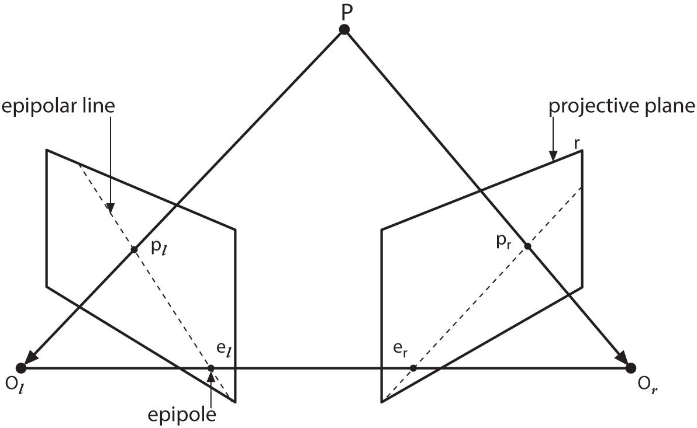
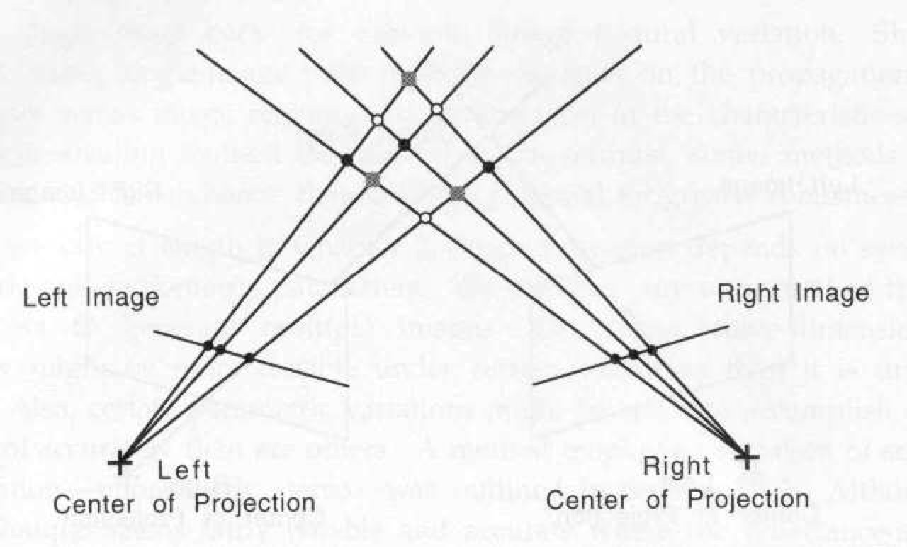
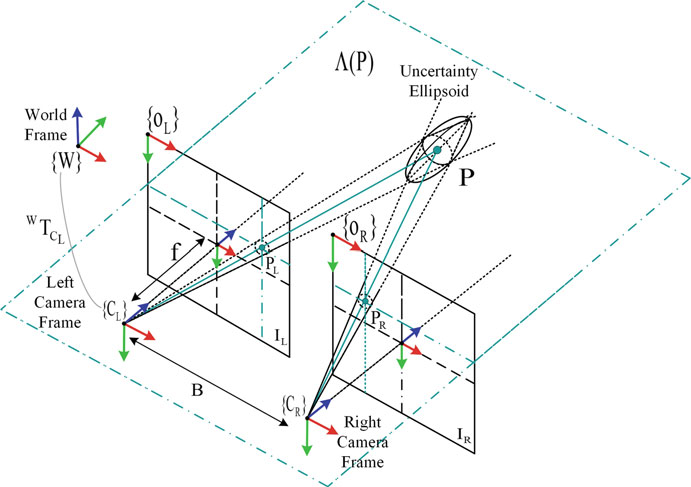

# Computer Vision

Computer vision is a key branch of artificial intelligence, aiming at understanding the surrounding environment from the visual information captured by cameras.

Vision is a process of seeing what is where.

Vision can be studied at three different levels: computational theory level, algorithm level and implementation level.

Each computation task is independent of specific algorithms, algorithms can be independent of the software or hardware platform on which they are implemented.

Estimate the values of unknown parameters (robot posture, camera orientation, etc.), given a number of measurements (sensory data, images, feature points, etc.). These kinds of problems are called inverse problem because they involve in estimating unknown model parameters instead of simulating the forward formation equations.

A multiple view problem is inherently a vision problem involving more than one view of the same scene.

Many of the visual problems are generally ill-posed, that is, solutions are not unique.

## Camera Pinhole Model

Vision system starts its work by acquiring an image or a set of images from cameras or data storage devices.

The pinhole perspective (also called central perspective) projection model, first proposed by Brunelleschi at the beginning of the fifteenth century, is mathematically convenient and, despite its simplicity, it often provides an acceptable approximation of the imaging process.

A thin lens produces the same projection as the pinhole. A camera is modeled as a pinhole, which performs a perspective projection. The perspective projection is a nonlinear mapping.

A 3D point is denoted by $M = [X,Y,Z]^T$ in world coordinates and $M' = [X',Y',Z']^T$ in camera coordinates.

$$ M' = RM + t $$

$(R, t)$, called the extrinsic parameters, is the rotation and translation which relates the world coordinate system to the camera coordinate system.

The projected 2D point on imaging plane is denoted by $m = [u,v]^T$ in pixel image coordinates and $m' = [x',y']^T$ in physical image coordinates.

Based on similar triangle theory, we obtain:

$$ \frac{f}{Z'} = \frac{x'}{X'} = \frac{y'}{Y'} $$

Image pixel and physical coordinate is related by:

$$
\begin{cases}
   u = αx'+c_x \\
   v = βy'+c_y
\end{cases}
$$

$(c_x,c_y)$ the pixel coordinates of the principal point. So

$$
\begin{cases}
u = αf\dfrac{X'}{Z'}+c_x = f_x\dfrac{X'}{Z'}+c_x \\\\
v = βf\dfrac{Y'}{Z'}+c_y = f_y\dfrac{Y'}{Z'}+c_y
\end{cases}
$$

$(f_x,f_y)$ is the focal lengths in image x and y axes expressed in pixel units. The above equation can be written in matrix form:

$$
\begin{bmatrix}
   u \\
   v \\
   1
\end{bmatrix} = \dfrac{1}{Z'}\begin{bmatrix}
   f_x & 0 & c_x \\
   0 & f_y & c_y\\
   0 & 0 & 1
\end{bmatrix}\begin{bmatrix}
   X' \\
   Y' \\
   Z'
\end{bmatrix} = \dfrac{1}{Z'}KM' = \dfrac{1}{Z'}K(RM + t)
$$

K is called camera intrinsic matrix:

$$
K=\begin{bmatrix}
   f_x & 0 & c_x  \\
   0 & f_y & c_y  \\
   0 & 0 & 1
\end{bmatrix}
$$

We use $\tilde x$ to denote the augmented vector by adding 1 as the last element: $\tilde m = [u,v,1]^T$ and $\tilde M= [X,Y,Z,1]^T$.

The relationship between a 3D point M and its image projection m is given by
$$ s\tilde m = K [R\ t] \tilde M = P \tilde M $$

where s is the z component of (RM + t), P is called projection matrix.

成像公式的本质上是把投影中心放到坐标原点，$f_x,f_y,c_x,c_y$决定了像点的三维坐标，$R,t$决定了物点的三维坐标，原点、像点、物点三点共线，根据这样的一组共线方程，可以解出相机的参数值。

### Reprojection

Given P and M, compute $[x,y,w]ᵀ=P\tilde M$, then u=x/w, v=y/w.

### Reconstruction

Given projection matrice of two cameras $P_1, P_2$ and two image points $m_1, m_2$.

### Camera matrix 相机内参矩阵，相机外参矩阵

影像坐标系是以二维影像为基本建立的坐标系，描述像素点在影像上的位置，分为以像素为单位的 uv 坐标系以及以物理尺寸为单位的 xy 坐标系。uv 坐标系以图像左上角为原点，u 轴和 v 轴分别平行于图像平面的两条垂直边（u 轴朝右，v 轴朝下）；xy 坐标系以相机主光轴与像平面的交点（主点）为原点，x 轴和 y 轴分别与 u 轴和 v 轴平行且方向一致。
相机坐标系从相机的视角来描述物体在三维空间中的坐标。以相机光学中心为原点，X 轴与 Y 轴分别与影像坐标系的 x 轴与 y 轴平行，且方向一致，根据右手坐标系规则得到 Z 方向。相机坐标系是物理尺寸单位。

## Camera Calibration

Accurate calibration is of key importance for performance most machine and computer vision tasks.

Camera calibration is a necessary step in 3D computer vision in order to extract metric information from 2D images.

Camera calibration is the process of estimating the intrinsic and extrinsic parameters of a camera.

In applications based on triangulation, such as stereo vision or structure light vision, the over all performance of the machine vision system strongly depends on the accuracy of the camera calibration.

Main factors that influence the calibration accuracy:

- the extraction of feature points in the image plane
- the geometric accuracy of the calibration target
- the lens distortion model conformity with the actual lens
- the optimization algorithms used to converge on the camera parameters
- the operational conditions of the experiments

Generally, camera calibration methods can be classified into two categories: self-calibration and object-based calibration.

Self-calibration estimates the camera’s parameters by using multi-view images without calibration targets. As such, it is the appropriate solution for on-line implementation in which accuracy is not highly demanded.

The object-based camera calibration is performed by employing an object, such as 3D object, 2D pattern or 1D pattern with known coordinates, which is commonly used in off-line calibration for highperformance applications.

### Homography matrix 单应矩阵

We assume the plane of a calibration board is on $Z = 0$ of the world coordinate system. We have

$ \tilde m = H \tilde M $ with $ H = λA [r_1\ r_2\ t]$, $m = [x,y]^T$, $\tilde M= [X,Y,1]^T$.

The 3×3 matrix $H$ is defined up to a scale factor, called homography matrix.

Let $h = [\bar h_1^T\ \bar h_2^T\ \bar h_3^T]^T$, $\bar h_i$ is the i-th row of H. Then

$$
\begin{bmatrix}
   \tilde M^T & 0^T & -x\tilde M^T \\
   0^T & \tilde M^T & -y\tilde M^T
\end{bmatrix}h=0
$$

When we are given n points, we have n above equations, which can be written in matrix equation as $Lh = 0$, where L is a 2n×9 matrix. As h is defined up to a scale factor, the solution is well known to be the right singular vector of L associated with the smallest singular value (or equivalently, the eigenvector of $L^TL$ associated with the smallest eigenvalue).

Using the knowledge that $r_1$ and $r_2$ are orthonormal, we have

$$
\begin{gathered}
h_1^TA^{-T}A^{-1}h_2 = 0 \\
h_1^TA^{-T}A^{-1}h_1 = h_2^TA^{-T}A^{-1}h_2
\end{gathered}
$$

Let

$$
B = \begin{bmatrix}
   B_{11} & B_{12} & B_{13}  \\
   B_{21} & B_{22} & B_{23}  \\
   B_{31} & B_{32} & B_{33}
\end{bmatrix} = λA^{-T}A^{-1} = λ\begin{bmatrix}
   \dfrac{1}{f_x^2} & 0 & -\dfrac{c_x}{f_x^2}  \\
   0 & \dfrac{1}{f_y^2} & -\dfrac{c_y}{f_y^2}  \\ \\
   -\dfrac{c_x}{f_x^2} & -\dfrac{c_y}{f_y^2} & (\dfrac{c_x}{f_x^2}+\dfrac{c_y}{f_y^2}+1)
\end{bmatrix}
$$

Note that B is symmetric, defined by a 6D vector
$$b = [B_{11},B_{12},B_{22},B_{13},B_{23},B_{33}]^T.$$

Let $H=[h_1\ h_2\ h_3]$, $h_i$ is the i-th column vector of H. Then

$$
h_i^TBh_j = v_{ij}^Tb
$$

with

$$
v_{ij}=[h_{i1}h_{j1},h_{i1}h_{j2}+h_{i2}h_{j1},h_{i2}h_{j2},h_{i3}h_{j1}+h_{i1}h_{j3},h_{i3}h_{j2}+h_{i2}h_{j3},h_{i3}h_{j3}]^T.
$$

Therefore, the two fundamental constraints from a given homography, can be rewritten as 2 homogeneous equations in b:

$$
\begin{bmatrix}
   v_{12}^T \\
   (v_{11}-v_{22})^T
\end{bmatrix}b=0
$$

If n images of the model plane are observed, by stacking n such equations we have

$$
Vb=0
$$

where V is a 2n×6 matrix. The solution is well known as the eigenvector of $V^TV$ associated with the smallest eigenvalue (equivalently, the right singular vector of V associated with the smallest singular value).

Once $b$ is estimated, we can compute all camera intrinsic matrix A.

$$
\begin{gathered}
f_x = \sqrt{\frac{λ}{B_{11}}} \\
f_y = \sqrt{\frac{λB_{11}}{B_{11}B_{22}-B_{12}^2}} \\
c_x = \frac{B_{13}}{B_{11}} \\
c_y = \frac{B_{12}B_{13}-B_{11}B_{23}}{B_{11}B_{22}-B_{12}^2} \\
λ = B_{33}- \frac{B_{13}^2+c_y(B_{12}B_{13}-B_{11}B_{23})}{B_{11}} \\
\end{gathered}
$$

Once A is known, the extrinsic parameters for each image is readily computed.

$$
\begin{gathered}
r_1 = λA^{-1}h_1 \\
r_2 = λA^{-1}h_2 \\
r_3 = r_1 \times r_2 \\
t = λA^{-1}h_3 \\
λ = \frac{1}{|A^{-1}h_1|} = \frac{1}{|A^{-1}h_2|}
\end{gathered}
$$

Because of noise in data, the so-computed matrix $R = [r_1\ r_2\ r_3]$ does not in general satisfy the properties of a rotation matrix. We need to estimate the best rotation matrix from a general 3×3 matrix.

LM 优化的本质是参数拟合，增加畸变参数很容易过拟合。
以最小化投影误差来拟合畸变参数，还要约束直线上的点在消畸变后仍在直线上。
两个相机分别拟合旋转平移参数后，还要约束两个相机的相对方位是固定的，以及同名点对应的光线能相交。
用直线法拟合畸变参数，由于不能确定畸变前直线的位置，准确性受限。
椭圆在畸变后，拟合的椭圆方程就不准了，进而影响对偏心误差的计算。

## Lens distortion model

It is difficult to manufacture a perfect lens. In practice, several simple lenses are carefully assembled to make a compound lens with better properties. The two planes of front and back lens, called the principal planes, are perpendicular to the optical axis, and are separated by a distance t, called the thickness of the lens. The principal planes intersect the optical axis at two points, called the nodal points.

The thick lens produces the same perspective projection as the ideal thin lens, except for an additional offset equal to the lens thickness t along the optical axis.

The centre-of-distortion may be displaced from the centre of the image or the principal point of the camera.

## Calibration Target

In principle, any appropriately characterized object could be used as a calibration object.

Circle targets can provide improved calibration quality due to a higher feature density. In contrast to the saddle points in checkerboards, circles are imaged as ellipses under camera perspective.

However, symmetric circle grids are not rotationally invariant, and hence not suitable for stereo calibration. In these cases, checkerboard or asymmetric circle grids can be used.
In order for the checkerboard targets to be rotation-invariant, the number of rows needs to be even and the number of columns odd, or the other way around.

Generally, the target should fill most of your camera's FOV (Field Of View) at the desired working distance. This is because cameras need to be focused on that specific distance and calibrated.
Changing the focus distance slightly affects focal length, which would throw any previous calibration off. Even aperture changes usually have a negative effect on calibration validity, which is why they should be avoided.

For accurate calibration, the camera model is best constrained if the camera sees the calibration target filling most of the image. Popularity speaking, if a small calibration plate is used, many combinations of camera parameters could explain the observed images.
As a rule of thumb, the calibration plate should have an area of at least half the available pixel area when observed frontally.
Capturing calibration information from the periphery of images is especially important for the determination of lens distortion parameters.

#### Calibration Best Practices

- Proper mounting of calibration target and camera.
- Perform calibration at the approximate working distance (WD) of your final application.
- Choose the right size calibration target.
- The target should have a high feature count. Using fine patterns is preferable.
- Collect images from different areas and tilts.
- Use good lighting. This is often overlooked, but hugely important.
- Have enough observations. Remove bad observations.
- Calibration is only as accurate as the calibration target used.

## Stereo Vision

Binocular stereo is a problem to determine the 3D shape of visible surfaces in a static scene from images taken of the same scene by two cameras.

The first step is to match the points in the two images, so that one can then determine the 3D position of each point by triangulation.

For any two views, they share the common epipolar constraint, which is the only geometrical constraint available.

A 3-D point P is projected onto both image planes, to points $p_l$ and $p_r$, which constitute a conjugate pair. Given a point $p_l$ in the left image plane, its conjugate point $p_r$ in the right image is constrained to lie on a line called the epipolar line. This is called the epipolar constraint.

The line connecting the lens centers of the two cameras, called baseline.

All the epipolar lines in one image plane pass through a common point ($e_l$ and $e_r$ respectively) called the epipole, which is the projection of the optical center of the other camera.

The epipolar plane is defined by the observed point P and the two centers of projection, $O_l$ and $O_r$; the epipoles are located at the point of intersection of the line joining the centers of projection and the two projective planes.

A very special case is when both epipoles are at infinityy, that happens when both image planes are parallel to the baseline. Epipolar lines, then, form a bundle of parallel lines in both images.

If you have a stereo camera where the relative position and orientation of two cameras is fixed, and if you computed poses of an object relative to the first camera and to the second camera, ($R_1$, $T_1$) and ($R_2$, $T_2$), respectively.

For the same object point M, its coordinates is $M_1$ and $M_2$ in each camera coordinates, we have

$$
\begin{gathered}
s_1\tilde m_1 = A_1 M_1 = A_1 [R_1\ T_1] \tilde M \\
s_2\tilde m_2 = A_2 M_2 = A_2 [R_2\ T_2] \tilde M \\
M_2 = R M_1 + T
\end{gathered}
$$

So given ($R_1$, $T_1$), if you know (R,T) the orientation and position of the second camera relative to the first camera, it is possible to compute ($R_2$, $T_2$):

$$
\begin{gathered}
R_2=R∗R_1 \\
T_2=R∗T_1+T
\end{gathered}
$$

From the coplanar constraint,

$$
\begin{gathered}
M_2 \cdot (T \times RM_1) = 0 \\
M_2^T E M_1 = 0
\end{gathered}
$$

### Essential matrix 本质矩阵

The essential matrix E is determined by the rotation $R$ and translation $T=[t_1,t_2,t_3]^T$ between the two cameras.

$$
E=T \times R=\begin{bmatrix}
   0 & -t_3 & t_2  \\
   t_3 & 0 & -t_1  \\
   -t_2 & t_1 & 0
\end{bmatrix}R
$$

Alternatively, $(R^T M_2)^T\cdot(T\times M_1)=0 \implies E = R \begin{bmatrix}
   0 & -t_3 & t_2  \\
   t_3 & 0 & -t_1  \\
   -t_2 & t_1 & 0
\end{bmatrix}.$

Then in image coordinates,

$$
\begin{gathered}
\tilde m_2^TA_2^{-T}EA_1^{-1}\tilde m_1=0 \\
F = A_2^{-T}EA_1^{-1} \\
E = A_2^TFA_1
\end{gathered}
$$

### Fundamental matrix 基础矩阵

The fundamental matrix F is a matrix determined from point correspondences between two images, it has determinant 0 with rank 2. We can compute F in a manner analogous to computing the image homography in the previous section, by providing a number of known correspondences.

To recover the epipolar geometry between two images from point matches, least-squares techniques are exploited to obtain more robust estimate.

$$\tilde m_2^TF\tilde m_1=0$$

For fixed $\tilde m_1$, $F\tilde m_1$ defines a line in the other imageplane, called the epipolar line of point $\tilde m_1$, vice versa. This implies that one point of a corresponding pair is on the epipolar line of the other point, therefore point correspondence detection reduces to search on the epipolar line.

The fundamental matrix cannot be uniquely determined if the corresponding points are exactly coplanar in the scene or exactly have a special symmetry, for example, at the vertices of a cube, This does not occur for real data with noise.

The essential matrix is the specialization of the fundamental matrix to the case of normalized image coordinates. Reversely, the fundamental matrix may be thought of as the generalization of the essential matrix in which the assumption of calibrated cameras is removed.

## Stereo Calibration

Stereo calibration determines the relative geometry (rotation and translation) between cameras. The intrinsic parameters of each camera can be determined separately as in camera calibration or jointly with the relative geometry.

Stereo calibration involves finding the rotation matrix R and translation vector T between the two cameras.

We can separately use single-camera calibration for the two cameras to obtain ($R_1$, $T_1$) and ($R_2$, $T_2$), then

$$
\begin{gathered}
R=R_2∗R_1^T \\
T=T_2 - R∗T_1
\end{gathered}
$$

A robust Levenberg-Marquardt iterative algorithm to find the (local) minimum of the reprojection error of the calibration points for both camera views, and the final solution for R and T is returned.

It was observed that correcting lens distortion while estimating internal camera parameters can lead to detrimental numerical compensations, where the apparence of an observed pattern can be explained by distortion or by change of point of view.

By using acalibration harp, photographs of this harp allow measuring the residual distortion after correction.

## Scene Reconstruction

Given two images of the same scene, we can compute the 3D position of the point determined by a corresponding pair of points if the positions, orientations, and internal parameters of the two cameras that took the images are known.

We determine from a corresponding point pair the triangle made by two lines of sight and the baseline. For the first camera, the ray is the line passing through the viewpoint and the point (x, y) on the image, determined by solving the first two equations. Similarly, the ray for the second camera is obtained by solving the last two equations up to one free parameter.

The epipolar equation is the necessary and sufficient condition that the two rays intersect, and the fundamental matrix F is determined by the projection matrices P and P'.

Ambiguous correspondence between points in the two images may lead to several different consistent interpretations of the scene.

#### rectification of stereo pairs

Any pair of stereo images, can be transformed so that epipolar lines are parallel and horizontal in each image. This procedure is called rectification.

The rectified images can be thought of as acquired by a new stereo rig, obtained by rotating the original cameras. The important advantage of rectification is that computing stereo correspondences (Dhond and Aggarwal, 1989) is made simpler, because search is done along the horizontal lines of the rectified images.

Dense stereo matching is greatly simplified if images are rectified.

## Bundle Adjustment

Bundle adjustment tries to minimize the sum of errors between 2D observations and the predicted 2D points, where the predicted points are re-projected from 3D structures by camera parameters.

### Three‐dimensional Reconstruction from Image Sequences with the Kalman Filter

A model of uncertainty sources needs to be introduced in order to have a reasonable algorithm. Such inference problems from noisy data are called probabilistic inference.

Maximum Likelihood Estimator (MLE)
standard Kalman filter (SKF)
extended Kalman filter (EKF)
unscented Kalman filter (UKF) 无迹卡尔曼滤波器

## Visual Odometry

In most of the industrial cases, one needs to obtain measurements from a vision system that are expressed in real-world coordinates. This requires transforming pixel measures into metric values.

When you want to find the solution to a problem, the first step is to express this problem in mathematical terms, and you can then use existing mathematical tools to find a solution to your equations. However, interesting problems can usually be expressed in many different mathematical ways, each of which may lead to a slightly different solution. It then takes work to analyze the different methods to understand which one provides the most stable/accurate/efficient/etc solution.

滚动快门不能保证开始与结束记录光线的时间完全相同。在这种情况下，快速移动的物体就会出现倾斜或者剪断的效果，当相机移动很快时，就会出现果冻效应，尤其是当相机处于横摇状态、物体快速通过、高快门速度、跑或者枪之类的镜头时会非常明显。闪光灯也很有可能只会照亮画面中的一部分区域。

全局快门需让所有的光线同时进入到感光元件上。在任何指定的时间点，这些元件要么同时开启，要么同时关闭。全局快门是被公认为最适合拍摄动态物体的快门。它可以有效地避免滚动快门的问题。

面阵相机是以 “面” 为单位来进行图像采集的成像工具，可以在短时间内曝光、一次性获取完整的目标图像。线阵相机的传感器只有一行感光像素，所以线阵相机一般具有非常高的扫描频率和分辨率。

相机软件接口

- Generic Interface for Cameras standard
  GenICam 提供了一种普遍适用的软件界面。它为包括 GigE Vision、USB 3.0 Vision、Camera Link ® 和 IEEE 1394 在内的各种标准接口（涵盖所有相机类型和图像格式）提供了一个端到端配置接口。这种方法方便连接符合 GenICam 标准的相机，无需对相机进行特定配置。
- USB3 Vision
  符合 GenICam 协议，连接线增加了螺丝固定。
- USB video class or UVC
  UVC v1.5 supports transmission of compressed video streams, including MPEG-2 TS, H.264, MPEG-4 SL SMPTE VC1 and MJPEG.

相机数据接口

- Camera Link
  Camera Link (CL)提供从 100 MB/s 到约 800 MB/s 的数据传输速率。
  Camera Link HS (CLHS)数据传输速率提高到了 1,200 to 80,000 MB/s，线材长度可达几百米。

- CoaXPress | CXP
  CoaXPress 1.0/1.1 标准的接口所支持的数据率最高可达 6.25 Gbps，
  CoaXPress 2.0 标准的传输速度比它快两倍，最高可达 12.5 Gbps。
  将信号触发和供电模式 (power over CXP) 相结合之后，只需一根 CoaXPress 电缆，即可实现 40 m 的最大电缆长度。

- USB 3.0
  USB 3.1 Gen 1 传输带宽高达 350 MB/s。
  USB 3.1 Gen 2 也被称为 USB Superspeed+，这款产品提供的最大带宽值甚至高于上一代的技术。

- 千兆网（GigE）
  传输速率高达 100MB / 秒、线材长度可达 100 米。
  千兆网（GigE） 相机可以使用以太网实现供电 (PoE)，即 通过数据线获取电力。而系统装置为了这一工作需要合适的千兆网线材方可实现。

相机镜头接口

- C 口：螺纹的公称直径为 24.5 mm（1 英寸），每英寸 32 牙。镜头接口的法兰与图像平面的距离是 17.526 mm（0.69 英寸）。
- CS 口：类似于 C 口，区别是法兰与图像平面的距离较短，为 12.526 mm（0.493 英寸）。通过使用 5 mm 垫圈（C-CS 适配器），C 口镜头也可以用于 CS 口相机。

相机感光芯片
芯片尺寸单位为英寸，但此数据对应芯片对角线长度，1 英寸为 16mm，而不是 25.4mm。这是因历史原因形成的。

## References

2019 Bundle Adjustment Revisited
对小孔相机模型的推导很到位

2000 A Flexible New Technique for Camera Calibration
张正友标定算法，方法简便、结果可靠，被广泛采用，对畸变系数的标定仍需改进

2009 Accurate camera calibration using iterative refinement of control points
标定出参数后，在校正畸变和还原为正视图后的图片上检测控制点的位置再次标定，迭代进行。
比较了方形、圆形、环形控制点定位精度，取环形控制点内外两个圆的圆心的中点作为圆环的中心。
引申思考：利用圆环的同心圆可以消除投影的偏心误差，从而减少迭代次数。

2012 A novel optimization method of camera parameters used for vision measurement
提出测量是在 3D 空间进行的，而传统的标定是在 2D 图像上进行优化，所以把标定的优化目标改成最小化 3D 坐标的测量误差。
反思：2D 图像上最小化重投影误差是假定 3D 的标定物是精确的，最小化 3D 坐标的测量误差则是假定像点坐标是精确的，所以两者优化出来的相机参数是不一样。对于标定场景，由于存在镜头畸变和像点检测误差，显然标定物的 3D 坐标更精确一些。

2016 Multistep Explicit Stereo Camera Calibration Approach to Improve Euclidean Accuracy of Large-Scale 3D Reconstruction
测量误差跟工作距离的平方成正比，跟双目基线长度成反比。
距离越远，像点位移变化越不敏感，很难用重投影偏差来优化。
标定板到相机的距离要保持较小的变化范围，每次位移不能是单纯的平移。
在不同的距离标定双目相机，重建三维坐标时使用对应距离的相机参数值。

2008 A new calibration model of camera lens distortion
将径向、偏心、薄棱镜三种畸变合并到一个最高为 5 次方的多项式中，解释了各个多项式系数的几何含义。
引入两个旋转角来代替一部分的畸变系数，减少了系数的个数，有大量的实验数据。
实验发现镜头焦距越短，畸变越大。

2012 Self-consistency and universality of camera lens distortion models
比较了五种经典的畸变/校正模型，概念准确、方法合理，必读。
给出了多项式畸变系数的计算方法。

2014 Camera matrix calibration using circular control points and separate correction of the geometric distortion field
先用竖琴标定畸变系数，再用圆点板标定几何参数；用待优化的参数把圆点投影成椭圆取圆心，与测量到的椭圆圆心作比对，避免了圆点圆心的投影偏差。
引申思考：既可以用竖线标定畸变系数，也可以用竖线代替点标定相机的内外参数。

2016 Distortion Correction Modeling Method for Zoom Lens Cameras with Bundle Adjustment
给出了一种拟合直线的方法，是否优于最小二乘法不确定。
先用拟合直线计算畸变参数，优化标定的重投影误差时固定其他参数不变，只改变畸变参数进行二次优化。

2017 A Precision Analysis of Camera Distortion Models
重申了 2012 年论文的观点，增加了 R+T 模型，扩充了一些数学推导和实验结果。

2016 An Open-Source Structured-Light Scanning System for Rapid Geometry Acquisition

结构光扫描仪的系统结构和工作原理、格雷码的编码原理和程序代码、点云转成网格面、3DUNDERWORLD-SLS 开源程序
源代码：https://github.com/theICTlab/3DUNDERWORLD-SLS-GPU_CPU
演示视频：https://vimeo.com/91703073

转盘只有一个转轴，只能扫侧面，可用机械臂多向转动。
投影仪要求物体表面较好的反光性，可以通过喷粉弥补。
点云分辨率与投影仪的分辨率相关，扫描精度与相机分辨率相关。

2010 Design, implementation and evaluation of an active vision-based 3-d scanner

横向和纵向的格雷码用蓝绿两种颜色叠加起来同时投影，缩短了编码长度。
格雷码与相位移结合使用，高位的 7 比特用格雷码，低位的 3 比特用相位移。
用 MeshLab 软件做点云的拼接。

2019 Camera Calibration Using Gray Code
用液晶显示器播放格雷码标定相机，每个像素都能在像片上找到对应点，对应点数量多但是没有亚像素精度。
启发：用格雷码的条纹来标定镜头的畸变参数，其他几何参数仍使用棋盘格或圆点阵列。

2005 Robust Euclidean alignment of 3D point sets: the trimmed iterative closest point algorithm
介绍点云拼接的 Iterative Closest Point (ICP)算法及各种改进
比较 least median of squares 和 least trimmed squares 算法
提出 Trimmed ICP (TrICP)拼接算法

2014 Robust registration of point sets using iteratively reweighted least squares
改进 ICP 算法

2016 Go-ICP: A Globally Optimal Solution to 3D ICP Point-Set Registration
在整个 SE(3)空间内全局地搜索旋转和平移参数，解决 ICP 只能局部最优的问题

2016 Global Registration of 3D Point Sets via LRS decomposition
多个点云全局对齐，两两组合计算相对位移，组成一个大的稀疏矩阵用 LRS 分解求均值

2016 Joint Registration of Multiple Point Sets
假定一个最终的点云，同时求解每个点云的刚性变换，用贝叶斯概率生成最终的模型

2020 TEASER: Fast and Certifiable Point Cloud Registration
颠覆了 ICP 算法，分步计算缩放、旋转和平移，能够排除外点，计算速度快，讲解细致

2016 Maximum consensus with mixed integer linear programming
很好的描述了有噪点的参数模型优化问题，汇总了已有的各种解法，但不看好论文本身给出的方法。
