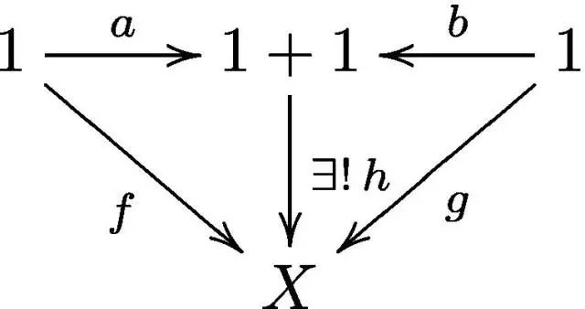
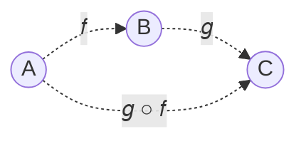

# 范畴学 Category Theory

范畴论是一个关于关系的理论，描述并研究关系的所有可能性质。

在还原论和演⽣论角逐的今天，范畴学正变得越来越重要。可以说，微积分对还原论的物理有多重要，范畴学对演⽣论的物理就有多重要。范畴学带来了超乎数学家想象的波澜壮阔，它在概念上统⼀了分析和代数，统⼀了离散和连续。范畴学的变⾰是如此底层，它会毫⽆疑问地在⼏乎所有科学领域发挥作⽤，包括逻辑学、数学、物理、计算机科学、语⾔学、社会学、经济学等等。

范畴学起源于代数拓扑，由 Samuel Eilenberg（1913-1998）和 Saunders Mac Lane（1909-2005）于上个世纪 40 年代提出。⾃从六⼗年代 Alexander Grothendieck （1928-2014）⽤范畴学的语⾔重建了代数⼏何基础以来，数学中就出现了⽤范畴学替代集合论作为数学的新基础的潮流。这个潮流不但在数学⾥⾯愈演愈烈，还在 90 年代被注⼊了新的强⼤动⼒：物理。

以前为了描写对称性，群论走进了物理。现在为了描写量子材料中的量子纠缠，范畴论也正在走进物理。⼈们发现描述二维有理共形量⼦场论和任意维拓扑序的数学语⾔也是范畴学。⼀个简单的范畴学的公式就可以完成⼀个复杂的量⼦场论的构造，或同时计算⽆穷多量⼦场论的融合 (fusion) ；很多复杂的物理和数学结构⾃然⽽然就是范畴学的；更重要的是，很多超越集合论的数学或物理事实只能在范畴学的意义下陈述和理解。

### 范畴学的视⻆

不要⽤“⼀个研究对象”⾥⾯“有什么东⻄”这样⾮常集合论或还原论的⽅式去看问题，⽽要以对象和其他对象的相互关系的⽅式来了解⼀个对象。这个⽅式其实是我们理解世界最根本的⽅法，这个世界上没有⽐相互关系或相互作⽤更基本的存在。

什么是“1”？⼀个苹果是“1”，⼀个⾹蕉也是“1”。它们都是“1”的代表。既然只是代表，是不是说它们都还不是“1”？那么到底什么是“1”呢？

“1”应该反映出来所有这些“1”的不同代表所具有的“共有性质”。数学家给这个“共有性质”起了⼀个正式的名字叫“万有性质” (universal property) 。

集合之间的映射 (map)其实就是⼀个分配规则。如果集合 X ⾥⾯没有元素（空集），等于分配规则⾃动定义好了，这个什么都不需要分配的分配规则就叫空映射。

定义：1 就是这样⼀个集合，任何⼀个集合到它都存在且有唯⼀⼀个映射。我们有⼀个简洁的图来记录这个定义：对任意集合 X，我们有

$$ X \xrightarrow{\exist!} 1 $$

这⾥“∃”是指“存在”，“!”是指“唯⼀”。什么集合可以呢？就是那些只有⼀个元素的集合，才可以同时保证存在性和唯⼀性。

这个定义也被称为“1”的“万有性质”。也就是说，我们⽤“1”的性质来定义“1”，⽽不是⽤“1”⾥⾯有什么东⻄来定义“1”。所有的数学概念都可以⽤它的“万有性质”来定义。

定义：0 就是这样⼀个集合，它到任何⼀个集合都存在且有唯⼀⼀个映射。即对任意集合 X，我们有：

$$ 0 \xrightarrow{\exist!} X $$

两个连在⼀起的映射$X\overset{f}{\rarr}Y\overset{g}{\rarr}Z$可以合成为⼀个从 X 到 Z 的映射，记为$X\xrightarrow{g \circ f}Z$。

定义：1+1 就是这样⼀个集合，它⾃动附带两个指定的从 1 来的映射：$$1\overset{a}{\rarr}1+1\overset{b}{\larr}1,$$从⽽对任何附带两个从 1 来的映射的集合 X：$$1\overset{f}{\rarr}X\overset{g}{\larr}1,$$ 都存在且有唯⼀⼀个映射：$1+1\overset{h}{\rarr}X$，使得$h\circ a=f，h\circ b=g$。

定义 1+1 需要有三个东⻄：(1+1, a, b)。这个看上去“复杂”的定义，正是 1+1 的本来⾯⽬。这样定义的 1+1 确实有些复杂，并不实⽤，但这是⽤⽜⼑去杀鸡，当然就看不到它的⼒量了，⽜⼑⽜在可以通杀⼀切众⽣。

把定义 1+1 的那个图的箭头都反过来，就是 1 x 1 的定义。也就是在说，乘法是加法的对偶概念。

不要问⼀个集合⾥⾯的元素，⽽要去看映射，后者更加丰富。⽐如，⼀个集合 X ⾥⾯的⼀个元素其实就是 1 到 X 的⼀个映射！范畴学中的箭头可以不是映射，可以是任意可能的关系。

⼀个序列：0.9, 0.99, 0.999, ... 的极限是 1。⽤范畴学的语⾔说就是 1 是图表 0.9→0.99→0.999→... 的余极限。怎么看呢？X 是这样的⼀个实数，序列 0.9, 0.99, 0.999, ...中的每⼀个都 ≤ X 。⽽ 1 就是这样的⼀个数，⽽且是最⼩的那⼀个。

一旦学会了无穷范畴，就没有人会回头。

2003 年 6 月 5 日，一位 25 岁的年轻人雅各布·卢里在科学预印本网站 arxiv.org 上发布了一份 60 页的论文，题为《论无穷范畴》（On Infinity Topoi）。在文中他开始勾勒一些规则，数学家们可以用这些规则研究无穷范畴。第一篇论文没有得到普遍好评。在受到批评后，卢里进入了一个旺盛的多产期，这段时期已经成为传奇。

2006 年，卢里在 arxiv.org 上 发布了《高阶范畴论》的书稿。在这项里程碑式的成就中，他用一种新的数学基础，基于无穷范畴的基础，建立了取代集合论的机制。伊利诺伊大学厄巴纳-香槟分校数学家查尔斯·瑞泽克（Charles Rezk）做了关于无穷范畴论重要的早期工作，他说：“他用上千页篇幅创造了我们现在都在使用的基础机制。我想我用一辈子都写不出《高阶范畴论》，他用两三年就完成了。”

为了将无穷范畴转化为可以做真正数学研究的对象，卢里必须证明有关它们的定理。为了做到这一点，他必须选择一个背景来建立这些证明，就像研究几何的人必须选择一个坐标系一样。数学家们称之为选择模型。卢里在拟范畴（quasi-categories）模型中发展了无穷范畴。

然后在 2011 年，卢里又写了一本篇幅更长的专著。在书中，他重新发明了代数。

代数为处理方程式提供了一套优雅的形式规则。数学家们一直使用这些规则来证明新定理。但是代数是在固定不动的等号平衡木上表演体操。如果你去掉这些平衡木，用更精巧的等价概念来代替它们，有些操作就会变得困难得多。

以小学教授的第一条代数规则结合律为例：3 个或 3 个以上数字的和或乘积并不取决于这些数字是如何分组的，比如 2 × (3 × 4) = (2 × 3) × 4。

如果用相等概念，要证明结合律对任何包含 3 个或 3 个以上数字的列表都适用是很容易的。但如果使用强等价概念，就会很复杂。如果使用更精巧的等价概念时，即使是像结合律这样的简单规则也会变得非常棘手。

在最新版长达 1553 页的《高阶代数》（Higher Algebra）中，卢里发展了无穷范畴版本的结合律——以及其他许多代数定理，它们共同奠定了等价数学的基础。

总而言之，他的两本书非常震撼，是引发科学革命的那种著作。里尔说：“规模非常庞大。这个成就可以与格罗滕迪克（Grothendieck）的代数几何革命相提并论。” 坎贝尔说：“一些人认为卢里的书是抽象的废话，一些人则甘之如饴，一些人的反应介于两者之间，一些人则是完全不理解。”

麻省理工学院的研究生彼得·海恩（Peter Haine）花了一年时间阅读卢里的著作，他说：“让你能真正学会这些东西的方式，就是坐下来自己动手。我认为这是最困难的。不仅仅是坐下来自己动手，而是通过坐下来读 800 多页的《高阶范畴论》来自己做。”

数学并不是只需要只有牧师才能阅读的神圣经文。这个领域既需要小册子，也需要大部头的书籍，除了原初的启示，还需要解释性作品。现在，《无穷范畴论》仍然主要以书架上的大部头的形式存在。

我们知道代数与几何有很强的关联，代数方程可以表示成图形和几何对象，几何特征可以用代数表达式刻画。就好像有一座桥梁连接广阔的数学世界中的这两个领域，桥的两边互为镜像。不仅如此，还有集合论、群论、线性代数、拓扑学、图论、微分几何等等，这些看上去似乎没什么关系的数学分支实际上都存在深层次的关联。通过将问题转移到不同领域，让你换个角度看问题，就可能让问题变得更容易解决。

范畴是一组对象及其关系的集合，这些对象之间的关系（称为态射，morphisms）在组合（composition ）和结合性（associativity）方面表现良好。这样就为数学提供了一个模板，将不同内容输入模板，就能重建一个数学领域：集合范畴由集合和它们之间的关系（映射）组成；群范畴由群和它们之间的关系（群同态）组成；拓扑空间范畴由拓扑空间和它们之间的关系（连续映射）组成；等等。范畴论是数学的数学。

### 关系就是一切

一个数学对象完全由它与所有其他对象的关系决定。换句话说，当且仅当两个对象以同样方式与范畴中的每个对象相关时，两个对象本质上是不可区分的。

范畴是有额外元数据的集合，这些额外元数据描述两个对象相互关联的所有方式，包括描述两个对象等价的所有方式。范畴论关注的是等价性。

数学的未来建立在等价的基础上，而不再是在相等的基础上。相等是一种严格的关系——要么两者相等要么两者不等——而等价则有不同的形式。

范畴之间的关系被称为函子，函子之间的关系被称为自然变换。

Category theory is a branch of mathematics originally developed to transport ideas from one branch of mathematics to another, e.g. from topology to algebra. Applied category theory refers to efforts to transport the ideas of category theory from mathematics to other disciplines in science, engineering, and industry.

We are defined by our relationships. Nowhere is this more true than in category theory.

A category is a system of related objects.

If we want to single out a particular object in a category, we can only do this by describing its pattern of relationships with other objects (and itself).

The relationships are called morphisms, and can be represented as arrows.

### Properties of Composition

The essence of a category is composition. Or, if you prefer, the essence of composition is a category.

Arrows compose, so if you have an arrow from object 𝐴 to object 𝐵, and another arrow from object 𝐵 to object 𝐶, then there must be an arrow — their composition — that goes from 𝐴 to 𝐶.

You can read 𝑔 ○ 𝑓 as “g after f”, called composition.

There are two extremely important properties that the composition in any category must satisfy.

1. Composition is associative.
   $$ ℎ \circ (𝑔 \circ 𝑓 ) = (ℎ \circ 𝑔) \circ 𝑓 = ℎ \circ 𝑔 \circ 𝑓 $$
2. Identity laws. For every object 𝐴 there is an arrow loops from the object to itself. The unit arrow for object A is called $id_𝐴$ (identity on 𝐴).

### Principle of duality

The principle of duality is fundamental to category theory. Informally, it states that every categorical definition, theorem and proof has a dual, obtained by reversing all the arrows.

Duality in the way how we can describe the laws of physics.
We can use the local picture, in which things happen sequentially and in small increments.
Or we can use the global picture, where we declare the initial and final conditions, and everything in between just follows.

In the local approach, we look at the state of a system around a small neighborhood, and predict how it will evolve within the next instant of time.
We reach the final solution by following a sequence of small steps, each depending on the result of the previous one.
In fact, computer simulations of physical systems are routinely implemented by turning differential equations into difference equations and iterating them.

In the global approach, we look at the initial and the final state of the system, and calculate a trajectory that connects them by minimizing a certain functional.
The simplest example is the Fermat’s principle of least time. It states that light rays propagate along paths that minimize their flight time.
All of classical mechanics can be derived from the principle of least action.
The action can be calculated for any trajectory by integrating the Lagrangian, which is the difference between kinetic and potential energy (notice: it’s the difference, not the sum — the sum would be the total energy).
In quantum mechanics, the Feynman path integral between initial state and final state is used to calculate the probability of transition.

Category theory encourages a global approach.
First of all, unlike calculus, it has no built-in notion of distance, or neighborhood, or time.
All we have is abstract objects and abstract connections between them.
If you can get from 𝐴 to 𝐵 through a series of steps, you can also get there in one leap.

## Declarative Programming

Category theory provides a meta-language for reasoning about computer programs at a declarative level.
It also encourages reasoning about problem specification before it is cast into code.

Depending on the cleverness of the compiler, there may be little or no difference between how declarative and imperative code is executed.
But the two methodologies differ, sometimes drastically, in the way we approach problem solving and in the maintainability and testability of the resulting code.

The main question is: when faced with a problem, do we always have the choice between a declarative and imperative approaches to solving it?
And, if there is a declarative solution, can it always be translated into computer code?

### 函⼦ Functor

A map between categories is called a functor.

Maps between functors are called natural transformations.

### 自然变换 natural transformation
