# Category Theory

We are defined by our relationships. Nowhere is this more true than in category theory.

A category is a system of related objects.

If we want to single out a particular object in a category, we can only do this by describing its pattern of relationships with other objects (and itself).

The relationships are called morphisms, and can be represented as arrows.

### Properties of Composition

The essence of a category is composition. Or, if you prefer, the essence of composition is a category.

Arrows compose, so if you have an arrow from object 𝐴 to object 𝐵, and another arrow from object 𝐵 to object 𝐶, then there must be an arrow — their composition — that goes from 𝐴 to 𝐶.

```mermaid
graph LR
  A((A)) -. "𝑓" .-> B((B)) -. "𝑔" .-> C((C))
  A -. "𝑔 ○ 𝑓" .->C;
```

You can read 𝑔 ○ 𝑓 as “g after f”, called composition.

There are two extremely important properties that the composition in any category must satisfy.

1. Composition is associative.
   $$ ℎ \circ (𝑔 \circ 𝑓 ) = (ℎ \circ 𝑔) \circ 𝑓 = ℎ \circ 𝑔 \circ 𝑓 $$
2. Identity laws. For every object 𝐴 there is an arrow loops from the object to itself. The unit arrow for object A is called $id_𝐴$ (identity on 𝐴).

### Principle of duality

The principle of duality is fundamental to category theory. Informally, it states that every categorical definition, theorem and proof has a dual, obtained by reversing all the arrows.

Duality in the way how we can describe the laws of physics.
We can use the local picture, in which things happen sequentially and in small increments.
Or we can use the global picture, where we declare the initial and final conditions, and everything in between just follows.

In the local approach, we look at the state of a system around a small neighborhood, and predict how it will evolve within the next instant of time.
We reach the final solution by following a sequence of small steps, each depending on the result of the previous one.
In fact, computer simulations of physical systems are routinely implemented by turning differential equations into difference equations and iterating them.

In the global approach, we look at the initial and the final state of the system, and calculate a trajectory that connects them by minimizing a certain functional.
The simplest example is the Fermat’s principle of least time. It states that light rays propagate along paths that minimize their flight time.
All of classical mechanics can be derived from the principle of least action.
The action can be calculated for any trajectory by integrating the Lagrangian, which is the difference between kinetic and potential energy (notice: it’s the difference, not the sum — the sum would be the total energy).
In quantum mechanics, the Feynman path integral between initial state and final state is used to calculate the probability of transition.

Category theory encourages a global approach.
First of all, unlike calculus, it has no built-in notion of distance, or neighborhood, or time.
All we have is abstract objects and abstract connections between them.
If you can get from 𝐴 to 𝐵 through a series of steps, you can also get there in one leap.

## Declarative Programming

Category theory provides a meta-language for reasoning about computer programs at a declarative level.
It also encourages reasoning about problem specification before it is cast into code.

Depending on the cleverness of the compiler, there may be little or no difference between how declarative and imperative code is executed.
But the two methodologies differ, sometimes drastically, in the way we approach problem solving and in the maintainability and testability of the resulting code.

The main question is: when faced with a problem, do we always have the choice between a declarative and imperative approaches to solving it?
And, if there is a declarative solution, can it always be translated into computer code?

### Functor

A map between categories is called a functor.

Maps between functors are called natural transformations.
