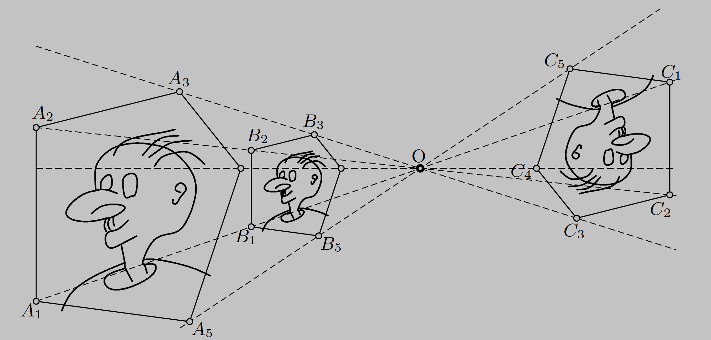
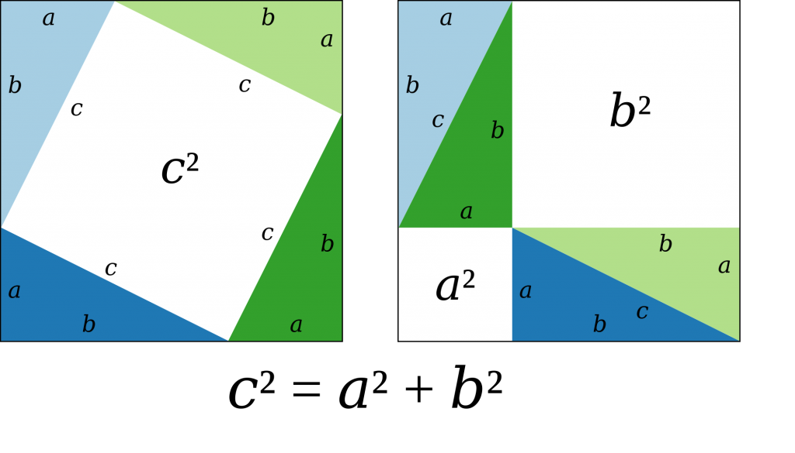
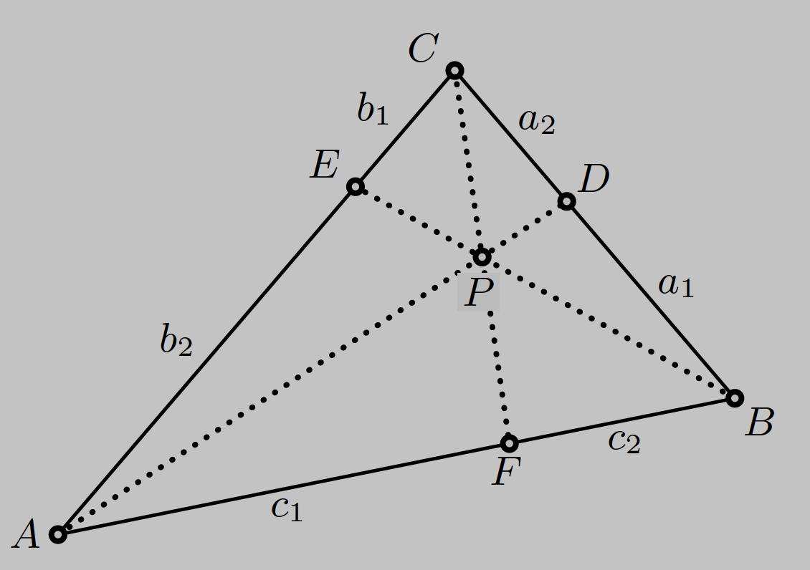
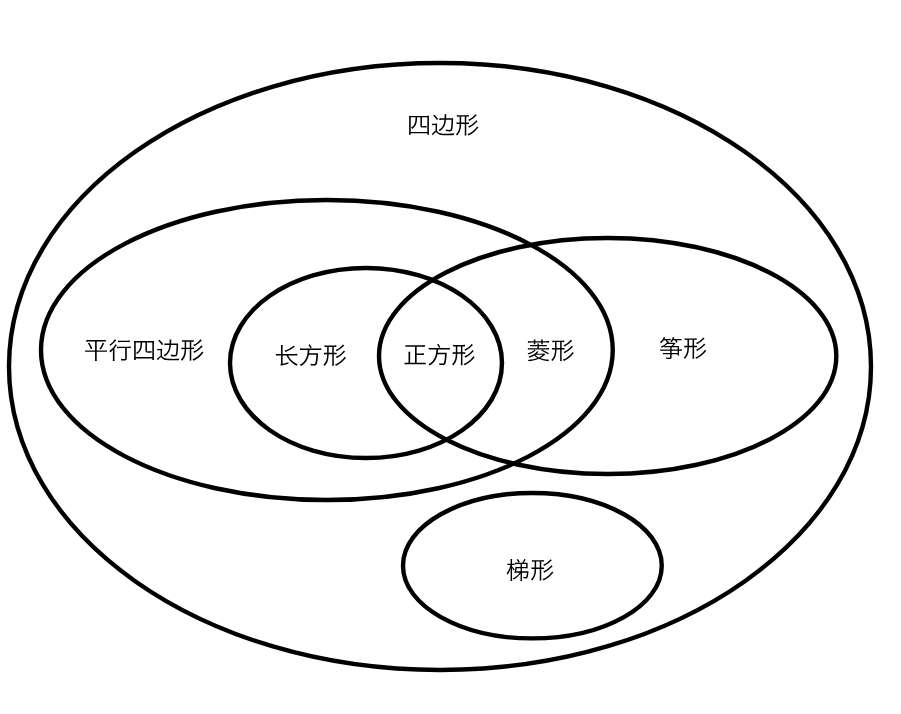

# 几何 Geometry

Geometry 的本义是测地学，丈量大地而产生的学问。

“I learned from the masters and not from the pupils.” —— Niels Henrik Abel

泰勒 Thales
毕达哥拉斯 Pythagoras 勾股定理
希波克拉底 Hippocrates
阿波罗尼斯 Apollonius of Perga 研究和著述圆锥曲线
芝诺 Zeno
阿基米德 Archimedes
欧几里得 Euclid 《几何原本（Elements）》
托勒密 Ptolemy 《天文学大成（Almagest）》
尼科梅德斯 Nicomedes
笛卡尔 Descartes
欧拉 Euler 三角函数
高斯 Gauss 高斯消元法
格拉斯曼 Grassmann (1809–1877) 矢量
丹迪林 Dandelin
克莱因 Klein
希尔伯特 Hilbert
庞加莱 Poincar´e
伯克霍夫 Birkhoff
格罗滕迪克 Grothendieck，（1928-2014）《代数几何基础》

Use what you know to find what you don’t know. And if you don’t have what you need, add it!
There’s sometimes more than one way to solve a problem, pick the way that seems like the least amount of work!

## 几何术语 geometry terms, geometry jargon

公理 axiom
公设 postulate
命题 proposition

直尺 ruler, straightedge
圆规 compass
量角器 protractor
三角尺 triangle ruler
指南针 compass

直线 straight line
线段 line segement

A line goes on forever in both directions. A line segment is just a bit of a line with a start and an end.

直角 right angle
平角 half turn, straight angle
周角 whole turn, revolution
圆心角 central angle

rpm: revolutions per minute

Angles can be made up of other, smaller angles.
Angles on a straight line add up to 180°.
Angles in a triangle add up to 180°.
Angles in a four-sided shape add up to 360°.

锐角 acute angle
钝角 obtuse angle
余角 complement angle
补角 supplementary angle

If two angles add up to 90°, they are complement.
If two angles add up to 180°, they are supplementary.

对顶角 vertical angles
平行线 parallel lines
垂线 perpendicular line
二等分 bisect

Vertically opposite angles are always equal.

Parallel lines are lines at exactly the same angle, parallel lines can never cross each other, the distance between the lines is constant.

When you have a line which crosses a set of parallel lines, all the sets of (opposite) vertical angles that are created are the same.

周长 perimeter
面积 area

The perimeter is the total length of the sides of a shape.

Anything you do with a SE&C can be broken down into a sequence of the following operations:

- Given two points we can draw a line connecting them.
- Given two (nonparallel) lines we can locate their point of intersection.
- Given a point p and a length r we can draw a circle with radius r centered at the point p.
- Given a circle we can locate its points of intersection with another circle or line.

### Sketch

- A square mark indicates a right angle.
- Tick marks indicate equal angles.
- V-shaped tick marks indicate sets of parallel lines or line segments.

In geometry, unless you’re specifically told to measure an angle, assume that the drawing isn’t accurate, but that the numbers on the sketch are. We calculate missing angles rather than measure them.

You can add parallel or perpendicular lines to your sketch to break down the missing angles into parts you have the tools to find.

### Diagram

Sketches can help you think, but an accurate drawing can also show you whether something is possible or impossible.

- Grid paper gives you a head start.
- Use a ruler for more accurate drawings.

### Model

- Use your brain to imagine.
- Use logic to prove something works or doesn’t work.
- Use kids’ toys, a scrap piece of wood, or make models out of cardboard to put your theories to the test.
- A computer model lets you test out stuff as if it was in the real world.

Geometry rules work with all these methods, you’ll get the same results however you approach it.

### 相似 Similar

If two shapes are similar, then they don’t just look alike, one is an exact scaled version of the other. This means that they have the same (equal) angles. Similarity is maintained even if your shape is reflected or rotated.

- Similar shapes have equal angles.
- Similar shapes have the same ratios between side lengths.
- Some shapes are always similar. All circles are similar. All squares are similar.

A ratio captures the proportions of a shape, and then by using a different factor, we can create a similar shape of any size.

**Thales’ intercept theorem**: Consider an arbitrary triangle ABC and
let AC be extended to C′ and AB to B′, so that B′C′ is parallel to BC.
Then the lengths of the sides satisfy the relations

$$
\frac{a′}{a}=\frac{b′}{b}=\frac{c′}{c}
$$

This tell us how to measure the height of a tree without having to climb it, erect a vertical stick,
measure its length and the length of the shadows of the tree and the stick.

Figures A,B,C are said to be similar with similarity centre O when
corresponding points $A_i,B_i,C_i$ lie on lines through O, and
the corresponding lines $A_iA_j, B_iB_j, C_iC_j$ are parallel.



### 全等 Congruent

Two figures are called congruent if they can be transformed into another by a combination of translations, reflections and rotations.

Tow congruent shapes are similar and also the same size.

## 三角形 triangle

直角三角形 right triangle
等边三角形 equilateral triangle
等腰三角形 isosceles triangle
不等边三角形 scalene triangle

高线 altitude
垂足 foot of perpendicular
中线 median
中点 midpoint
底边 base
斜边 hypotenuse
直边 leg
对边 oppsite
邻边 adjacent
顶角 apex angle
内角 internal angle

The sum of the three angles of an arbitrary triangle is equal to two right angles.

The height comes from the attidude of the triangle —— it's perpendicular to the base.
Medians are lines from the midpoint of a side to the opposite vertex.

### 毕达哥拉斯定理 The Pythagorean Theorem

The sum of the squares of the legs of a right triangle is equal to the square of the hypotenuse.



勾股数/毕氏三元数 pythagorean triple
整数解：(3,4,5), (5,12,13), (7,24,25), (8,15,17), (9,40,41), (11,60,61), (12,35,37)

### 三角形的五心

内心 incenter
外心 circumcenter
重心 centroid
垂心 orthocenter

The three angle bisectors of a triangle are concurrent in a point I, called the incentre. The incenter is the center of the biggest circle you can draw inside the triangle.

The three perpendicular side bisectors of a triangle are concurrent in a point O, called the circumcenter. The circumcenter is the center of the smallest circle you can draw around the outside of a triangle.

The three medians of a triangle are concurrent in a point G, called the centroid. The centroid divides the medians in the ratio 2 : 1. It is the centre of gravity of a triangle.

The three altitudes of a triangle are concurrent in a point H, called the orthocenter.

The feet of the altitudes of a given triangle form a new triangle which is called the orthic triangle.

三角形的重心，外心，垂心，内心和旁心称之为三角形的五心。
三角形的三条边的中线交于一点，该点叫做三角形的重心。重心和三角形任意两个顶点组成的 3 个三角形面积相等。重心是到三个顶点的距离平方和最小的点。
三角形的三条高线交于一点，该点叫做三角形的垂心。
三角形内切圆的圆心，叫做三角形的内心。三条内角平分线交于内心。内心到三条边的距离相等。
三角形外接圆的圆心，叫做三角形的外心。三条边的垂直平分线交于外心。外心到三个顶点的距离相等。
三角形的旁切圆（与三角形的一边和其他两边的延长线相切的圆）的圆心，叫做三角形的旁心。每个三角形都有三个旁心。
三角形的三个顶点是其三个旁心组成的三角形的三个垂足。

重心和内心总是在三角形内，外心和垂心可能在三角形的外面(有钝角时)，旁心一定在三角形外。
只有等边三角形才有中心，这时重心，内心，外心，垂心，四心合一。

In any triangle the points H, G and O lie on a line (called the Euler line), and G divides the segment HO in the ratio HG : GO = 2 : 1.

The three side midpoints and three altitude foots of a triangle lie on the same circle. Its center is the midpoint between H and O and its radius is half of the radius of the circumcircle.

直角三角形斜边上的中线等于斜边的一半。逆命题也成立，如果一个三角形一条边的中线等于这条边的一半，那么这个三角形是直角三角形。
以直角三角形的斜边为直径作圆，顶点在圆上，因为直径上的圆周角是直角，斜边上的中线则是圆的一条半径。

任意三角形的边延伸到每个顶点之外，并且其距离等于对边的长度，所得的六个点将在一个圆上，这个圆称为"康威圆"。

### Ceva’s theorem

In a triangle the lines AD, BE and CF are concurrent if and only if

$$
\frac{a1}{a2}·\frac{b1}{b2 }·\frac{c1}{c2} = 1 .
$$



## 面积

The area of a triangle is half the area of the bounding rectangle.

$$ 长方形面积 = 长 \times 宽 $$

$$ 三角形面积 = \frac{1}{2} \times 底 \times 高 $$

$$ 梯形面积 = \frac{1}{2} \times (上底 + 下底) \times 高 $$

Heron’s formula lets you find the area of a triangle when you only know the sides.
三角形面积的海伦公式：$ A = \sqrt{s(s-a)(s-b)(s-c)}, s=\frac{a+b+c}{2} $

等边三角形的面积： $ A = \frac{\sqrt 3}{4} a^2 $

圆内接四边形面积：$ A = \sqrt{s(s-a)(s-b)(s-c)(s-d)}, s=\frac{a+b+c+d}{2} $

When you needed to find the total area of a shape you were unfamiliar with, you split your shape up into other simpler shapes you were more familiar with.

## 圆 circle

直径 diameter
半径 radius
扇形 sector
圆弧 arc
外接圆 circumcircle
内切圆 incircle
同心圆 concentric circles

If AB is a diameter and C a point (other than A or B) on the circle, then ACB is a right angle.

The diameter of a circle is the distance from one side to the other, passing through the center.
The radius is the distance from the center to any point on the edge. Diameter is always two times the radius.
When a circle is divided up using lines that pass through the center of the circle, the resulting shapes are called sectors.
An arc is a section of the circumference, you can use the sector angle to find out the arc's length or area.

A circle’s perimeter is called the circumference, it equals multiplying the diameter by the number Pi.
Pi is really nothing more than a placeholder for the ratio between a circle’s circumference and its diameter.
π = 3.1415926535897932384626433832795…

三角形的面积是 ½ 底 × 高，圆可以看作是无数个小三角形组成的，高是半径，总的底是圆的周长，所以圆面积=½ 圆的周长 × 半径=½τr²。
τ = 2π = 6.28318530717958647692…

> Arc Length: $s = rθ$
> Sector Area: $A = \frac{1}{2}r^2θ$

## 四边形 quadrilateral

四角形 quadrangle
正方形 square
长方形 rectangle
平行四边形 parallelogram
筝形 kite
菱形 rhombus
梯形 trapezoid
等腰梯形 isosceles trapezoid
直角梯形 right-angled trapezoid



A quadrilateral is a flat shap with four straight sides.
A parallelogram is a four-sided shape whose opposite sides are parallel to each other.
A rectangle is a parallelogram and each of the four corners forms a right angle.
A square is a rectangle and four sides are all the same length.
A rhombus is quadrilateral where all four sides are the same length.

A kite has two pairs of adjacent congruent sides.
① 两组邻边分别相等的四边形是筝形，但四边不等长。
② 有一条对角线垂直平分另一条对角线的四边形是筝形。

A trapezoid has exactly one pair of opposite parallel sides.
An isosceles trapezoid is a trapezoid with congruent legs.
Trapezoid Area = height × (upper base + bottom base) / 2

对角线 diagonal
A diagonal is a straight line that connects one corner to the corner opposite.

Parallelogram Area = Base Width × Height

两条对角线垂直的四边形面积等于对角线长度的乘积除以 2。
两条对角线夹角为 θ，长度为 p 和 q，四边形面积为 $ A = \frac{1}{2} pq \cdot\sinθ $。

练习题：如果一个长方形与某个正方形的周长和面积都相等，那么这个长方形也是个正方形。

## 多边形 polygon

正多边形 regular polygon
五边形 pentagon
六边形 hexagon
七边形 heptagon
八边形 octagon
九边形 septagon，nonagon，enneagon

Regular polygons have fascinated geometers since the dawn of science.

All the sides on a regular polygon are the same length, then all the angles are equal too.
A circle is just a regular polygon with infinite sides.

外接圆半径 circumradius
边心距 apothem

The radius of the circumcircle of a polygon is the polygon’s circumradius, and the radius of the incircle is called the polygon’s apothem.

- The apothem joins the center to the middle of a side, bisecting it.
- The apothem meets the side at a right angle.
- The circumradius joins the center to a vertex.
- The circumradius bisects the internal angle.

Polygon area = 1/2 perimeter x apothem

面积一定的情况下，边心距越短，周长越大，三角形的周长最大。周长一定的情况下，边心距越长，面积越大，圆的面积最大。

## 多面体 polyhedra

立方体 cube
平行六面体 parallelepiped
四面体 tetrahedron
八面体 octahedron
十二面体 dodecahedron
二十面体 icosahedron
棱锥体 pyramid
棱柱体 prism
球体 sphere
圆柱体 cylinder
圆锥体 cone

正多面体 regular polyhedra
tetrahedron ↔ tetrahedron, octahe-dron ↔ cube, and dodecahedron ↔ icosahedron
are seen to be dual by joining the centres of the faces of the regular polyhedra.

Volume of a cube = length x width x depth
Volume of prisms: $ V = A · h $
Volumes of pyramids: $ V = \frac{1}{3} A · h $
Volumes of cylinders: $ V = \pi r^2 · h $
Volumes of cones: $ V = \frac{1}{3} \pi r^2 · h $
Volumes of sphere: $ V = \frac{4}{3} \pi r^2 · h $

## Hilbert’s axioms

Many of Euclid’s vague definitions for the principal objects of Euclidean geometry, namely points, straight lines and planes, are simply omitted and Hilbert characterises them by their mutual relations, such as situated, between, parallel, and congruent.
In Hilbert’s own words, such basic objects may be replaced by tables, chairs and beer mugs, as long as they meet the required relations.

## Conic Sections

焦点 focus,foci
准线 directrix
渐近线 asymptote

A plane perpendicular to the axis of a circular cone intersects the cone in a circle. When the plane is slightly inclined, the section becomes an ellipse.

If a cone is cut by a plane that has the same slope as the generators of the cone, then the intersection is a parabola.

If the intersecting plane is inclined still nearer to the axis of the cone, it meets both branches of the cone, now the curve of intersection is a hyperbola.

Every plane that does not contain the vertex intersects a cone either in an ellipse or in a parabola or in a hyperbola.

The conics are also known as the curves of the second order because they are represented by equations of second degree in Cartesian coordinates.

### 抛物线 parabola

Let d be a line, called the directrix , and F be a point, called the focus, at distance p from the directrix.
The locus of all points P that have the same distance from F as from d is called a parabola.
The line of symmetry is called the axis of the parabola. It intersects the parabola at its vertex.

Vertex as orgin, axis as x-axis, parabola equation is $y^2 = 2xp$.

Light rays parallel to the axis reflected by a parabolic mirror pass through the focus of the parabola.
The parabolic antennas on our balconies, the parabolic mirrors used in headlights and for astronomical telescopes are all based on this principle.

The locus of points P which have the same distance from a given circle and a given line is a parabola.

### 椭圆 ellipse

##### First definition of an ellipse

Consider the focus F at distance p/e from a line d, with 0 ≤ e < 1. The locus of all points P for which the ratio of the distances to the point F and to the line d equals e is called an ellipse. The line d is called the directrix.

##### Second definition of an ellipse

The sum of the distances from two given points to any point on the curve is constant.
This curve is called an ellipse, and the two fixed points are called its foci.

Mirror property of ellipse: All rays emitted by one focus are reflected into the other focus.

$A_{ellipse} = abπ$.

##### Proclus’ construction of an ellipse.

The ellipse is generated by two circles of radius a and b, respectively. Rotating the ray OBA around the centre, one obtains the point P of the ellipse by a horizontal projection of B and a vertical projection of A.

Standard ellipse equation:
$$ \frac{x^2}{a^2} + \frac{y^2}{b^2} = 1 $$

$(x+c)^2+y^2 = (a+ex)^2$, $(x-c)^2+y^2 = (a-ex)^2$ with $c=ae$, so
$l_1=\sqrt{(x+c)^2+y^2}=a+ex$, $l_2=\sqrt{(x-c)^2+y^2}=a-ex$.

The line with equation $y = px + q$ is tangent to the ellipse if and only if $a^2p^2 + b^2 = q^2$.

The shadow that a circle throws onto an oblique plane is an ellipse if the light rays are perpendicular to the plane of the circle.

椭圆边缘的任意两条互相垂直的切线，其交点在以椭圆中心为圆心、$\sqrt{a^2+b^2}$为半径的圆上，此圆称为椭圆的准圆。椭圆的外切矩形的 4 个顶点位于准圆上。

### 双曲线 hyperbola

The difference of the distances from two fixed points to any point on the curve is constant. The curve is called a hyperbola, and the two fixed points are called its foci.

Standard hyperbola equation:
$$ \frac{x^2}{a^2} - \frac{y^2}{b^2} = 1 $$
$$ (\frac{x}{a} + \frac{y}{b})\cdot(\frac{x}{a} - \frac{y}{b}) = 1 $$

An asymptote is thus a line that, although approaching the curve, never meets it. If the values of x and y become large, the 1 on the right-hand side becomes negligible and the equation factors to
$$ y = \frac{b}{a}x \quad and \quad y = -\frac{b}{a}x $$

These are the two lines that the hyperbola approaches as x and y tend to infinity.

Mirror property of hyperbola: Rays emitted by one focus are reflected as if they are coming from the other focus.

### 极点与极线 Pole and Polar

如果极点 P 在圆锥曲线上，对应的极线与圆锥曲线相切与 P 点。
If the point P0 lies outside the conic, then the polar of P0 is the line through the two points of contact of the tangents to the conic from P0.

If the point P0 lies inside the conic, then the polar of P0 is the set of all points whose polar passes through P0.

If a point P1 lies on the polar of P0, then the point P0 lies on the polar of P1.
圆锥曲线中极线共点于 P，则这些极线相应的极点共线于点 P 相应的极线.反之亦然.称为极点与相应极线对偶性.

### 共焦二次曲线 confocal conics

An ellipse and a hyperbola with the same foci are two confocal conics.

There are exactly two curves of the system of confocal ellipses and hyperbolas passing through every point of the plane.
At every given point, except at the foci, the tangent to the ellipse and the tangent to the hyperbola bisect the two supplementary angles formed by the focal radii at the point and are therefore perpendicular to each other.

The confocal ellipses and hyperbolas form an "orthogonal net of curves".

Two families being called orthogonal if every curve of one family intersects every curve of the other at right angles,
where the angle between two curves at their point of intersection is defined to be the angle between their tangents at this point.

Another particularly simple example of orthogonal families of curves are concentric circles and the straight lines passing through their common center.

### 阿基米德螺线

Consider a ray that rotates at constant angular velocity around the origin. Let P be a point on the ray, that moves away from the origin at constant speed. Then the locus of P is a curve called an Archimedean spiral.

The spiral is characterised by the formula $r = aϕ$.

### 旋转曲面 surface of revolution

The surfaces of revolution are characterized by the property that they can be generated by rotating a plane curve about an axis lying in the plane of the curve.

The circular cylinder is the simplest curved surface. It can be obtained by rotating a straight line about an axis parallel to it.

The circular cone is, next to the circular cylinder, the simplest surface of revolution. It is obtained by rotating a straight line about an axis that intersects it.

We obtain a prolate spheroid or an oblate spheroid depending on whether we rotate the ellipse about its major axis or about its minor axis.

The parabola has only one axis of symmetry. Thus it gives rise to only one surface of revolution, the paraboloid of revolution.

The hyperbola, on the other hand, gives rise to two different surfaces of revolution. According to whether we rotate a hyperbola about the line connecting the foci or about the perpendicular bisector of that line, we obtain the hyperboloid of revolution of two sheets or the hyperboloid of revolution of one sheet.

### 扩张 dilatation

A deformation called dilatation is achieved by holding fixed all the points of some arbitrary plane containing the axis of rotation and moving all other points in a fixed direction toward the plane or away from it in such a way that the distances from the plane of all points in space change in a fixed ratio.

It can be proved that such a transformation changes all circles into ellipses (or circles), straight lines into straight lines, planes into planes, and all second-order curves and surfaces into second-order curves and surfaces respectively.

By dilatation of a spheroid (either prolate or oblate), we get the most general ellipsoid. The general ellipsoid has only three planes of symmetry. They are called the principal planes of the ellipsoid. They are mutually perpendicular, and the segments of their lines of intersectio cut off by the surface are three unequal axes, called the major, mean, and minor axes of the ellipsoid.

为什么海水冲刷形成的鹅卵石是椭球形的？

### 直纹曲面 ruled surface

Fixing a certain course in space along which we move a straight line. A surface that can be generated in this manner is called a ruled surface.

Of the nine different types of quadrics, six are ruled surfaces, namely the three kinds of cylinders, the cone, the hyperboloid of one sheet, and the hyperbolic paraboloid.

### 球面投影 Stereographic projection

In order to map the sphere onto a flat sheet, Hipparchus and Ptolemy invented the projection from the antipodal point N onto a plane tangent to the sphere.
This projection is called a stereographic projection.

Stereographic projection is conformal, i.e. preserves all angles.
Stereographic projection maps circles onto circles.

## 解析几何 Analytic Geometry

The so-called Cartesian coordinates is used to determine the position of a point in the plane.

The methods of coordinate geometry allow us to translate any geometric statement into the language of algebra, and though this language is less elegant, it has a larger vocabulary.

Spatial geometry simply adds a third coordinate z. If you know how to calculate with two variables, you can also calculate with three.

##### The equation of a circle.

$$ (x − x_0)^2 + (y − y_0)^2 = r^2 $$

##### Equations of lines.

$y = px + q$ (given ordinate q at origin and slope p)

$y = y_0 + p(x − x_0)$ (given point P0 and slope p)

$y = y_0 −\frac{1}{p}(x − x_0)$ (perpendicular to slope p through P0)

$$\frac{y-y_0}{y_1−y_0} = \frac{x − x_0}{x_1−x_0}$$ (two given points P0, P1)

##### The distance of a point $(x_0,y_0)$ from a line $y = px +q$.

$$ d = \frac{|px_0 + q − y_0|}{\sqrt{1 + p^2}} $$

For $ ax+by+c=0 $, the distance is
$$ d = \frac{|ax_0 + by_0 + c|}{\sqrt{a^2 + b^2}} $$

##### The distance between two parallel lines $ ax+by+c_1=0 $ and $ ax+by+c_2=0 $,

$$d = \frac{|c_1 - c_2|}{\sqrt{a^2 + b^2}} $$

### Constructions with ruler and compass

Every construction with ruler and compass in Euclidean geometry corresponds to a composition of rational operations and square roots in Cartesian geometry, and vice versa.

Any such construction can provide only

1. The line through two points
2. The intersection of two lines
3. The intersection of a line with a circle
4. The intersection of two circles

Briefly, Euclidean geometry, in the strict sense, corresponds to all calculations that involve linear or quadratic equations.
On the other hand, all curves of higher degree or algebraic curves belong to Descartes geometry.

### 矢量 Vector

It is convenient to identify two parallel vectors that have the same length and the same direction. In the literature, one finds several definitions that take these distinctions into account (“vector”, “free vector”, “bound vector”, “position vector”, etc.).We simply call a vector “a point” if it starts at the origin O.

##### Straight line through two points a and b; parametric form.

$$ x = a + λ(b − a) $$
λ is a parameter that determines the position of the point x on the line.

**Varignon’s theorem.** The midpoints of the four sides of an arbitrary quadrilateral in $R^3$ form a plane parallelogram.

##### Plane through three points a, b and c; parametric form.

$$
\begin{aligned}
x =& a + λ(b − a) + μ(c − a) \\
=& (1 − λ − μ)a + λb + μc \\
=& m_1a + m_2b + m_3c \\
m_1 &+ m_2 + m_3 = 1
\end{aligned}
$$

(a) $m_1 = 1$ or $m_2 = 1$ or $m_3 = 1$, then x is a vertex of the triangle;
(b) $m_1 = 0$ or $m_2 = 0$ or $m_3 = 0$, then x is on a side;
(c) $m_1 > 0$ and $m_2 > 0$ and $m_3 > 0$, then x is inside the triangle;
(d) $m_1 = m_2$ or $m_2 = m_3$ or $m_3 = m_1$, then x is on one of the medians;
(e) $m_1 = m_2 = m_3 = \frac{1}{3}$, then x is the centroid.

##### Cartesian equation of a plane.

Let a be a given point and n be a vector of norm 1. Then the point x lies in the plane passing through a and orthogonal to n if and only if
$$ (x − a) · n = 0 $$

Let y denote an arbitrary point. Its distance to the above plane is given by
$$ d = (y − a) · n $$

Angle between two planes is the angle between the two normal vectors.

##### Plane passing through three points.

$$ (x − a) · \lgroup (b − a) × (c − a)\rgroup = 0$$

##### Distance of two skew lines in space.

Let a and b be two points in $R^3$ and let p and q be two given direction vectors. We wish to determine the shortest distance h between the lines $a + λp$ and $b + μq$.

By parallel translations of the vectors p and q we obtain a parallelepiped spanned by the vectors b − a, p and q, the volume V of this parallelepiped is

$$ V = (b − a) · (p × q) $$

The parallelepiped has a base of area A = |p×q|, while its altitude is precisely the distance h which we are looking for.

$$ h = \frac{(b − a) · (p × q)}{|p×q|} $$

##### Position of the shortest connection between two skew lines.

The vector connecting the points a+λp and b+μq must be perpendicular to both p and q, hence the scalar product of (a + λp) − (b + μq) with p and q must be zero. This gives a linear system for the unknowns λ and μ to solve.

$$
\begin{gathered}
(p · p) λ − (q · p) μ = (b − a) · p ,\\
(p · q) λ − (q · q) μ = (b − a) · q ,
\end{gathered}
$$

##### Reflection of the point x to the plane that is orthogonal to n and passes through the origin.

For arbitrary x, the scalar product $⟨n|x⟩ = n^Tx$ gives the distance to this plane. Therefore, $x − n n^Tx$ is the orthogonal projection of x onto the plane. Taking
twice the distance gives the reflection of the point x.

$$y = x − 2n n^Tx,\ i.e.\ y = Qx\ with\ Q = I − 2nn^T$$

#### Interpretations of matrix-vector multiplication

**Changes of Coordinates** The coordinates y of a point x with respect to the basis $s_1, s_2$ satisfy $x = By$, where the elements of the ith column of the matrix B are the coordinates of the vector $s_i$ with respect to the basis $e_1, e_2$.

In the new coordinate system based on two conjugate diameters, the ellipse is described by $y_1^2 + y_2^2 = 1$, the equation of a circle.

**Linear Mappings** The formula $y = Ax$ defines a linear mapping $y = α(x)$, where the columns of the matrix A are the coordinates of the images $Ae_i = α(e_i)$ of the basis vectors $e_i$ (with respect to this basis).

Compositions of linear mappings with translations are called affine mappings.

Composition of two linear mappings is the product of two matrices.

**Theorem** The determinant of the matrix A, whose columns are the images of the basis vectors $e_i$, represents the factor by which the area or volume of a figure is increased by the linear transformation $y = Ax$. Its sign indicates whether the columns of A have the same orientation as the basic vectors $e_i$ (positive sign) or not (negative sign).

**Lemma**. If a linear mapping preserves distances, then it also preserves angles.

Let y = Qx and w = Qv.

$$ y^Tw = x^TQ^TQv = x^Tv \implies Q^TQ = I $$

A matrix Q with this property is called orthogonal.

**Theorem**. For a square matrix Q, the following properties are equivalent:
(a) The columns of Q form an orthonormal basis;
(b) The rows of Q form an orthonormal basis;
(c) $Q^TQ = I$, i.e. Q is orthogonal;
(d) $QQ^T = I$;
(e) Q is invertible and $Q^{−1} = Q^T$.

The set of orthogonal transformations form a group, called the orthogonal group and is denoted by O(3); the orthogonal transformations with detQ = 1 form the subgroup denoted by SO(3). In contrast, the orthogonal transformations with detQ = −1 do not form a group.

The rotations are orthogonal with detQ = 1.

The reflection transformation is orthogonal and changes the orientation, detQ = -1.
The corresponding mapping in two dimensions is a reflection in a line and also changes the orientation.
On the other hand, the reflection in the origin $y = −x$ changes the orientation in three dimensions, but preserves it in two dimensions, since it is then just a rotation through the angle π.

Permutation matrices are also orthogonal.

A matrix A is called skew-symmetric, if $A^T = −A$.
Such matrices have zeros in the main diagonal, and the entries not on this diagonal, say the $a_{ij}$ with $i \ne j$, are such that $a_{ij} = −a_{ji}$.

A linear mapping x |→ Ax with skew-symmetric matrix A
corresponds to the outer product a×x (where the first factor a is fixed), and vice versa.

For a skew-symmetric matrix A, the matrices $I±A$ are always invertible.

**Theorem (Cayley, 1846)**. If a matrix A is skew-symmetric, then
$$ Q = (I + A)(I − A)^{−1} = (I − A)^{−1}(I + A) $$
is orthogonal. Conversely, if Q is orthogonal and det(Q + I) $\ne$ 0, then A can be written as
$$ A = (Q − I)(Q + I)^{−1} = (Q + I)^{−1}(Q − I) ,$$
where A is skew-symmetric.

## 投影几何 Projective geometry

Mathematics is fundamentally the study of structure.

Although arithmetic is ostensibly about numbers and geometry about points and lines, the real objects of study in these branches of mathematics are the relations which exist between numbers and between geometrical entities.

As mathematics develops, so it becomes more abstract, until at last it is seen to be concerned with networks of formal relations only, and not with any particular sets of entities between which the relations hold.

One of the most important instances is the widespread occurrence of the group structure, which is found not only in additive and multiplicative groups of numbers, but also in groups of transformations and groups of matrices. Since this type of structure pervades much of mathematics, we may say that it is especially significant.

The totality of all displacements in space is a group of transformations; two bodies are congruent if and only if one can be made to take the place of the other by an operation of the group; and the shape of a body is determined by those of its spatial characteristics which are invariant with respect to the whole group. This, then, is the nature of euclidean geometry—it is the invariant-theory of the group of displacements.

Early in the nineteenth century, since the discovery of the non-euclidean geometries, systems consistent within themselves but incompatible with Euclid's system, it has become a commonplace that the mathematician is free to study the consequences of any axioms that interest him, whether or not they have any application in experience, provided only that they are not mutually contradictory.

Although, from the point of view of pure mathematics, each structure is regarded as self-contained, the mathematical scheme usually has one or more concrete realizations, that is to say, the structure is usually to be found (possibly only to a certain degree of approximation) in a more concrete system.

Abstract euclidean geometry of three dimensions, for instance, has as one of its realizations the structure of ordinary space. Indeed this is what led to its discovery, as well as what makes it so much more interesting than other systems which are logically of equal status with it.

### Projective geometry

Although the formal system of projective geometry is logically self-contained and independent of geometrical intuition, the full significance of the formal steps is only to be grasped by bearing in mind all the time the concrete realization of the abstract model.

It so happens, however, that euclidean geometry is complicated; and we can appreciate it better when we relate it to projective geometry, where the structure is very much simpler. Projective geometry is more symmetrical than euclidean, by virtue both of the existence of a principle of duality and also of the fact that it may be handled by means of homogeneous coordinates.

In a synthetic treatment we argue directly about geometrical entities (points, lines, etc.) and geometrical relations between them, whereas in an analytical treatment we first represent the geometrical entities by coordinates or equations, in order to be able to use the technique of algebraic manipulation.

For Euclid, a segment was simply a portion of a line intercepted between two ofits points and, as such, it had no essential characteristic apart from its length.

Nowadays we know the value of taking into account the sense of the segment as well as the length, i.e. we give the directed segment $\overrightarrow{PQ}$ precedence over the undirected segment $PQ$. The advantage of doing this is that we are enabled to formulate more comprehensive statements than would otherwise be possible. Thus, for instance, if P, Q, R are any three collinear points then

$$
\overrightarrow{PR} = \overrightarrow{PQ} + \overrightarrow{QR}
$$

irrespective of the order of the points in their line; whereas with
undirected segments we should have to distinguish a number of different cases.

A straight line may either cut a circle in two distinct points, or it may touch it, or it may lie wholly outside it. Trying to find the coordinates of the points of intersection leads us to a quadratic equation, and in the three cases the roots are respectively real and distinct, real and coincident, and conjugate complex. We are accordingly led to say that a secant cuts a circle in two distinct real points, a tangent cuts it in two coincident real points, and a line that lies entirely outside it cuts it in two conjugate complex points.

There are two new notions involved here——coincident points and complex points——and both of them are of considerable service in making it possible to state theorems in a more comprehensive form. We can say quite simply, for instance, that every line cuts every circle in two points; and the distinction between the possible cases is converted into a more manageable distinction between different kinds of point-pair.

Complex points are example of ideal elements in geometry; for such points, having no 'real' existence, can only be thought of as artificial entities which we find convenient to adjoin to the actual plane.
We are justified in treating them as if they were actual points by the fact that they can be represented by complex coordinates——and complex numbers behave algebraically in the same way as real numbers.

This choice is particularly convenient in view of the fact that the complex field is algebraically closed, every equation with complex coefficients having just as many roots as its degree indicates.

When we wish to confine our attention to real projective geometry we must take as ground field the field of all real numbers; and since the real field is a subfield ofthe complex field we can do this by picking out the real points in complex space and considering them alone.

## Point at infinity

Suppose that, being given two lines l and m which meet in P, we choose another point A of l and then rotate l about this point. As we do so, P moves farther and farther away along m until, when l is parallel to m, it disappears altogether. If we go on turning beyond this position, the point of intersection reappears and moves along m from the other end. Using a natural metaphor, therefore, we may say that the two lines have a point of intersection even when they are parallel, but that this point is then at infinity.

Every line possesses a single point at infinity, which may be approached by travelling along the line in either direction, and all lines parallel to the given line meet it in this same point.

Consider the following three properties of straight lines:
(i) there is a unique line which passes through two given points;
(ii) there is a unique line which passes through one given point and has a given absolute direction;
(iii) two lines, which do not coincide, either have a unique common point or have the same absolute direction.

If we agree to replace the phrase 'absolute direction' by 'point at infinity', and if we class together all the points at infinity as a single line at infinity, the three properties can be replaced by one, namely:
There is a unique line through any two distinct points, and any two distinct lines have a unique point in common.

The points at infinity are also ideal points. They can be handled algebraically by making the coordinates homogeneous.

Besides affording a simple algebraic representation of points at infinity,
the equation of every algebraic locus is also homogeneous——e.g.
for the straight line we have $ax+by+cz=0$ in place of $aX+bY+c=0$
and the greater symmetry of equations of this kind makes the algebra very much easier to work with.

Each line is represented by an equation of the form
$ux+vy+wz=0$
and this equation is uniquely determined by the ratios between its coefficients.

We may therefore take the three numbers u, v, w as homogeneous cartesian coordinates of the line; and a line is then determined by its coordinates (u, v, w) just as a point is determined by its coordinates (x, y, z).

If u, v, w are fixed, the equation means that the variable point (x,y,z) lies on a fixed line, but if x, y, z are fixed, the same equation means that the variable line (u,v,w) passes through a fixed point. Thus a point is regarded as the common point of the system of all lines through it. There is thus complete duality between the representation of points and lines.

### The principle of duality.

To each theorem in projective geometry, there corresponds a “dual theorem” in which each expression in one column:

- line ↔ point
- pass through ↔ lie on
- intersection point of two lines ↔ line connecting two points
- concurrent ↔ collinear
- polar ↔ pole

is replaced by the corresponding expression in the other column.

### Projective invariant

Any two figures that can be transformed into each other by a series of projections are to be regarded as projectively equivalent, so that from the projective point of view they are two instances of the same figure (as congruent figures are 'equal in all respects' in Euclid).

Straight lines project into straight lines, and this means that collinearity of points is a projective property.
Similarly, concurrence of lines is also projective.
The length of a segment is not invariant over projection.

The cross ratio of four collinear points is a projective invariant and which enables us to discriminate projectively between different collinear tetrads.
This invariant plays as fundamental a part in projective geometry as does length in euclidean geometry.

Besides the properties that are peculiar to the different types of conic, there are many properties that are common to all conies the polar properties, for example. These are, in fact, the projective properties, and they may be established by the homogeneous equation.

Since every conic is projectively equivalent to a circle, we only have to write down the projective properties of the circle and restate them in terms of the general conic.

### Central projection

Since the projection lines all meet at the projection centre, this type of projection is also called a central projection.

Since the invention of photography, modern cameras operate on the same principle, the difference is just that the screen now lies behind the “eye”.

Given a point $\tilde{x}$ (representing the eye of an artist or the focal point of a camera), a vector $a$ (representing the projection line and the distance from ex to the projection plane), and a spatial object $x$, we wish to determine the coordinates $u_1, u_2$ of the central projection of $x$ onto the plane.

$$
\begin{gathered}
w = λ(x − \tilde{x}) \\
⟨w − a|a⟩ = 0 \implies λ = \frac{⟨a|a⟩}{⟨x − a|a⟩}
\end{gathered}
$$

## 3D Vector

```rust
/// rotate vector around perpendicular axis
fn rotate_perp_vector(axis: &Vec3, vector: &Vec3, angle: f64) -> Vec3 {
    let (sin, cos) = angle.sin_cos();
    vector * cos + axis.cross(vector) * sin
}

/// rotate vector around oblique axis
fn rotate_oblique_vector(axis: &Vec3, vector: &Vec3, angle: f64) -> Vec3 {
    let projection = axis * axis.dot(vector);
    let rejection = vector - projection;
    projection + rotate_perp_vector(axis, &rejection, angle)
}

/// compute the angle to rotate from `a` to `b` around `n`
fn rotation_angle(a: Vec3, b: Vec3, n: Vec3) -> f64 {
    n.cross(&a).dot(&b).atan2(a.dot(&b)-n.dot(&a)*n.dot(&b))
}

// another method
/// compute the angle to rotate from `a` to `b` around `n`
fn rotation_angle(a: Vec3, b: Vec3, n: Vec3) -> f64 {
    let ra = a - n * a.dot(&n);
    let rb = b - n * b.dot(&n);
    n.cross(&ra).dot(&rb).atan2(ra.dot(&rb))
}

fn point_on_normal_bisector(a: Point2, b: Point2, ratio: f64) -> Point2 {
    let center = (a + b) / 2.0;
    let perp_dir = (b - a).perp(); // returns (-y, x)
    center + perp_dir * ratio
}

fn skew_symmetric(v: Vector3<f64>) -> Matrix3<f64> {
    let mut ss = Matrix3::zeros();
    ss[(0, 1)] = -v[2];
    ss[(0, 2)] = v[1];
    ss[(1, 0)] = v[2];
    ss[(1, 2)] = -v[0];
    ss[(2, 0)] = -v[1];
    ss[(2, 1)] = v[0];
    ss
}
```
