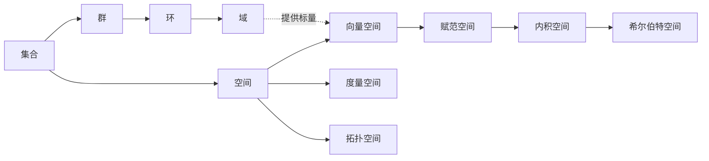

# 集合论

集合论是整个数学学科的逻辑基础。现代数学，几乎全部都是建立在集合论基础上的。

集合就是一组事物的组合，这一组事物中的每一个，都叫做这个集合的一个“元素”。一个集合可以包含有限个元素，也可以包括无限个元素。

我们可以用枚举的方式定义一个集合，比如说：

集合Ａ={1,2,3}

说的是由 1、2、3 三个自然数组成的集合。

任何一个集合的元素都是有数目的，如果两个集合之间，它们的元素可以一一对应，那么我们说它们的元素数目是相同的。所有这些相同元素数目（比如说 3 个元素）的集合构成的集合，就是这个自然数的定义。

朴素的集合论中有一个公理，叫做“无限制概括公理”，说的是：

对于任何一个性质，满足该性质的所有元素，构成一个集合。

**一个集合的元素可能包括它自己吗？**

以这个公理来看，这个问题的答案是肯定的。比如说，所有“不是爱吹牛的人”的事物构成的集合。这个集合本身，它不论是什么，反正不是一个爱吹牛人。所以它满足“不是爱吹牛的人”这个性质，它是它本身的元素。

那么我们可以这样来定义一种集合：

_所有“元素不包括自己的集合”的集合。_

我们把这个集合叫做 A，那么，A 的元素包括它自己吗？假设 A 不包括它自己，那么，A 就满足“元素不包括自己的集合”这个性质，所以它就必然包括它自己，这是个矛盾；如果我们假设 A 包括它自己呢？那么根据 A 的性质，它必然不包括它自己，也是个矛盾。

这个悖论有一个更加通俗的版本，叫做“理发师悖论”，这个悖论是这样的：

小城里的理发师放出豪言：他只为，而且一定要为，城里所有不为自己刮胡子的人刮胡子。但问题是：理发师该为自己刮胡子吗？如果他为自己刮胡子，那么按照他的豪言“只为城里所有不为自己刮胡子的人刮胡子”他不应该为自己刮胡子；但如果他不为自己刮胡子，同样按照他的豪言“一定要为城里所有不为自己刮胡子的人刮胡子”他又应该为自己刮胡子。

罗素悖论的出现，引起了数学界的一次轩然大波。以至于后来，在 ZFC 集合论中，把无限制概括公理给限制了一下，我这里就不再试图用符号逻辑表示它了，而是直接把它翻译成人话：

**对任意给定集合 A 和一个性质 P，我们可以找到 A 的子集 B，它的任何成员都是那些满足 P 的 A 的成员。**

这个公理是什么意思呢？它把无限制的概括公理加了一条限制：单独由一条性质并不能定义一个集合，这个集合的元素必须来源于另外一个集合。这样一来，**集合论就不再接受那些包括了自身的集合**了。

严格讲，罗素悖论并没有因此被解决掉，而只是被绕道而行了。这个悖论的存在，就说明了在数学中，我们不能处理某些单独由一个群体性质定义的集合。这看上去不容易理解，给定一个性质，难道我们找出所有满足这个性质的事物，不能组成一个集合吗？要知道，即使找不到任何事物满足这个性质，我们也可以组成一个不包含任何元素的集合，即空集。但是事实上，罗素悖论证明了这样做会引发矛盾。那么，我们即使可以找到满足这个性质的所有事物，这些事物的组合也并不总是可以被数学所接受，因而不能构成一个集合。罗素悖论要是那么好解决，它就不会引发第三次数学危机了。

诗曰：

横看成岭侧成峰
远近高低各不同
不识庐山真面目
只缘身在此山中

集合是数学对象的基础容器，集合是由确定的、互异的元素构成的整体，元素间无序。
代数结构是在集合上赋予运算规则的系统，复杂度逐级递增：群→环→域。
空间是定义了额外规则（如距离、内积）的集合，用于描述几何或分析性质。

