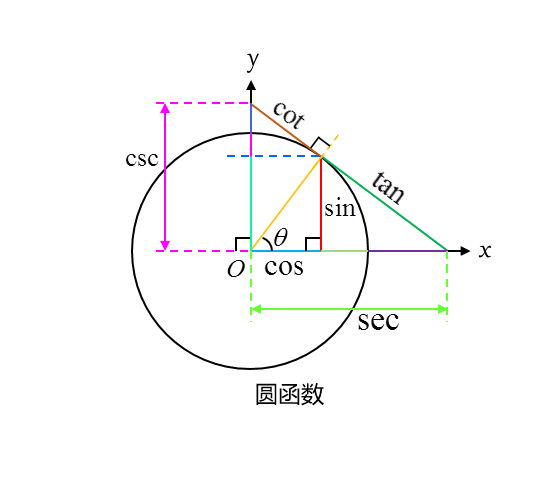

# 三角学 trigonometry

在实域内，三角函数的值可以通过单位圆上点的坐标值及相关的线段长度来定义，三角函数又称圆函数。

[正弦和余弦的函数图像](https://www.desmos.com/calculator/ogvpbi5v7j)

For $x^2+y^2=r^2$
正弦 sine function: $\sin θ = \frac{y}{r}$
余弦 cosine function: $\cos θ = \frac{x}{r}$
正切 tangent function: $\tan θ = \frac{y}{x}$
余切 cotangent function: $\cot θ = \frac{x}{y}$
正割 secant function: $\sec θ = \frac{r}{x}$
余割 cosecant function: $\csc θ = \frac{r}{y}$

#### 周期

$$
\begin{gathered}
\sin(θ+2π) = \sinθ, \quad \cos(θ+2π) = \cosθ \\
\csc(θ+2π) = \cscθ, \quad \sec(θ+2π) = \secθ \\
\tan(θ+π)=\tan θ, \quad \cot(θ+π)=\cot θ
\end{gathered}
$$

#### 余角和补角

$$
\begin{gathered}
\sin(-θ) = -\sinθ, \quad \cos(-θ) = \cosθ \\
\sin(\pi-θ) = sinθ, \quad \cos(\pi-θ) = -\cosθ \\
\sin(\frac{\pi}{2}-θ) = \cosθ, \quad \cos(\frac{\pi}{2}-θ) = \sinθ \\
\tan(\frac{\pi}{2}-θ)=\cot θ, \quad \cot(\frac{\pi}{2}-θ)=\tan θ
\end{gathered}
$$

The functions sine and cosine, tangent and cotangent, and secant and cosecant are called cofunctions of each other. Cofunctions of complementary angles are equal.

#### 基本恒等式

$$
\begin{gathered}
\sin^2θ + \cos^2θ = 1 \\
\tan^2θ + 1 = \sec^2θ \\
\cot^2θ + 1 = \csc^2θ \\
\end{gathered}
$$

#### 和角公式

$$
\begin{gathered}
\sin(α+β) = \sinα \cdot \cosβ + \cosα \cdot \sinβ \\
\cos(α+β) = \cosα \cdot \cosβ - \sinα \cdot \sinβ \\
\tan(α+β) = \frac{\tanα + \tanβ}{1 - \tanα\cdot \tanβ} \\
\sin(α+β)\sin(α-β) = \sin^2α - \sin^2β
\end{gathered}
$$

#### 差角公式

$$
\begin{gathered}
\sin(α-β) = \sinα \cdot \cosβ - \cosα \cdot \sinβ \\
\cos(α-β) = \cosα \cdot \cosβ + \sinα \cdot \sinβ \\
\tan(α-β) = \frac{\tanα - \tanβ}{1 + \tanα\cdot \tanβ}
\end{gathered}
$$

tan(α-β)可用于求两条直线的夹角。

#### 倍角公式

$$
\begin{gathered}
\sin2α = 2\sinα \cdot \cosα \\
\cos2α = \cos^2α - \sin^2α = 1 - 2\sin^2α = 2\cos^2α - 1
\end{gathered}
$$

$$
\begin{gathered}
\sin 3α = \sin(2α + α) = \sin2α\cosα+\cos2α\sinα\\
= 2\sinα \cos^2α + \cos^2α\sinα - \sin^3α  \\
= 3 \sinα \cos^2 α − \sin^3 α = 3 \sinα − 4 \sin^3 α
\end{gathered}
$$

#### 半角公式

$$
\begin{gathered}
\sin\frac{α}{2} = \pm \sqrt{\frac{1-\cosα}{2}} \\
\cos\frac{α}{2} = \pm \sqrt{\frac{1+\cosα}{2}} \\
\tan\frac{α}{2} = \dfrac{\sinα}{1+\cosα} = \dfrac{1-\cosα}{\sinα}
\end{gathered}
$$

#### 三倍角公式

$$
\sin3x = 3\sin x - 4\sin^3x
$$

$$
\cos3x = 4\cos^3x - 3\cos x
$$

### 积化和差

$$
\begin{gathered}
\sinα\sinβ=\cfrac{1}{2}[\cos(α-β)-\cos(α+β)] \\
\cosα\cosβ=\cfrac{1}{2}[\cos(α-β)+\cos(α+β)] \\
\sinα\cosβ=\cfrac{1}{2}[\sin(α+β)+\sin(α-β)] \\
\end{gathered}
$$

### 和差化积

$$
\sin x + \sin y = 2 \sin \cfrac{x+y}{2} \cos \cfrac{x-y}{2} \\
\sin x - \sin y = 2 \cos \cfrac{x+y}{2} \sin \cfrac{x-y}{2} \\
\cos x + \cos y = 2 \cos \cfrac{x+y}{2} \cos \cfrac{x-y}{2} \\
\cos x - \cos y = -2 \sin \cfrac{x+y}{2} \sin \cfrac{x-y}{2} \\
\tan x + \tan y = \cfrac{\sin (x+y)}{\cos x \cos y} \\
\tan x - \tan y = \cfrac{\sin (x-y)}{\cos x \cos y}
$$

#### 余弦定理

$$
c^2=a^2+b^2-2ab\cosγ \quad or \quad \cosγ=\frac{a^2+b^2-c^2}{2ab}
$$

#### 正弦定理

$$
\frac{\sinα}{a}=\frac{\sinβ}{b}=\frac{\sinγ}{c}=\frac{1}{2R}=\frac{2A}{abc} \quad or \quad
\begin{gathered}
a = 2R\sinα \\
b = 2R\sinβ \\
c = 2R\sinγ
\end{gathered}
$$

R 是三角形的外接圆半径, A 是三角形的面积.

$$
\sin^2 α + \sin^2 β − \sin^2 γ = 2 \sinα \sin β \cos γ
$$

#### Law of Tangents

$$
\frac{a-b}{a+b} = \frac{\tan[\frac{1}{2}(A-B)]}{\tan[\frac{1}{2}(A+B)]}
$$

#### 三角形面积

$$
A = \frac{1}{2}ab\sinγ = \frac{abc}{4R} = 2R^2\sinα \sinβ \sinγ = \frac{a+b+c}{2}\cdot r
$$

r 是三角形的内切圆半径.

海伦公式:

$$
p=\frac{a+b+c}{2}, A = \sqrt{p(p-a)(p-b)(p-c)}
$$

结合海伦公式:

$$
r = \cfrac{A}{p} = \sqrt{\frac{(p-a)(p-b)(p-c)}{p}} \\
R = \cfrac{abc}{4A} = \frac{abc}{4\sqrt{p(p-a)(p-b)(p-c)}} \\
Rr = \cfrac{abc}{4p} = \frac{abc}{2(a+b+c)}
$$

### 反三角函数

$ \sin(\arccos(x)) = \sqrt{1-x^2} $

$ \cos(\arcsin(x)) = \sqrt{1-x^2} $

$ \tan(\arcsin(x)) = \dfrac{x}{\sqrt{1-x^2}} $

$ \tan(\arccos(x)) = \dfrac{\sqrt{1-x^2}}{x} $

$ \sin(\arctan(x)) = \dfrac{x}{\sqrt{1+x^2}} $

$ \cos(\arctan(x)) = \dfrac{1}{\sqrt{1+x^2}} $

## 微积分 calculus

$ \frac{d}{dx}\sin x = \cos x $

$ \frac{d}{dx}\cos x = -\sin x $

## 双曲函数

- 基本定义

双曲函数的值也可通过双曲线和角终边上的双曲函数线的长度定义。

$$
\begin{gathered}
\sinh x = \cfrac{e^x-e^{-x}}{2} \\
\cosh x = \cfrac{e^x+e^{-x}}{2} \\
\tanh x = \cfrac{\sinh x}{\cosh x} = \cfrac{e^x-e^{-x}}{e^x+e^{-x}} \\
\end{gathered}
$$

- 与三角函数的关系

$$
\begin{gathered}
\sinh (iφ) = i\sin(φ) \\
\cosh (iφ) = \cos(φ) \\
\tanh (iφ) = i\tan(φ) \\
\end{gathered}
$$

- 恒等式、倍角公式

$$
\begin{gathered}
\cosh^2 x - \sinh^2 x = 1 \\
\sinh 2x = 2 \sinh x \cosh x \\
\cosh 2x = \cosh^2x + \sinh^2x = 1 + 2\sinh^2x = 2\cosh^2x - 1 \\
\sinh 3x = 4\sinh^3 x + 3\sinh x \\
\cosh 3x = 4\cosh^3x - 3\cosh x
\end{gathered}
$$

- 应用

悬链线的方程为双曲余弦函数，定义$a$为悬链线系数，悬链线方程为：

$$
y = a \cosh (\frac{x}{a}-1)
$$

##### 例题

$$
\cos\frac{\pi}{12}=\cos(\frac{3\pi}{12}-\frac{2\pi}{12})=\cos(\frac{\pi}{4}-\frac{\pi}{6})=\cos\frac{\pi}{4}\cos\frac{\pi}{6}+\sin\frac{\pi}{4}\sin\frac{\pi}{6}\\
=\frac{\sqrt2}{2}\cdot\frac{\sqrt3}{2}+\frac{\sqrt2}{2}\cdot\frac{1}{2}=\frac{1}{4}(\sqrt6+\sqrt2)
$$

$$
\cos\frac{\pi}{12}=\cos(\frac{1}{2}\cdot\frac{\pi}{6})=\sqrt{\frac{1+\cos\frac{\pi}{6}}{2}}=\sqrt{\frac{1+\frac{\sqrt3}{2}}{2}}=\sqrt{\frac{2+\sqrt3}{4}}=\frac{\sqrt{2+\sqrt3}}{2}
$$
