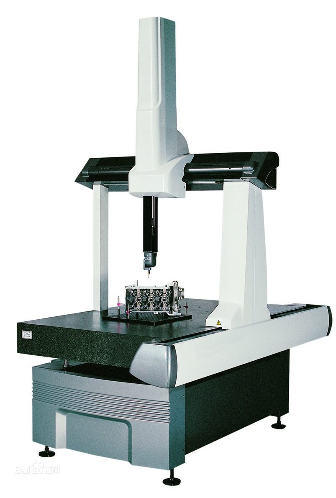
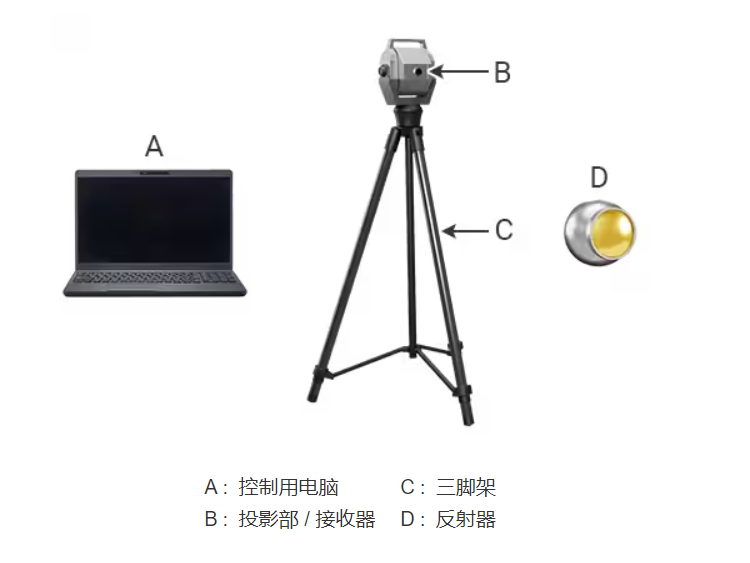

## 三坐标测量机

三坐标测量机 Coordinate Measuring Machine, 简称 CMM，自六十年代中期第一台三坐标测量仪问世以来，随着计算机技术的进步以及电子控制系统、检测技术的发展，为测量机向高精度、高速度方向发展提供了强有力的技术支持。
CMM 按测量方式可分为接触测量和非接触测量以及接触和非接触并用式测量，接触测量常于测量机械加工产品以及压制成型品、金属膜等。

三坐标测量机一般由以下几个部分组成：
1、主机机械系统（X、Y、Z 三轴或其它）；
2、 测头系统；
3、 电气控制硬件系统；
4、 数据处理软件系统（测量软件）；

## 影像测量仪

影像测量仪是一种由高解析度 CCD 彩色镜头、连续变倍物镜、彩色显示器、视频十字线显示器、精密光栅尺、多功能数据处理器、数据测量软件与高精密工作台结构组成的高精度光学影像测量仪器。

影像测量仪是基于机器视觉的自动边缘提取、自动理匹、自动对焦、测量合成、影像合成等人工智能技术，具有点哪走哪自动测量、 CNC 走位自动测量、自动学习批量测量的功能，影像地图目标指引，全 视场鹰眼放大等优异的功能。同时，基于机器视觉与微米精确控制下的自动对焦过程，可以满足清晰影像下辅助测量需要，亦可加入触点测头完成坐标测量。

全自动影像测量仪，是在数字化影像测量仪 (又名 CNC 影像仪) 基础上发展起来的人工智能型现代光学非接触测量仪器。其承续了数字化仪器优异的运动精度与运动操控性能，融合机器视觉软件的设计灵性，属于当今最前沿的光学尺寸检测设备。

## 近景摄影测量系统

近景摄影测量又称移动视觉测量，利用严格标定的高分辨率相机在不同测站位姿下拍摄标记点，通过亚像素级别的精密图像处理得到被测标记点在图像上的坐标，根据相机成像模型并利用光束平差优化原理计算被测量标记点的坐标。
近景摄影测量精度高且抗干扰能力强，适用于较恶劣的现场环境中。
例如 GSI 公司的 V-STARS 系统，精度可以到达 5μm+5μm /m；德国 AICON 公司的 DPA-PRO 测量系统，精度可以达到 0.02mm/m；德国 GOM 公司的 TRITOP 测量系统，精度可以达到 0.03mm/m。

## 全站仪

全站仪作为一种球坐标测量系统，一般依靠基于相位测量的激光飞行时间（ToF）法测距。其工作模式为单点式测量，测距精度较低，且无法实现动态跟踪，并且需要人工对被测目标进行观测瞄准，自动化程度低。
例如 Leica TDRA 6000 激光全站仪在使用角锥棱镜合作目标时，在 35m 范围内三维点坐标测量精度为 0.25mm。

## 激光跟踪仪

激光跟踪仪是空间大尺寸三维坐标测量仪器，是一台以激光为测距手段配以反射靶标的仪器，它同时配有绕两个轴转动的测角机构，形成一个完整的球坐标测量系统。主要用于百米大尺度空间三维坐标的精密测量，用于大型零件加工检验、部件组装、型面检测、机器人姿态调整以及动态跟踪，在航空航天、轨道交通、汽车船舶、大型装备、机器人、高等院校中有着广泛应用。激光跟踪仪主要功能之一就是大尺寸形位公差测量，因为被称之为大尺寸测量利器。

激光跟踪仪可以测量目标点距离和水平、垂直方向偏转角。其基本原理是在目标位置上安置一个反射器，激光跟踪头发出的激光射到反射器上并返射回到跟踪头，当目标移动时，跟踪头调整光束方向来对准目标。同时，返回光束为检测系统所接收，用来测算目标的空间位置。总之，激光跟踪仪是通过测量一个在目标点上放置的反射器的位置，进而确定目标点的空间坐标。

激光跟踪仪同样作为一种球坐标测量系统，通过激光干涉原理（提供精密的相对距离）结合基于相位测量的激光飞行时间法（提供绝对距离）测距，在测量精度、测量范围等方面有较强的优势。
如 Leica 的 AT901-LR 的在激光干涉原理下测长精度为 0.5μm/m，测角精度为 15μm+6μm /m。

激光跟踪仪由于其灵活性，对现场环境适应能力强，适用于批量不大的大型构件检测，广泛应用于重型机械、飞机、汽车、船舶等多个行业。
但激光跟踪仪在使用时需要手动引导角锥反射球（SMR），测量效率低。

GTS 系列激光跟踪仪
测量范围：测量半径 80 米，水平方向 ±360°，垂直方向 - 145° ～+145°
干涉测距精度：±0.5μm/m
绝对测距精度：±10μm（全程）
水平仪精度：±2.0"
目标自锁距离：60m

## 激光干涉仪

激光干涉仪是以激光波长为已知长度、利用迈克耳逊干涉系统丈量位移的通用长度丈量工具，是校准数控机床、坐标测量机、测长机、电动滑台、线性模组及其它定位装置精度及线性指标最常用的标准仪器。

SJ6000 激光干涉仪主要参数：

稳频精度：±0.05ppm
测量精度：±0.5ppm
线性测量距离：（0 ～ 80）m （无需远距离线性附件）
测量分辨力：1nm
