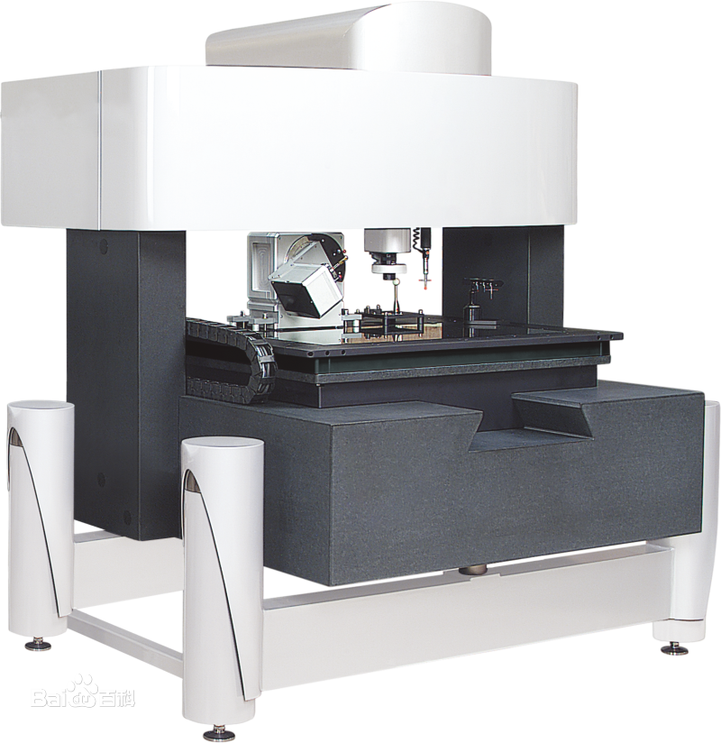

## 国际单位制

国际单位制（缩写 SI），是现代科学和工程中使用的标准化单位体系。它基于七个基本单位，这些基本单位通过物理常数定义，并且可以组合成各种导出单位，以满足不同测量需求。核心逻辑是先确定常数，再反推单位。

### 七个基本单位的定义 (2019 版本)
⏱️ 秒 (Second, s) —— 时间
依据常数： 铯 - 133 原子基态的超精细能级跃迁频率 ($\Delta \nu_{Cs}$) 
定义： 1 秒是铯 - 133 原子在基态的两个超精细能级之间跃迁时，所辐射电磁波周期的 9 192 631 770 倍的时间长度。
意义： 这是所有单位的基石，因为频率测量是目前人类能做到的最高精度测量。

📏 米 (Meter, m) —— 长度
依据常数： 真空中的光速 ($c$) 
定义： 取光速 $c$ 的数值为 299 792 458 m/s。
解释： 1 米就是光在真空中于 1/299 792 458 秒内行进的距离。
注意： 它的定义依赖于 “秒”。

⚖️ 千克 (Kilogram, kg) —— 质量
依据常数： 普朗克常数 ($h$) 
定义： 取普朗克常数 $h$ 的数值为 $6.62607015 \times 10^{-34}$ $\text{J}\cdot\text{s}$。
$1\text{J}\cdot\text{s} = 1 \text{kg}\cdot\text{m}^2/s^2$
解释： 这是一个量子力学常数。通过质能方程 $E=mc^2$ 和光子能量公式 $E=h\nu$，我们将质量与频率（时间）和光速（长度）联系起来。实际上，现在是用 **基布尔天平（Kibble Balance）** 通过电磁力来复现千克。

⚡ 安培 (Ampere, A) —— 电流
依据常数： 基本电荷 ($e$) 
定义： 取基本电荷量 $e$ 的数值为 $1.602176634 \times 10^{-19}$ C（库仑）。
解释： 1 安培就是每秒钟通过 $1/(1.602176634 \times 10^{-19})$ 个电子的电流强度。这比过去用 “无限长平行导线受力” 的定义要精确和实用得多。

🌡️ 开尔文 (Kelvin, K) —— 热力学温度
依据常数： 玻尔兹曼常数 ($k$) 
定义： 取玻尔兹曼常数 $k$ 的数值为 $1.380649 \times 10^{-23}$ $\text{J}\cdot\text{K}^{-1}$。
解释： 温度本质上是微观粒子热运动的能量。这个定义直接将温度与能量（焦耳）挂钩，不再依赖水的三相点。

🧪 摩尔 (Mole, mol) —— 物质的量
依据常数： 阿伏伽德罗常数 ($N_A$) 
定义： 取阿伏伽德罗常数 $N_A$ 的数值为 $6.02214076 \times 10^{23}$ $\text{mol}^{-1}$。
解释： 1 摩尔精确包含 $6.02214076 \times 10^{23}$ 个基本单元（原子、分子等）。它不再依赖于 “0.012 千克碳 - 12 所含的原子数”，变成了一个单纯的计数单位。

🕯️ 坎德拉 (Candela, cd) —— 发光强度
依据常数： 频率为 $540 \times 10^{12}$ Hz 单色辐射的光视效能 ($K_{cd}$) 
定义： 定义该频率光辐射的光视效能为 683 $\text{lm}\cdot\text{W}^{-1}$。
解释： 这是唯一一个与人类感知（人眼对绿光的敏感度）相关的基本单位。它将物理上的辐射功率（瓦特）转化为生物学上的视觉强度（流明 / 坎德拉）。

计量用的 硅同位素球（Si-28 Avogadro Sphere）制造极难（世界只有 2–3 颗）相对不确定度 ~10⁻⁸
   1. 用干涉仪测球的直径 → 得到体积 V
   1. 用 X 射线干涉仪测晶格常数 a → 得到单原子体积
   1. 用质量比较仪测球的质量 m
   1. 用表面分析扣除氧化层体积和质量
   1. 用晶胞公式计算原子数 $N = 8V / a^3$

在 2019 年前用于确定阿伏伽德罗常数，2019 年后作为对 SI 基本常数（NA、kg）的最高精度验证装置，独立测量千克，与 Kibble Balance 方法比对验证 SI 是否自洽。

法拉第常数（F）是每摩尔电子所携带的电荷，$F = e N_A = 96485.33289±0.00059$ C / mol
此值是由美国国家标准局所依据的电解实验得到的。

## 三坐标测量机

三坐标测量机 Coordinate Measuring Machine, 简称 CMM，自六十年代中期第一台三坐标测量仪问世以来，随着计算机技术的进步以及电子控制系统、检测技术的发展，为测量机向高精度、高速度方向发展提供了强有力的技术支持。
CMM 按测量方式可分为接触测量和非接触测量以及接触和非接触并用式测量，接触测量常于测量机械加工产品以及压制成型品、金属膜等。

三坐标测量机一般由以下几个部分组成：
1、主机机械系统（X、Y、Z 三轴或其它）；
2、 测头系统；
3、 电气控制硬件系统；
4、 数据处理软件系统（测量软件）；

## 影像测量仪

影像测量仪是一种由高解析度 CCD 彩色镜头、连续变倍物镜、彩色显示器、视频十字线显示器、精密光栅尺、多功能数据处理器、数据测量软件与高精密工作台结构组成的高精度光学影像测量仪器。

影像测量仪是基于机器视觉的自动边缘提取、自动理匹、自动对焦、测量合成、影像合成等人工智能技术，具有点哪走哪自动测量、 CNC 走位自动测量、自动学习批量测量的功能，影像地图目标指引，全 视场鹰眼放大等优异的功能。同时，基于机器视觉与微米精确控制下的自动对焦过程，可以满足清晰影像下辅助测量需要，亦可加入触点测头完成坐标测量。

全自动影像测量仪，是在数字化影像测量仪 (又名 CNC 影像仪) 基础上发展起来的人工智能型现代光学非接触测量仪器。其承续了数字化仪器优异的运动精度与运动操控性能，融合机器视觉软件的设计灵性，属于当今最前沿的光学尺寸检测设备。

## 近景摄影测量系统

近景摄影测量又称移动视觉测量，利用严格标定的高分辨率相机在不同测站位姿下拍摄标记点，通过亚像素级别的精密图像处理得到被测标记点在图像上的坐标，根据相机成像模型并利用光束平差优化原理计算被测量标记点的坐标。
近景摄影测量精度高且抗干扰能力强，适用于较恶劣的现场环境中。
例如 GSI 公司的 V-STARS 系统，精度可以到达 5μm+5μm /m；德国 AICON 公司的 DPA-PRO 测量系统，精度可以达到 0.02mm/m；德国 GOM 公司的 TRITOP 测量系统，精度可以达到 0.03mm/m。

## 全站仪

全站仪作为一种球坐标测量系统，一般依靠基于相位测量的激光飞行时间（ToF）法测距。其工作模式为单点式测量，测距精度较低，且无法实现动态跟踪，并且需要人工对被测目标进行观测瞄准，自动化程度低。
例如 Leica TDRA 6000 激光全站仪在使用角锥棱镜合作目标时，在 35m 范围内三维点坐标测量精度为 0.25mm。

## 激光跟踪仪

激光跟踪仪是空间大尺寸三维坐标测量仪器，是一台以激光为测距手段配以反射靶标的仪器，它同时配有绕两个轴转动的测角机构，形成一个完整的球坐标测量系统。主要用于百米大尺度空间三维坐标的精密测量，用于大型零件加工检验、部件组装、型面检测、机器人姿态调整以及动态跟踪，在航空航天、轨道交通、汽车船舶、大型装备、机器人、高等院校中有着广泛应用。激光跟踪仪主要功能之一就是大尺寸形位公差测量，因为被称之为大尺寸测量利器。

激光跟踪仪可以测量目标点距离和水平、垂直方向偏转角。其基本原理是在目标位置上安置一个反射器，激光跟踪头发出的激光射到反射器上并返射回到跟踪头，当目标移动时，跟踪头调整光束方向来对准目标。同时，返回光束为检测系统所接收，用来测算目标的空间位置。总之，激光跟踪仪是通过测量一个在目标点上放置的反射器的位置，进而确定目标点的空间坐标。

激光跟踪仪同样作为一种球坐标测量系统，通过激光干涉原理（提供精密的相对距离）结合基于相位测量的激光飞行时间法（提供绝对距离）测距，在测量精度、测量范围等方面有较强的优势。
如 Leica 的 AT901-LR 的在激光干涉原理下测长精度为 0.5μm/m，测角精度为 15μm+6μm /m。

激光跟踪仪由于其灵活性，对现场环境适应能力强，适用于批量不大的大型构件检测，广泛应用于重型机械、飞机、汽车、船舶等多个行业。
但激光跟踪仪在使用时需要手动引导角锥反射球（SMR），测量效率低。

GTS 系列激光跟踪仪
测量范围：测量半径 80 米，水平方向 ±360°，垂直方向 - 145° ～+145°
干涉测距精度：±0.5μm/m
绝对测距精度：±10μm（全程）
水平仪精度：±2.0"
目标自锁距离：60m

## 激光干涉仪

激光干涉仪是以激光波长为已知长度、利用迈克耳逊干涉系统丈量位移的通用长度丈量工具，是校准数控机床、坐标测量机、测长机、电动滑台、线性模组及其它定位装置精度及线性指标最常用的标准仪器。

SJ6000 激光干涉仪主要参数：

稳频精度：±0.05ppm
测量精度：±0.5ppm
线性测量距离：（0 ～ 80）m （无需远距离线性附件）
测量分辨力：1nm

好的，我们来推导一下相位式 ToF (Time-of-Flight) 激光雷达要达到 1mm 测距精度（这里更准确地说是分辨率）所需的调制频率。

基本原理

相位式 ToF 激光雷达通过发射一束强度随时间周期性调制（通常是正弦波）的激光，然后测量发射波和接收到的反射波之间的相位差（$ \Delta \phi $）来计算距离。

设激光的调制频率为 $ f $ (Hz)。
调制信号的波长为 $ \lambda_{mod} = \frac{c}{f} $，其中 $ c $ 是光速 (约为 $ 3 \times 10^8 $ m/s)。
激光从雷达到目标再返回，走过的总距离是 $ 2d $，其中 $ d $ 是雷达到目标的单程距离。
接收到的信号相对于发射信号的相位延迟 $ \Delta \phi $ (以弧度为单位) 与往返距离 $ 2d $ 的关系是： $ \Delta \phi = \frac{2d}{\lambda_{mod}} \times 2\pi $
将 $ \lambda_{mod} = c/f $ 代入： $ \Delta \phi = \frac{2d}{c/f} \times 2\pi = \frac{4\pi f d}{c} $
推导精度与频率的关系

我们关心的是距离测量的精度（或分辨率）$ \Delta d $ 与相位测量精度 $ \Delta \phi_{err} $ 之间的关系。对上面的公式两边取微分（或者考虑微小变化量）：

$ \Delta (\Delta \phi) = \frac{4\pi f}{c} \Delta d $

令 $ \Delta (\Delta \phi) $ 为系统能够分辨的最小相位差，即相位测量精度 $ \Delta \phi_{err} $，令 $ \Delta d $ 为对应的距离分辨率（我们希望它达到 1mm）。

$ \Delta \phi_{err} = \frac{4\pi f}{c} \Delta d $

整理得到距离分辨率 $ \Delta d $ 的表达式：

$ \Delta d = \frac{c}{4\pi f} \Delta \phi_{err} $

或者，整理得到所需调制频率 $ f $ 的表达式：

$ f = \frac{c}{4\pi \Delta d} \Delta \phi_{err} $

关键因素：相位测量精度 $ \Delta \phi_{err} $

从上式可以看出，要达到目标距离分辨率 $ \Delta d = 1 $ mm ($ 0.001 $ m)，所需的调制频率 $ f $ 直接取决于系统能够达到的相位测量精度 $ \Delta \phi_{err} $。相位测量精度是衡量系统分辨细微相位差异能力的关键指标。

相位测量精度通常用一个周期的多少分之一来表示，或者用度或弧度表示。例如：

如果系统能分辨周期的 1/1000，则 $ \Delta \phi_{err} = \frac{2\pi}{1000} $ 弧度 (或 0.36 度)。
如果系统能分辨周期的 1/3600，则 $ \Delta \phi_{err} = \frac{2\pi}{3600} $ 弧度 (或 0.1 度)。
计算所需频率

现在我们将 $ \Delta d = 0.001 $ m 和 $ c \approx 3 \times 10^8 $ m/s 代入频率公式：

$ f = \frac{3 \times 10^8}{4\pi \times 0.001} \Delta \phi_{err} \approx \frac{3 \times 10^8}{0.012566} \Delta \phi_{err} \approx 2.387 \times 10^{10} \times \Delta \phi_{err} $ (Hz)

接下来，我们根据假设的相位测量精度来计算具体的频率值：

假设相位精度为周期的 1/1000 ($ \Delta \phi_{err} = 2\pi / 1000 \approx 0.00628 $ 弧度):
$ f \approx 2.387 \times 10^{10} \times \frac{2\pi}{1000} \approx 2.387 \times 10^{10} \times 0.00628 $
$ f \approx 1.5 \times 10^8 $ Hz = 150 MHz

假设相位精度为周期的 1/3600 ($ \Delta \phi_{err} = 2\pi / 3600 \approx 0.001745 $ 弧度):
$ f \approx 2.387 \times 10^{10} \times \frac{2\pi}{3600} \approx 2.387 \times 10^{10} \times 0.001745 $
$ f \approx 4.167 \times 10^7 $ Hz = 41.67 MHz

假设一个较低的相位精度，例如周期的 1/500 ($ \Delta \phi_{err} = 2\pi / 500 \approx 0.01256 $ 弧度):
$ f \approx 2.387 \times 10^{10} \times \frac{2\pi}{500} \approx 2.387 \times 10^{10} \times 0.01256 $
$ f \approx 3.0 \times 10^8 $ Hz = 300 MHz

结论

推导公式为：$ f = \frac{c}{4\pi \Delta d} \Delta \phi_{err} $
要达到 1mm 的测距分辨率 ($ \Delta d = 0.001 $ m)，所需的调制频率 $ f $ 并非一个固定值，它**强烈依赖于系统的相位测量精度 $ \Delta \phi_{err} ∗∗。∗如果系统的相位测量精度很高（例如能分辨周期的1/3600或0.1度），则可以在较低的调制频率下（例如约42MHz）达到1mm的分辨率。∗如果系统的相位测量精度较低（例如只能分辨周期的1/1000或0.36度），则需要更高的调制频率（例如150MHz）才能达到1mm的分辨率。∗实际应用中，还需要考虑信噪比(SNR)、积分时间、目标表面反射特性、环境光干扰、电子学噪声和时钟抖动等因素，这些都会影响最终的实际测量精度。高频调制通常也意味着更短的无模糊距离（ d_{unambiguous} = c / (2f) $），因此常采用多频调制等技术来解决测程问题。