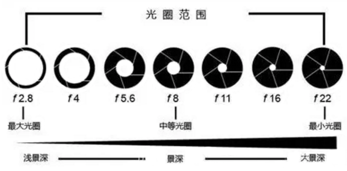
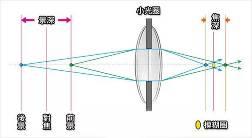
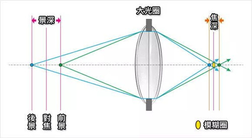

# 光学

Kepler 开普勒 首次正确地解释了人眼的工作原理，解释了近视和远视，指出视网膜上形成图像是倒置的。
Galileo 伽利略 建造了望远镜，观察了木星以及木星的四颗主要卫星。
Willebrord Snell 威理博·斯涅尔 在 1621 年发现了光的正弦折射定律。
Fermat 费马 提出了光线遵循最短的时间的路径。
Descartes 笛卡尔 用一头死牛的眼睛做了一个实验，刮掉它的视网膜，发现图像确实是颠倒的。
Newton(1642—1727) 牛顿 提出了光的粒子理论，做了棱镜的色散实验。
Huygens 惠更斯 提出了光的波动理论。利用木星卫星的日食数据得到了第一个合理的光速值。
Thomas Young 托马斯 · 杨在 1797 年至 1799 年间在剑桥进行的光干涉实验为波动理论提供了重要的证据。意识到色觉是由于眼睛拥有感受器，每个感受器对红、绿、蓝三种颜色中的一种很敏感。
Fresnel 菲涅耳 提出了一个解释衍射的数学理论。
Poisson 泊松 推导当光线以稍微倾斜的角度穿过不透明圆形屏幕时的阴影中心会有一个亮斑。
Fraunhofer 弗朗合费 数学上计算出由圆孔产生的衍射图样。
Maxwell 麦克斯韦 意识到电磁现象与光有关，完成了对光的经典理解。
Fizeau 斐索 用一个有 720 个齿的旋转轮将光束分解成一系列脉冲计算光速。每秒 30 万公里，误差为每秒 1000 公里。
Kirchhoff 基尔霍夫 通过燃烧的物质观察到光源光谱中的暗线。

Lagrange(1736–1813) 拉格朗日 创立二次型论，拉格朗日中值定理，拉格朗日力学等。
Hamilton(1805–1865) 哈密顿 重新表述了牛顿力学，创立被称为哈密顿力学的力学表述，因为发现四元数而闻名。

With the invention of the telescope and microscope there was a great deal of experimentation with lens shapes in the 17th and early 18th centuries by those trying to correct chromatic errors seen in lenses.

Optical theory on refraction and experimentation was showing no single-element lens could bring all colours to a focus. This led to the invention of the compound achromatic lens by Chester Moore Hall in England in 1733.

## Spherical lenses: two surfaces are parts of the surfaces of spheres.

The focal length of a lens in air can be calculated from the lensmaker's equation:

$$\frac{1}{f}=(n-1)[\frac{1}{R_1}-\frac{1}{R_2}+\frac{(n-1)d}{nR_1R_2}]$$

Spherical aberration occurs because spherical surfaces are not the ideal shape for a lens, but are by far the simplest shape to which glass can be ground and polished, and so are often used.

Coma, or comatic aberration, occurs when an object off the optical axis of the lens is imaged. In general, a bundle of parallel rays passing through the lens at a fixed distance from the centre of the lens are focused to a ring-shaped image in the focal plane, known as a comatic circle.

Chromatic aberration is caused by the dispersion of the lens material—the variation of its refractive index, n, with the wavelength of light. Since, from the formulae above, f is dependent upon n, it follows that light of different wavelengths is focused to different positions. Chromatic aberration of a lens is seen as fringes of colour around the image.

Other kinds of aberration include field curvature, barrel and pincushion distortion, and astigmatism.

An aplanatic lens is a lens that is free of both spherical and coma aberrations. Aplanatic lenses can be made by combining two or three lens elements.

A single-element aplanatic lens is an aspheric lens whose surfaces are surfaces of revolution of a cartesian oval.

### 小孔成像公式

$ \frac{f}{do} = \frac{hi}{ho} $

$ hi = f \frac{ho}{do} $

### 薄透镜成像公式

$ \frac{1}{f} = \frac{1}{do} + \frac{1}{di} $

f 焦距
do 物距
di 像距

#### 透镜成像规律

规律 1：当物距大于 2 倍焦距时，则像距在 1 倍焦距和 2 倍焦距之间，成倒立、缩小的实像。此时像距小于物距，像比物小，物像异侧。
应用：照相机、摄像机。

规律 2：当物距等于 2 倍焦距时，则像距也在 2 倍焦距， 成倒立、等大的实像。此时物距等于像距，像与物大小相等，物像异侧。

规律 3：当物距小于 2 倍焦距、大于 1 倍焦距时，则像距大于 2 倍焦距， 成倒立、放大的实像。此时像距大于物距，像比物大，像位于物的异侧。
应用：投影仪、幻灯机、电影放映机。

规律 4：当物距等于 1 倍焦距时，则不成像，成平行光射出。

规律 5：当物距小于 1 倍焦距时，则成正立、放大的虚像。此时像距大于物距，像比物大，物像同侧。
应用：放大镜。

## 照相机

当平行光线穿过透镜时，会汇聚到一点上，这个点叫做焦点。从光心（凸透镜的中心）到焦点的距离，叫焦距。

对焦是移动镜片位置调整像距使相机能清晰成像的的过程；而合焦是一个结果，指的是在传感器上形成清晰的图像。

相机有自动对焦和手动对焦之分，自动对焦是相机利用红外、超声波、激光精确测距后以及图像处理等方式，自动移动镜片来实现聚焦。

变焦，是改变镜头的焦距，从而造成视角或图像大小的变化，获取拉近或拉远的效果。通常是通过镜头组合的变化实现的。
焦距越长，视角越窄，画面中能容纳的景象就少，画面看起来越近。焦距越短，视角越大，画面中能容纳的景物就多，画面看起来较远。

一般的拍摄步骤是先变焦确定拍摄范围，然后对焦使主体清晰。对焦操作改变的是像距。

短焦距镜头视野范围大，也叫做广角镜头；长焦距镜头视野范围小；标准焦距镜头的视野范围就如同我们的眼睛所见一般。
广角镜拍出来的人脸显得尖瘦，焦距过长又使脸看起来扁平。这也就是拍人像的镜头以 50mm-135mm 为主的原因，这个焦距区间的照片脸部变形最不明显。
这些变形都是因为相机与拍摄物体的距离而引起了透视关系的变化。

焦距除了决定视野范围、间接带来画面变形外，还与光圈共同决定了景深的大小。在同样光圈下，焦距越短，景深也就越大，虚化越少；焦距越长，景深越浅，虚化越强。

光圈是镜头里调节进光孔大小的装置，由镜头内部的光圈叶片构成。调整光圈大小可控制进光量。
光圈一般用 F 值来表示，例如 F1.2、F4、F10 等等。光圈的大小与数值成反比，例如 F1.2 就是大光圈，F16 就是小光圈。
大光圈镜头的价钱很贵，光圈大一级，镜片就大很多，加工难度大。镜头在中等光圈的时候成像最好（图片最清晰），我们称成像最好的那档光圈为最佳光圈。
光圈是决定景深大小最重要的因素，光圈小，景深大，光圈大，景深浅。

一般而言，照相机拍摄物体的距离比较远，像距近似等于镜头焦距 f，像的面积是与像距的平方成正比，通光面积与光圈直径 d 的平方成正比。
所以，像面接收到的光强正比于$(\frac{d}{f})^2$，$\frac{d}{f}$叫做相对孔径。相对孔径的倒数$\frac{f}{d}$，称之为 F 数，也叫光圈数。
例如，F 数等于 5.6 记作 F/5.6，表示镜头的焦距等于光圈直径的 5.6 倍。
F 数还能表征镜头的分辨率，F 数越小，能分辨两点间的距离越小，即分辨率越高。因为圆孔最小衍射角为：
$$ θ_0 = \frac{λ}{d} $$

光圈的大小直接影响着景深，用大光圈拍摄，焦平面上的被摄物清晰，而焦外模糊（也就是人们常说的虚化）。
小景深适用于微距摄影，会产生很棒的画面效果。相反，如果你想拍摄的是大范围的景色，例如山峰，田野或是大海，你可以选择大景深，使整幅画面达到清晰一致，采用较小的光圈时景深的范围比较广，可以使远处和近处的景物都清晰。

光圈优先就是手动定义光圈的大小，相机会根据光圈值确定快门速度。
大光圈镜头的制造工艺要求更高（大光圈时对边缘像场减小畸变的要求更高），在畸变差异不大的前提下，往往最大光圈越大，其价格也就越高。

快门是相机里控制曝光时间的装置。 快门有机械快门，电子快门，以及电子机械联合快门等很多种类。
快门速度越快，曝光时间越短。曝光时间短到曝光不足时，可使用三脚架来固定相机，避免抖动，延长曝光时间。
在使用 135 相机拍摄的时候有一个 手持相机拍摄的安全速度原则：安全速度是焦距的倒数，如果使用 35mm 镜头，快门速度不得低于 1/35 秒，使用 200mm 镜头时速度不得低于 1/200 秒，否则图片就可能糊了。

## 摄像机

2019 年 4 月，信息科学与工程学院、工程与应用技术研究院徐敏研究员团队的 “大视场低畸变高分辨率全景视觉系统”发明成果在 360° 全景视觉系统的光学设计上提出了新型的物象关系，使其光学系统具有大视场、低畸变、高分辨率的成像特征；在制造工艺上解决了内折反自由面镜片的加工和镀膜难点。和传统全景周视相机比较，具有畸变控制、性价比、实时性、小型化和高精度定位等的竞争优势。可以为机器人视觉、医学内窥镜观察、无人机预警、管道检测、全方位监控、虚拟现实等领域提供最佳的视觉成像解决方案。

滚动快门不能保证开始与结束记录光线的时间完全相同。在这种情况下，快速移动的物体就会出现倾斜或者剪断的效果，当相机移动很快时，就会出现果冻效应，尤其是当相机处于横摇状态、物体快速通过、高快门速度、跑或者枪之类的镜头时会非常明显。闪光灯也很有可能只会照亮画面中的一部分区域。

全局快门需让所有的光线同时进入到感光元件上。在任何指定的时间点，这些元件要么同时开启，要么同时关闭。全局快门是被公认为最适合拍摄动态物体的快门。它可以有效地避免滚动快门的问题。

面阵相机是以 “面” 为单位来进行图像采集的成像工具，可以在短时间内曝光、一次性获取完整的目标图像。线阵相机的传感器只有一行感光像素，所以线阵相机一般具有非常高的扫描频率和分辨率。

相机软件接口

- Generic Interface for Cameras standard
  GenICam 提供了一种普遍适用的软件界面。它为包括 GigE Vision、USB 3.0 Vision、Camera Link ® 和 IEEE 1394 在内的各种标准接口（涵盖所有相机类型和图像格式）提供了一个端到端配置接口。这种方法方便连接符合 GenICam 标准的相机，无需对相机进行特定配置。
- USB3 Vision
  符合 GenICam 协议，连接线增加了螺丝固定。
- USB video class or UVC
  UVC v1.5 supports transmission of compressed video streams, including MPEG-2 TS, H.264, MPEG-4 SL SMPTE VC1 and MJPEG.

相机数据接口

- Camera Link
  Camera Link (CL)提供从 100 MB/s 到约 800 MB/s 的数据传输速率。
  Camera Link HS (CLHS)数据传输速率提高到了 1,200 to 80,000 MB/s，线材长度可达几百米。

- CoaXPress | CXP
  CoaXPress 1.0/1.1 标准的接口所支持的数据率最高可达 6.25 Gbps，
  CoaXPress 2.0 标准的传输速度比它快两倍，最高可达 12.5 Gbps。
  将信号触发和供电模式 (power over CXP) 相结合之后，只需一根 CoaXPress 电缆，即可实现 40 m 的最大电缆长度。

- USB 3.0
  USB 3.1 Gen 1 传输带宽高达 350 MB/s。
  USB 3.1 Gen 2 也被称为 USB Superspeed+，这款产品提供的最大带宽值甚至高于上一代的技术。

- 千兆网（GigE）
  传输速率高达 100MB / 秒、线材长度可达 100 米。
  千兆网（GigE） 相机可以使用以太网实现供电 (PoE)，即 通过数据线获取电力。而系统装置为了这一工作需要合适的千兆网线材方可实现。

相机镜头接口

工业相机的镜头接口从大的分类来看，可以分为螺纹接口和卡口两类。
螺纹接口这个类别中，最常用的是 C，CS，M12，M42，M58 这五种。

- C 口：螺纹接口直径为 24.5 mm（1 英寸），每英寸 32 牙。镜头接口的法兰与图像平面的距离是 17.526 mm（0.69 英寸）。
- CS 口：类似于 C 口，区别是法兰与图像平面的距离较短，为 12.526 mm（0.493 英寸）。通过使用 5 mm 垫圈（C-CS 适配器），C 口镜头也可以用于 CS 口相机。
- M12 接口，指的是接口直径是 12mm（同理，M42 的直径是 42mm，M58 是 58mm，一般用在大靶面的工业相机甚至线扫相机上）。

所谓法兰距，也叫做像场定位距离，是指机身上镜头卡口平面与机身曝光窗平面之间的距离，即镜头卡口到感光元件（一般是 CMOS 或 CCD）之间的距离。

单反相机基本上用的都是卡口，最常见的是尼康的 F 口和佳能的 EF 口等等。最大的区别是法兰距不同：F 接口镜头的法兰距比 EF 接口要长。
如果您的相机是 EF 接口的，加装一个转接环，即可使用 F 接口的镜头。
在工业相机这个特定领域，尼康 F 接口最为常见。

- F 口：卡口环直径 47mm，法兰距 46.5mm。
- EF 口：卡口环直径 54mm，法兰距 44.0mm。

相机感光芯片
芯片尺寸单位为英寸，但此数据对应芯片对角线长度，1 英寸为 16mm，而不是 25.4mm。这是因历史原因形成的。

线对数 (Line pairs)
每毫米线对一般指分辨率的单位，指仪器在一毫米内能分辨出多少对线。
在一定尺度内的可分辨线对数常被用来衡量仪器的空间分辨能力，能分辨的线对数越多，其能分辨每根线的宽度也越小，其分辨能力也越好。
工业镜头的分辨率是指在成像平面上 1 毫米间距内能分辨开的黑白相间的线条对数，单位是 “线对 / 毫米 "（lp/mm，line-pairs/mm）。
比如一个工业相机标出感光元的尺寸是 4um，那么所选镜头的极限分辨率线宽（白线或黑线）也应该是 4um，一对黑线白线的宽度 2x0.004mm，镜头的分辨率就是 1/（2×0.004）=125lp/mm。
用于 MTF 时，再乘以 0.67。

## 感光芯片

- CCD（Charge-coupled Device，电荷耦合元件，或称为 CCD 图像传感器）

在 1975 年数码相机发明以前，人们记录影像的方式是使用胶片。
维纳德 • 波利（Willard S. Boyle）和乔治 • 史密斯（George E. Smith）在 1969 年发明了 CCD 技术，因此获得了 2009 年诺贝尔物理学奖。
CCD 在刚发明时分辨率非常低，信噪比很差，根本派不上实际用场。
在接下来的时间里，成百上千的科学家和工程师努力奋斗，逐步将 CCD 推向实用化。
进入 90 年代后，CCD 应用于分辨成像，广泛应用于专业电子照相、空间探测、X 射线成像及其他科研领域。

CCD 图像传感器是按一定规律排列的 MOS（金属—氧化物—半导体）电容器组成的阵列。
在 P 型或 N 型硅衬底上生长一层很薄（约 120nm）的二氧化硅,再在二氧化硅薄层上依次序沉积金属或掺杂多晶硅电极（栅极），形成规则的 MOS 电容器阵列，再加上两端的输入及输出二极管就构成了 CCD 芯片。

- CMOS（Complementary Metal-Oxide-Semiconductor Image Sensor，CIS）

1998 年，CMOS 图像传感器诞生了。CMOS 的光电信息转换功能与 CCD 的基本相似，区别就在于这两种传感器的光电转换后信息传送的方式不同。CMOS 具有读取信息的方式简单、输出信息速率快、耗电少(仅为 CCD 芯片的 1/10 左右)、体积小、重量轻、集成度高、价格低等特点。从 2008 年开始，各大厂商都开始逐渐把背照式 CMOS 使用在不同的数码相机产品上。从此，CMOS 图像传感器迅速发展。

Sony（索尼）是最大的 CMOS 芯片制造商之一，其 IMX 型号包括 Pregius 系列、STARVIS 系列和 Pregius S 系列。

IMX 芯片之所以具备高成像质量，原因之一是 Sony 采用了一项名为 Exmor 的特殊技术。借助该技术，在读出像素时，芯片记录的降噪模拟信号可直接转换为数字信号。这种方法使得 IMX 芯片有别于与其他制造商的芯片，不仅可以提高噪声性能，还可以实现更高的帧速率。

IMX174 和 IMX249 是第一代 IMX 芯片的型号，也称为 Pregius 系列。这两款全局快门芯片使用边长为 5.68 μm 的方形像素，分辨率为 1920 x 1200 像素，帧速率各不相同：IMX249 支持 41 fps 的帧速率，高速版型号 IMX174 甚至可达到惊人的 166 fps。

第二代 IMX 芯片中，Sony 将像素尺寸减小到 3.45μm x 3.45μm，并在 2016 年底推出了分辨率为 300 万像素（IMX252 和 IMX265）、500 万像素（IMX250 和 IMX264）、900 万像素（IMX255 和 IMX267）以及 1200 万像素（IMX253 和 IMX304）的型号。这些芯片还能让用户享受到全局快门的优势，并借助 Exmor 技术实现出色的成像质量。在速度方面，标准的第二代型号（IMX265、IMX264、IMX267 和 IMX304）的帧速率范围为 23-56 fps，而高速版型号每秒可采集 68-216 fps。

STARVIS 系列与 Pregius 芯片第一代/第二代芯片之间最重要的区别特征就是具备滚动快门和背照式技术。STARVIS 芯片采用的像素尺寸非常小，边长仅为 1.85 μm。

BSI 芯片的光敏平面高于传统的 FSI 设计，通过比较灵敏度和绝对阈值可看出效果差异，EMVA1288 标准对此阈值进行了定义，并指出了芯片平均需要多少光线（即光子）才能产生有别于噪声的充足信号。第一代 Pregius 芯片的阈值为 10，第二代 Pregius 型号的阈值为 3，而 STARVIS 系列芯片的阈值为 4。

2020 年，Sony 推出了目前最先进的 Pregius S 芯片系列，其像素尺寸为 2.74μm x 2.74μm，分辨率为 510 万 - 2450 万像素。标准型号 IMX540、IMX541、IMX542、IMX545、IMX546 和 IMX547 的帧速率为 35 - 122 fps 或每秒最高可达 87 亿像素，而高速版型号 IMX530、IMX531、IMX532、IMX535、IMX536 和 IMX537 甚至可实现 106 - 259 fps 或每秒最高可达 260 亿像素，从而可以对高速移动的物体进行检测。
Pregius S 芯片把为 STARVIS 系列开发的 BSI 技术优势，与前两代 Pregius 系列的全局快门技术相结合，并继续提供 Exmor 降噪技术的优点。

图像处理器最为关键的参数是单像素尺寸，单像素尺寸越大则进光量越大，图像质量越优秀。
背照式（BSI）技术就是将晶片掉转方向，让光线首先进入感光二极管，从而增大感光量，显著提高低光照条件下的拍摄效果。
但背照式技术在接收大量光线和色彩后，在相邻两个像素之间容易混合互相影响。

三星提出了 ISOCELL 技术，在相同的像素尺寸情况下可做到优化，可有效提升进光量。
ISOCELL 技术克服了背照式的缺点，通过在像素之间形成一道物理屏障来解决光信号互相影响的问题。
除此之外，因为有了屏障的存在，即便使用较小的像素也能实现出色的图像质量。

三星与富士共同研发了 ISOCELL Plus 图像传感器，其最大特点就是通过使用富士公司开发的新型材料取代了原有像素前部的金属网，进一步减小了像素之间相互干扰的可能，最大限度地减少了光损耗和光反射。

- sCMOS（scientific CMOS）

细胞生物学家需要在低光条件下以高分辨率和高灵敏度探测细胞中的快速运动。
sCMOS 芯片采用背照式且在每个像素列末端都放置一个 ADC，同时具有高速帧率和低读出噪声。

大多数 CMOS 相机比 sCMOS 相机便宜得多。CMOS 传感器在不断发展，CMOS 和 sCMOS 之间的性能正在迅速缩小。
不管是 CMOS 还是 sCMOS，都应该选择单色传感器，而不是彩色传感器，因为单色传感器具有固有的量子效率优势。

### 滤光片

滤光片是只允许某一波段的光通过 (透过率高) 的光学元件。根据光谱特征区分过滤器:

- 带通滤波器：选择特定波段的光通过，带通以外的光截止。小于 2% 定义为窄带，大于 2% 定义为宽带。
- 短波 (低通) 滤波器：比选定波长短的光通过，比选定波长长的光被截止。
- 长波 (高通) 滤波器：比选定波长长的光通过，比该波长短的光被截止。
- 双带通滤光片：允许透射两个不同的特定波长区域

根据过滤光的方法有：

- 吸收型滤光片: 吸收特定波长的光并透过其他波长的光，从而使材料具有与其透过的光相对应的颜色。
- 二向色滤光片：反射而不是吸收不需要的波长的光。

滤光片会因反射而产生损耗，覆盖增透膜有助于减少损耗和减少眩光。

由于机器视觉通常以灰度为指标，因此滤光片可以帮助增加两个颜色相似物体之间的对比度或显著突出颜色不同的物体。

### 偏光片

偏光片的工作原理是只透射特定偏振方式的光。与偏光片方向对齐的光将被完全透射，相反，任何垂直于滤光片的光都将被完全阻挡。任何在 0° 和 90° 之间的偏振光都将有一部分平行于偏光片对准并透射。

在机器视觉方面，偏振滤光片能够显著减少眩光，提高信噪比，因此可用于塑料、标签和其他非金属表面的包装检查。
