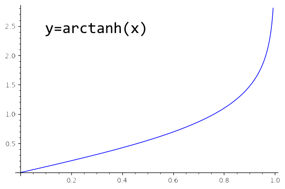

# 相对论

> 上帝是不可捉摸的，但并无恶意。 ——爱因斯坦

伽利略相对论：一切匀速直线运动或静止的坐标系中，力学规律是一样的。

麦克斯韦方程组可以算出电磁波的速度是光速，但这个速度没有限定参照系。

爱因斯坦相对论：一切匀速直线运动或静止的坐标系中，物理规律是一样的。

光速恒定：光速在所有参照系中都是同一个数值。

光速极限：一切静止质量不为零的物体都不可能达到光速。

相对论效应：运动的物体时间膨胀、长度收缩、质量变重。

“同时”是相对的，事件是绝对的。所谓事件，就是特定的时间和地点发生的事情。

广义相对性原理：在所有的坐标系中，物理规律是一样的。

自由落体的物体处于失重状态，等效于引力不存在。

等效原理：在任何局部实验中，引力效应和加速效应无法区分。

惯性质量恰好等于引力质量这件事，现代物理学家能给出的最好解释是 ⋯⋯ 纯属巧合。

平直空间中两点之间距离最短的线路是直线，弯曲空间中两点之间距离最短的线路叫做测地线。黎曼几何是弯曲空间中的几何学，也是广义相对论的数学基础。

广义相对论可以用两句话概况：

1. 物质告诉时空如何弯曲：一个有质量的物质，会弯曲它周围的时空。
2. 时空告诉物质如何运动：在不受外力的情况下，一个物体总是沿着时空中的测地线运动。

时空的形状由所有的物质共同决定，然后所有物质都沿着自己周围时空的测地线运动。

弯曲时空的是物质的静止质量，因为所有物质以自己为参照时都是静止的。可以说根本没有引力，有的只是时空的弯曲。

所谓自然运动，就是在没有任何外力作用的情况下，一个物体自由自在的状态。

亚里士多德认为，自然的运动状态是静止。
伽利略和牛顿说，匀速直线运动和静止都是自然运动。
爱因斯坦表示，一切沿着测地线的运动，都是自然运动。

广义相对论认的实验证明：

1. 水星轨道在排除其他行星的干扰后，每 100 年进动 43 弧秒。
2. 光线在大质量星体附近弯曲的程度是“牛顿引力+狭义相对论”预言结果的两倍。
3. 星球对时空的弯曲在地面附近导致的时间膨胀和高度成反比。

对普通航班来说，高度影响比速度的影响略大一些，一个飞行了 1600 万公里的人，会比地面上的人老约 0.059 秒。

相对论中的不变量：

- 两个事件的时空间隔
- 因果关系
- 静止质量
- 光速

广义相对论认为引力不是一种“力”，另外三种力已经被“大统一理论”，GUT(Grand Unification Theory)统一在了同一个理论框架中。

强核力、弱核力、电磁力都可以用某种粒子的“交换”来解释，这种负责传递力的粒子是客观存在的。引力则可以是幻觉。

“标准模型”理论能描述除了引力之外的所有粒子，而且很精确。
标准模型有 19 个自由的参数是无法用理论计算出来的，所以不知道为什么这些参数恰好是这样的数值。

标准模型无法解释暗物质和暗能量。

相对论认为时空是连续可分的，而量子力学认为时空存在一个最小的尺度，是量子化的。这是二者根本性的一个矛盾。

想象一种理论可以让时空既是弯曲的又是量子化的，像是时空的元胞自动机。

M 理论是统一量子力学和引力的一个尝试，在数学上似乎是可行的，但没有任何实验验证，可以说 M 理论是数学家的一个游戏。

如果空间大于三维，行星绕着恒星公转的轨道就会是不稳定的。超弦理论认为总共有多达 11 维时空，其实那些多出来的维度是蜷缩着的，不能算数。

为什么这些已经超过 100 年的学说还没有普及呢？人类中的先进分子发现新知识的速度，大大超过了人类整体的适应速度。

不存在引力，在弯曲的时空中物体不停地加速以保留在原地不动。
地面的支持力没有对抗重力，而是真的产生了加速度。
自由落体的电荷不发射电磁波，静止的电荷却在发射电磁波。
https://www.youtube.com/watch?v=XRr1kaXKBsU

时间和空间可以相互投影，运动的本质不是速度而是快度$η$。

$$
η \triangleq iφ \\
tan(φ) \triangleq \cfrac{x}{ict}=\cfrac{x}{ict}=\cfrac{v}{ic} \\
\tanh(η)=\tanh(iφ)=i\tan(φ)=\cfrac{v}{c}\\
η=arctanh(\cfrac{v}{c})
$$

在同一方向，快度可以简单叠加，光速是速度的上限，光的快度是无穷大。
