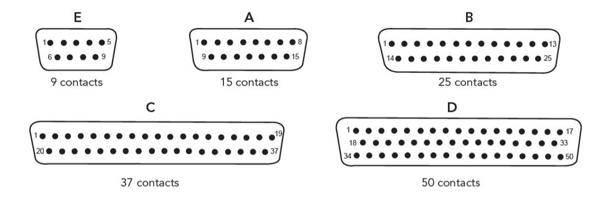
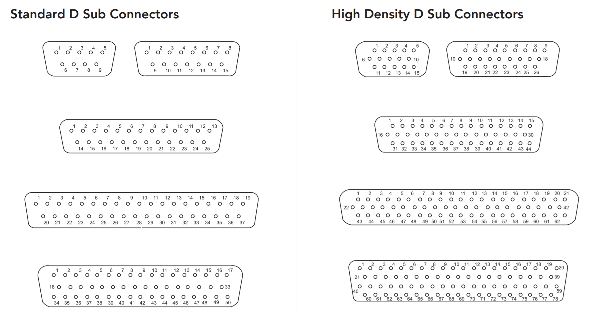
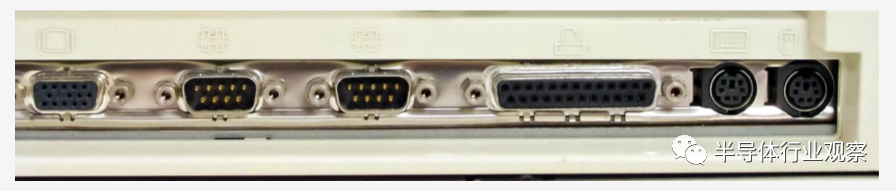
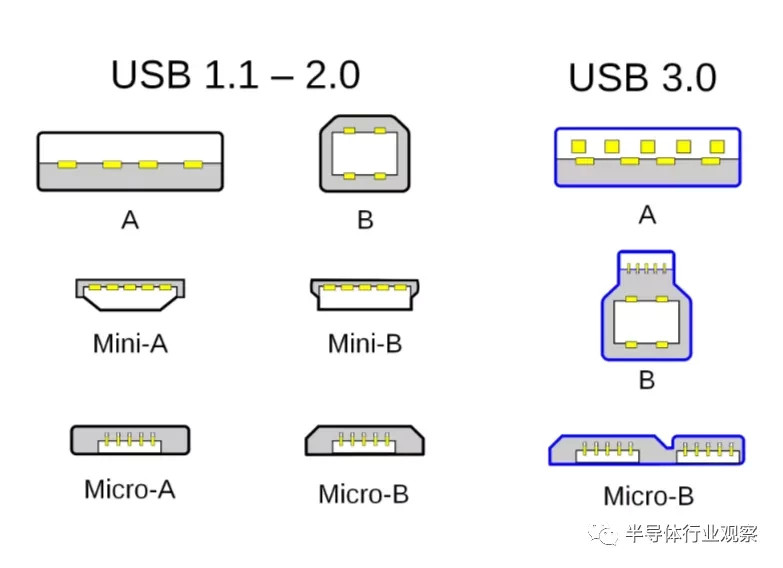
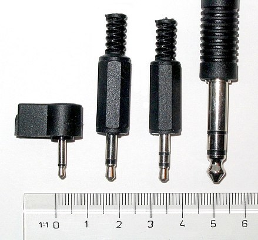

## D-subminiature

The D-subminiature or D-sub is a common type of electrical connector. They are named for their characteristic D-shaped metal shield.

The D-sub series of connectors was introduced by Cannon in 1952. Subsequently the US military documented the interface in Mil Standard 24308.

Cannon's part-numbering system uses D as the prefix for the whole series, followed by one of A, B, C, D, or E denoting the shell size, followed by the number of pins or sockets, followed by either P (plug or pins) or S (socket) denoting the gender of the part. For example, the DE-15, usually found in VGA cables, has 15 pins in three rows, all surrounded by an E size shell.

However, this naming pattern is not always followed. Because personal computers first used DB-25 connectors for their serial and parallel ports, when the PC serial port began to use 9-pin connectors, they were often labeled as DB-9 instead of DE-9 connectors, due to an ignorance of the fact that B represented a shell size. It is now common to see DE-9 connectors sold as DB-9 connectors.

| Shell Type | Size \(mm\)     | Normal density   | Pin layout      | High density | Pin layout     | Double density | Pin layout     |
|------------|----------------|------------------|-----------------|--------------|----------------|----------------|----------------|
| DE         | 30\.81x12\.55  | DE\-09           | 5\-4            | DE\-15       | 5\-5\-5        | DE\-19         | 6\-7\-6        |
| DA         | 39\.14x12\.55  | DA\-15           | 8\-7            | DA\-26       | 9\-9\-8        | DA\-31         | 10\-11\-10     |
| DB         | 53\.04x12\.55  | DB\-19 DB\-25 | 10\-9 13\-12 | DB\-44       | 15\-15\-14     | DB\-52         | 17\-18\-17     |
| DC         | 69\.32x12\.55  | DC\-37           | 19\-18          | DC\-62       | 21\-21\-20     | DC\-79         | 26\-27\-26     |
| DD         | 66\.94x15\.37 | DD\-50           | 17\-16\-17      | DD\-78       | 20\-19\-20\-19 | DD\-100        | 26\-25\-24\-25 |

1 个 DE-15 VGA 插槽，2 个 DE-9 串行端口和 1 个 DB-25 并行端口以及 2 个 PS/2 连接器。
串行 PS/2 端口是6针接口，连接键盘和鼠标。DB-25 并行端口连接打印机和扫描仪。

## USB - Universal Serial Bus

USB 2.0 连接器包含 4 个引脚：一个用于 5 伏电源，两个用于数据，另一个则用于接地。

USB Type-C，支持正反插。

## Registered jack

A registered jack (RJ) is a standardized telecommunication network interface for connecting voice and data equipment to a service provided by a local exchange carrier or long distance carrier.

For example, RJ11 uses a six-position two-conductor connector (6P2C), RJ14 uses a six-position four-conductor (6P4C) modular jack.

The RJ45(S) 8P8C modular connector is used in Ethernet networks and the connector is often referred to as RJ45 in this context.

## Phone connector

A phone connector, also known as phone jack, audio jack, headphone jack or jack plug, is a family of electrical connectors typically used for analog audio signals. Three-contact versions are known as TRS connectors, where T stands for "tip", R stands for "ring" and S stands for "sleeve".

Phone connectors:
- 2.5 mm mono (TS)
- 3.5 mm (​1⁄8 in) mono (TS)
- 3.5 mm (​1⁄8 in) stereo (TRS)
- 6.35 mm (​1⁄4 in) (TRS)

