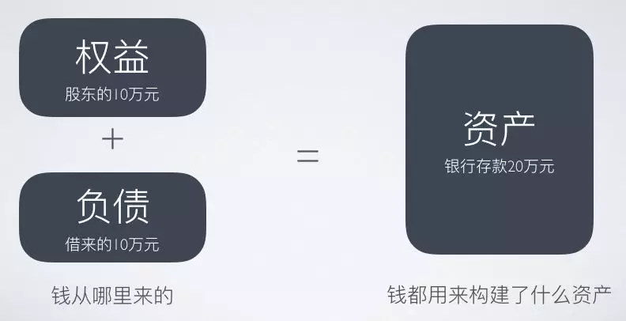

# 财务

任何一家商业公司，都可以抽象成一个用钱生钱的过程：融资拿到钱，投资花掉钱，经营赚回钱。

想要了解一家公司，必不可少的是三张报表：资产负债表、利润表、现金流量表。

资产负债表反映的是企业的融资和投资过程。所有者权益 + 负债 = 资产。



利润表反映的是企业的经营，即如何利用资产为企业创造收入。收入 - 成本 = 利润。

```
毛利润 = 总收入 - 变动成本
营业利润 = 毛利润 - 固定成本
净利润 = 营业利润 - 缴税
```


利润表实施的是权责发生制，企业统计资产、确认收入，都是以权利和责任确认的时间点为基础的。而现金流量表是收付实现制，也就是说，它是以真的有钱进账，或钱款汇出的时间点进行统计的。

三张表是同一件事情的三个维度，一个表上某个科目的变动，一定会在其他表上显露出来。

评估一个企业，现金流比利润更靠谱。现金流量表能够辅助判断企业经营成果的真实性，审视企业的财务风险和短期偿债能力。

现金流有三种形式：筹资性现金流、经营性现金流、投资性现金流。

一个运转良好、主营业务清晰的企业，一定是经营性现金流非常稳健的。经营能力强是核心竞争力，是自我造血。

对于初创企业，不仅要看它的筹资能力，还要看未来创造经营性现金流的能力。

## 金融学

金融就是为时间定价，而我们这些购买金融产品，做出金融决策的人，就是购买了不同的未来价值。

银行、债券、股票，所有的金融工具都在帮助人类将散落的、点状的资金累积起来，投入到最需要资金的地方。

个人、企业、战争、一个城市的兴衰，背后其实都是金融的力量，它帮助我们突破了时间和地域的限制，进行快速有效的资金积聚、从而实现了目标。

资金的时间价值和聚集价值，就好像是金融的左手右手，缺了谁都不行一一没了时间，资金的聚集没有意义，没了聚集，时间发挥不出最大的威力。时间价值、聚集价值，作为金融最底层的逻辑，是我们构建金融知识体系的地基。

保险能够帮助个体将风险转移、分散到社会群体中间，提高了我们人类的独立性和安全感。

股票让更多人“利益共享，风险共担”。

风投和创投分担了创业创新的风险，拓展了人类经济活动的范围和能力。

金融市场犹如国家的循环系统，美国是“金融立国”，意味着循环系统强大健康，为整个人体输送血液，保持人体的良好运作。

金融能帮我们加工时间，集聚资金和分散风险。这三种能力，被我们称为“金融三大定理”。

把金融思维运用到生活的方方面面中：求职、求学、创业、婚姻、家庭、生活……你就可以成为一个把风险、收益权衡得特别好的人。

金融是一门对未来做资产配置的学问，它的一切都是基于对未来的计算、预测和分析。它不关心过去，只关心未来。

我们每个人的工作，都是在一定程度上利用信息不对称在赚钱，你的客户没有这些信息，所以才需要你为他服务。

互联网提高了信息传递的效率，但并不能解决信息不对称的问题。

现代经济最重要的就是信用扩张的功能，银行体系就是其中的关键角色。
基础货币包括流通中的现金(MO)加银行等存款机构中的库存现金，也就是准备金。
存款准备金是银行预留出来应对储户提现需求的钱，存款准备金率是预留资金占存款的比率。存款准备金率与市场流通货币规模相关，由于资金在银行间往复流转，最终的货币流通量，是基础货币量除以存款准备金率。
央行在银联的基础上推出了网联，网联相当于一家广义的商业银行，可以监管资金的运行，支付宝、微信相当于其分支机构，不过只能做存款和支付业务，不能做贷款业务。放贷、信用创造是银行的专属功能银行拿到储户的存款，才能进行放贷。

存款准备金制度主要是控制了资金的量，而基准利率调整的是资金的价格，然后通过量、价同时控制的手段，整个社会的信用规模和经济冷热就能够被国家所控制了。

央行可以通过调节基准利率的水平，调节整个社会的投资需求来控制经济的冷热。这个加息和降息的尺度其实非常难把握，过猛的加息可能会导致经济的突然崩盘，而过度的降息可能会导致经济泡沫。

银行体系，在整个社会经济中，处于一个枢纽地位。国家通过银行体系进行信用创造，调控经济，这是现代经济运行的一个最重要的特征。

银行的货币信用扩张机制是国家首先通过中央银行发行货币，然后经过商业银行的体系吸储放贷，进行信用创造。这就像一个巨型的水利工程，央行是水库，它发行的法定货币就是水库里的水，而商业银行就是中途大大小小的送水站，这个体系直接影响着整个社会上的信贷规模、经济冷热。这个水利工程有两个大的闸门，一个叫存款准备金，一个叫基准利率，它们一个是通过控制资金的量，一个是通过控制资金的价格，调控着整个社会的信贷规模和经济冷热。

现代货币的本质是信用货币，它的背后是国家信用。现代货币的价值完全依赖于一个国家的实力以及其它国家对于这个国家的信心。

微观金融现象的背后一定有宏观层面的逻辑和推动力，不知宏观者无以谋微观，不知未来者无以谋当下，不知世界者无以谋中国。

基金和银行理财是不一样的，基金是基金公司发售的，蚂蚁金服平台是代销，余额宝是典型的货币市场基金，风险等级比较低。而银行理财是银行发售的。

国家的信用和国家的经济实力，是支撑一国货币最主要的力量。汇率走势与经济增速也就密切相关。

加息必然意味着平均的资产价格会下降，对于整个市场而言算负面消息。所以我们经常也会看到，加息消息一出来，股市应声而落的情况。

加息对于有房产贷款的人来说肯定是坏消息，因为这就意味着你每个月的月供压力加大。

金融资产价格=未来现金流/贴现率，加息意味着贴现率上升。

银行的作用：首先，银行可以吸收很多小笔的存款，然后汇聚起来借给那些需要大量资金的人，这叫规模转换。第二，银行将这些不同时间点上汇聚的资金，匹配给那些资金使用期限不同的人，一年的、两年的、五年的，打一个时间差，这叫期限转换。第三，银行还要承担贷款收不回来的风险，这叫风险转换。第四，降低借贷双方的交易成本。

存贷差是银行吸收的存款和放出去的贷款，中间的利率差额，这是银行最重要的利润来源。吸收存款能力越强的银行，赚钱越多。

互联网银行与传统银行相比，吸收存款的能力比较弱，优势是能够覆盖一些风险比较大的小微企业和个人客户，然后从中获得更高的利润。
