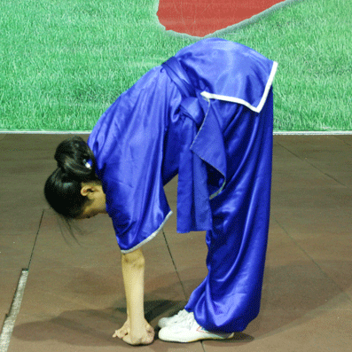

# 健身

健身的目的是让身体拥有充足的精力，然后更好地去工作，在工作之余能更好地享受生活。

心肺系统就好比是人体的发动机。衡量心肺功能的一个重要指标是最大摄氧量，即在运动中能获取的最大氧气量。这个指标正常成年男性达到40，女性达到36才算及格，54以上算优秀，耐力型运动员能达到88。

建议合适的运动强度是刚刚稍微有一点喘气比较急促的时候，千万不要到上气不接下气的程度。

适合心肺功能训练的卡氏公式：心肺训练心率=（220-年龄-静态心率）×（55%~65%）+ 静态心率

锻炼从快走开始，也可以用跑步机调成上坡，速度选择4到6公里每小时。一天训练，一天休息，间隔进行。

睡眠不好时不要做有强度的训练，做慢走和瑜伽来舒缓一下精神状态，先补足睡眠。

建议用体脂称测量体脂率，健康的男生应该是15%到20%，女生是20%到25%。

高强度运动消耗的是身体的糖分和水分。在低强度的运动中，合适的心率区间去走路或上坡走，才会消耗较多的脂肪，而且运动过程中必须有充足的氧气才能消耗脂肪。

适合减脂的心率区间是卡氏公式的35%到55%，比心肺功能训练低一些，运动时长要相应的增加一些。

节食会造成皮肤变差，免疫力下降等，对身体有很大的损害。正确的饮食是每天吃的分量要等于你的能量消耗。

食物大致分为糖、脂肪、蛋白质三类，它们在人体内的吸收率和转化率是不一样的。
糖的转化率是70%左右，脂肪是96%左右，蛋白质是需要多少吸收多少，多余的氨基酸会优化用于能量消耗。
大部分糖类来源于主食，比如米饭和粗粮；蛋白质的主要来源是肉、蛋、奶类；脂肪来自肉和炒菜里的油脂。

如果要减脂，适当提高蛋白质的摄入量，这样会更有饱腹感，同时降低糖和脂肪的摄入量。

25岁以上减脂人群的能量摄入量公式：
男性糖类每日摄入量 = 体重 × 2 g/Kg
女性糖类每日摄入量 = 体重 × 1.8 g/Kg
脂肪每日摄入量 = 体重 × 1 g/Kg
蛋白质每日摄入量 = 体重 × 1.4 g/Kg

当年纪大了之后，当生活质量影响最大的不是肌肉力量，而是关节柔韧度。柔韧度和韧带、肌腱、肌肉、关节、伸展度都是相关的。保养关节最好的方法就是适宜的运动。

直立前俯腰，手能够到脚尖说明柔韧度还不错，如果只能够到膝盖，柔韧度就很差了。

静态拉伸是保持一个拉伸动作静止不动，大概15到30秒。静态拉伸应在运动完做整理的时候进行。
动态拉伸是连续地做一些拉伸动作，每个动作做到位，然后马上换下一个拉伸动作。在运动前做动态拉伸可以有效地降低运动损伤。普通人做动态拉伸的训练时间是10到20分钟。

一个人从30岁到70岁，臀大肌、大腿前侧、还有腹肌、背肌，这些肌肉的粗细和力量最后只会剩下一半。肌肉衰老的程度和心脏功能差不多，所以肌肉训练是一种很有效的抗衰老模式。

肌肉的三个指标是耐力、力量和肌肉量。

能做到匀速地蹲起30次，说明肌肉耐力是正常的。

走路的时候注意髋关节稳定，减少身体的晃动。加大步幅和摆臂的幅度，让更多的身体肌肉参加进来。每一步脚尖都要向前，既不能内八字，也不能外八字。

