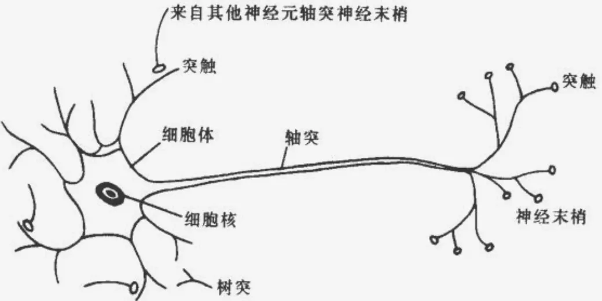
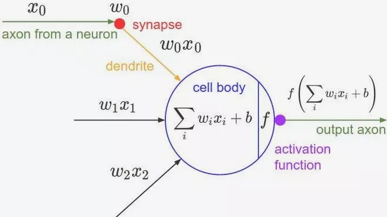
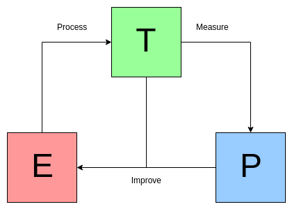

# 智能

## 目标

通过智能的机器，延伸和增强人类在改造自然、治理社会的各项任务中的能力和效率，最终实现一个人与机器和谐共生共存的社会。

## 历史

前30年以数理逻辑的表达与推理为主，后30年以概率统计的建模、学习和计算为主。

## 现状

现在的机器人，机械控制这一块已经很不错了，完全由人手动控制，机器人都可以做手术了。

一些机器人竞赛，感知、认知、动作都是人在遥控。

用电池续航短，燃油能效低，比如波士顿动力学公司的机器人电驴走山路很稳定，但是马达噪音很大。

在概率统计的框架下，当前的很多深度学习方法，属于一个“大数据、小任务范式（big data for small task）”。
人工智能的发展，需要进入一个 “小数据、大任务范式（small data for big tasks）”，要用大量任务、而不是大量数据来塑造智能系统和模型。

自然辨证法里面，恩格斯讲过，“劳动创造了人”。我认为一个更合适的说法是 “任务塑造了智能”。

智能系统的影响可以分成三个时间段：（1）亿万年的进化，被达尔文理论的一个客观的适者生存的 pheontype landscape 驱动；（2）千年的文化形成与传承；（3）几十年个体的学习与适应。

## 人脑

人脑可能有 1000 多亿个神经元，每个神经元都可能在几个方向上互相连接着，这么大量的神经元及连接就形成了一个超级大型的网络。我们就是因为这些网络而存在各种各样的思想和意识。

大脑神经元(neuron)即是脑神经细胞，主要包括细胞体(cell body)、树突(dendrite)、轴突(axon)、突触(synapse)等。

细胞体，由细胞核、细胞质和细胞膜组成。它是神经元新陈代谢的中心，是接收信息并处理的部件。
树突，是细胞体向外延伸树枝状的纤维体，它是神经元的输入通道，接收来自其他神经元的信息。
轴突，是细胞体向处延伸的最长最粗的一条树枝纤维体，即神经纤维，它是神经元的输出通道。轴突有髓鞘纤维和无髓鞘纤维两种结构形式，两者传递信息的速度不同。轴突末端有许多向外延伸的树枝状纤维体，称为神经末梢，它是神经元信息的输出端。
突触，是神经元的神经末梢与另一神经元树突或细胞体的接触处。每一个神经元都通过突触与其他神经元联系，细胞之间通过突触建立起连接，从而实现信息传递，每个神经元约有 103～104 个突触。

大脑的神经元的数学模型如下，尚不能确定这个模型是否正确。

## 问题

缺乏物理的常识和社会的常识 “Common sense”，是目前人工智能研究最大的障碍。

## 策略

世界上最聪明的鸟是乌鸦。在日本一所大学附近的十字路口，经常有乌鸦等待红灯的到来。红灯亮时，乌鸦飞到地面上，把胡桃放到停在路上的车轮胎下。等交通指示灯变成绿灯，车子把胡桃碾碎，乌鸦们赶紧再次飞到地面上美餐。

乌鸦的启示：
1. 它是一个完全自主的智能。感知、认知、推理、学习、和执行， 它都有。
2. 这个乌鸦有几百万人工标注好的训练数据给它学习吗？没有，它自己把这个事通过少量数据想清楚了，没人教它。
3. 乌鸦头有多大？不到人脑的 1% 大小。 人脑功耗大约是 10-25 瓦，它就只有 0.1-0.2 瓦，就实现功能了。

智能系统的根源可以追溯到两个基本前提条件：

一、物理环境客观的现实与因果链条。这是外部物理环境给乌鸦提供的、生活的边界条件。在不同的环境条件下，智能的形式会是不一样的。任何智能的机器必须理解物理世界及其因果链条，适应这个世界。

二、智能物种与生俱来的任务与价值链条。这个任务是一个生物进化的 “刚需”。如个体的生存，要解决吃饭和安全问题，而物种的传承需要交配和社会活动。这些基本任务会衍生出大量的其它的 “任务”。动物的行为都是被各种任务驱动的。任务代表了价值观和决策函数，这些价值函数很多在进化过程中就已经形成了，包括人脑中发现的各种化学成分的奖惩调制，如多巴胺（快乐）、血清素（痛苦）、乙酰胆碱（焦虑、不确定性）、去甲肾上腺素（新奇、兴奋）等。

## 视觉

大约在 5.4 亿年前，有的动物开始进化出了简陋的眼睛。对于一个个体来说，这没有什么大不了，不就是多了一个小孔，这个小孔能接收光线，仅此而已。

但这对于整个地球而言，可就是一件改变整个生命历程的大事。就因为有眼睛，动物们看得见食物了。他们可以从被动获取食物，变成主动寻找食物。他们学会了隐藏，学会了伺机而动，也学会了快速出击。

于是，动物的存活率大大提升，而大幅提升的存活率又大大促进了生物的进化。可以这么说，正是因为视觉的诞生，才有了寒武纪大爆发。

从那以后，动物们开始进化出各种各样的视觉系统。实际上，视觉已经变成了动物大脑中最为重要的感知神经系统。因为发达的视觉系统，让他们的生命不断延续，种类不断增多。

在人类的大脑中，视觉神经系统非常重要。甚至可以这么说，视觉是人类智能的基石。

我们对图像的理解就可以表达成为一个层次分解（compositional）的时空因果的解译图（Spatial，Temporal and Causal Parse Graph）, 简称 STC-PG。

几何重建的一个很重要的背景是，我们往往不需要追求十分精确的深度位置。比如，人对三维的感知其实都是非常不准的，它的精确度取决于你当前要执行的任务。在执行的过程中，你不断地根据需要来提高精度。比如，你要去拿几米以外的一个杯子，一开始你对杯子的方位只是一个大致的估计，在你走近、伸手的过程中逐步调整精度。

场景识别的本质是功能推理。当你看到一个三维空间之后，人脑很快就可以想象我可以干什么：这个地方倒水，这里可以拿杯子，这里可以坐着看电视等，这些动作都是想象出来的，实际图像中并没有。

我们对图像的理解包含了物体之间的物理关系，每个物体的支撑点在哪里，这个解译图必须满足物理规律。理解图像中的三维场景和人的动作，其实是因果关系的推理。所谓因果就是：人的动作导致了某种流态的改变。

增加了时间维度，对人和动物的之前和之后的动作，做一个层次的分析和预测。当机器人能够预判别人的意图和下面的动作，那么它才能和人进行互动和合作。

对的场景理解的minimax标准：minimize instability and maximize functionality最小化不稳定性且最大化功能性。

感知的图像往往只占5%，提供一些蛛丝马迹；而后面的95%，包括功能、物理、因果、动机等等是要靠人的想象和推理过程来完成的。
大量的运算属于“top-down”自顶向下的计算过程。也就是用你脑皮层里面学习到的大量的知识来解释你看到的“蛛丝马迹”，形成一个合理的解。

# 算法

算法表达的是人类的逻辑， 通常可以被数学公式，或者是某种符号语言表达。然后我们通过晶体管精密的运作方式表达这种逻辑， 然后帮助人类来工作。

复杂是简单中产生的，一个简单的规则，通过很多步骤，就得到复杂。一个非常有趣的例子是元胞自动机，它可以极好的阐述一个简单的规则如何产生极为复杂的图案。

算法其实也并不一定是程序。 通过一个给定的规则和自动化的过程得到一个结果，只要是这件事，有没有计算机都可以看成算法。比如生物进化可以看作一个巨大的遗传进化算法，一开始有一堆原始的细胞， 然后你规定一个过程，细胞可以通过遗传产生一样的新细胞， 这个过程会有错误出现变异， 然后自然环境可以选择有利的变异， 只要迭代论述足够多， 这个算法得到的结果是所有复杂的生命类型。一些社会现象， 如自由市场对经济的调控， 也可以看作算法。

## 知识库

6，70 年代的知识工程师试图把人类所有领域的专业知识一条一条的输入给计算机，从而解决这个世界所有只有人类才可以解决的问题。在有限的情况下， 可以说它们的表现真的非常接近人类。知识机器参与到医学诊疗这样的复杂过程，并在某些特定领域表现超过人类。 可惜这个流派在长期的努力里，能够作用的事情非常有限。这样的企图最终失败了。

然而真实世界的情况太复杂了！而且能够被知识和规则所表现的，只是冰山浮出水面的一角。再复杂的专家经验，也无法穷举无限的可能性，再细致的规则， 也无法表达那些连人都难以表达的规律，一旦真实情况超出了专家系统已经写入的可能，机器就抓瞎了。不要说应对变化的规则。

## 机器学习

机器学习的定义：如果一个计算机程序在某些任务T上以P度量的性能随着经验E的增加而提高，那么我们称这个计算机程序是在从经验E中学习。

我们要让机器学习到人类应对这种情况的本质 - 学习！  像人的头脑一样学习，能够从大量的经验里学习总结，从经验出发解决未出现的问题！

学习的本质是什么？知识的增加和优化。

归纳法， 从特殊到一般，就创造了知识。演绎法，用规则去推断具体的情况并指导行动，是知识的应用。

一个好的学器需要从比较少的样例里， 得到能够判断比这些样例多的多的结果，这个通常称为泛化能力， 就好像一种推而广之的能力。

贝叶斯派试图把特征条件，到他们引发的结果， 用概率的箭头连接。 然后我们就得到了一个无比巨大的条件之间互相连接的关系网络，又称贝叶斯网络。通过不停的收集数据来修正每个小红箭头对应的概率，直到这个网络变得稳定和完美，它就可以源源不断的告诉我们各种结果的可能性。

连接主义认为， 信息和概念存储在大脑的突触连接之间， 特定的连接形式对应特定的知识。 如果我们要让机器能够学习， 就是要让它能够通过学习大脑的连接，来掌握特定的知识。 问题的本质在于神经元的数量，只要我们能够有足够多的神经元，它就可以干很复杂的事情。

信息存储在无数神经元构成的网络连接里， 如何让它学进去， 也就是最难的问题。 一种叫反向传播的方法是把学习理解成一个巨大的根据数据来优化的过程， 数据犹如一颗颗子弹打进来， 如果神经网络的预测错误 ，它就会在网络的连接之间一点点的引导网络权重的改变，虽然每次只改一点点， 最终当数据的量特别巨大，却发生一场质变。计算机硬件的进步，使得大规模的使用反向传播算法进行优化成为可能。随着互联网的爆发，积累了大量的数据。算法、硬件、数据一起催生了深度学习革命。

机器能够在图像中识别出猫狗， 你和我， 甚至也可以看出一个人的情绪。 能够掌握直觉， 正式深度学习最反直觉的地方。 构成我们决策的大量因子， 其实是我们自身都无法描述的隐形知识， 抑或直觉， 这些能够被神经网络学习。

从图像识别开始，深度学习一步步潜入那些人们起初没有想到的领域，比如语音识别， 甚至下围棋。为了让机器听懂人类的语言， 一种叫 LSTM 的神经网络， 模拟了人类最奇妙的记忆能力， 而开始逐步的替代人类承担起类似翻译的作用。

目前的 AI 算法缺少一种元学习的能力。何为元学习， 就是提取一大类问题里类似的本质， 我们人类非常容易干的一个事情。 到底什么造成了人工神经网络和人的神经网路的差距，还是未知的， 而这个问题也构成一个非常主流的研究方向。

在解决的 AI 问题犹如一个个分离的孤岛， 比如说视觉是视觉， 自然语言是自然语言，这些孤岛并没有被打通。 相反， 人类的智慧里， 从来就没有分离的视觉、运动或自然语言。

另外， 人类的智慧是建立在沟通之上的， 人与人相互沟通结成社会， 社会基础上才有文明， 目前的人工智能体还没有沟通， 但不代表以后是不能的。

### Neural Computer

Neural computer is a form of memory-augmented neural network.

Neural network is called a controller, analogous to the processor in a computer, it is responsible for taking input in, reading from and writing to memory, and producing output that can be interpreted as an answer. The memory is a set of locations that can each store a vector of information.

At every tick of a clock, it chooses whether to write to memory or not. If it chooses to write, it can choose to store information at a new, unused location or at a location that already contains information the controller is searching for. This allows the controller to update what is stored at a location. If all the locations in memory are used up, the controller can decide to free locations, much like how a computer can reallocate memory that is no longer needed. When the controller does write, it sends a vector of information to the chosen location in memory. Every time information is written, the locations are connected by links of association, which represent the order in which information was stored.

The controller can read from multiple locations in memory. Memory can be searched based on the content of each location, or the associative temporal links can be followed forward and backward to recall information written in sequence or in reverse. The read out information can be used to produce answers to questions or actions to take in an environment.

Neural computers learn how to use memory and how to produce answers completely from scratch. They learn to do so using the magic of optimisation: when a neural computer produces an answer, we compare the answer to a desired correct answer. Over time, the controller learns to produce answers that are closer and closer to the correct answer. In the process, it figures out how to use its memory.

Neural computer is a learning machine that, without prior programming, can organise information into connected facts and use those facts to solve problems.
