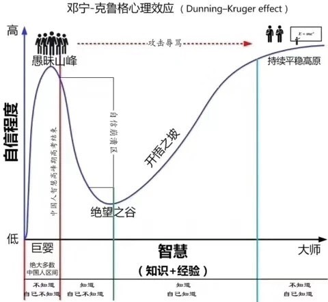

# 心理

达克效应（D-K effect），全称为邓宁-克鲁格效应（Dunning-Kruger effect）。它是一种认知偏差现象，指的是能力欠缺的人在自己欠考虑的决定的基础上得出错误结论，但是无法正确认识到自身的不足，辨别错误行为。

达克效应属于心理学上元认知能力的缺陷， 能力欠缺的人无法认识到自身的无能，不能准确评估自身的能力。他们的研究还表明，反之，非常能干的人会低估自己的能力，错误地假定他们自己能够很容易完成的任务，别人也能够很容易地完成。

人很容易对自我产生认知偏差，最简单来说，就是会过于高估自己。大部分人其实都处在愚昧之巅。人能够成长为智者和大师，要先从愚昧之巅，掉到绝望之谷，然后再从绝望之谷，辛苦攀爬，经受攻击和辱骂，积累知识和经验，成为智者和大师。“有担当的管理者的一个重要责任，就是把下属从愚昧之巅推向绝望之谷，至于能否爬上开悟之坡，看个人造化。”
人都有向上之心。每个人都想成长为智者和大师，但是绝大部分人都没有走上这条路。原因在于，“大部分人没有完成的是从愚昧之巅到绝望之谷这个过程”。因为大部分人不知道自己在愚昧之巅。
这里面存在一个信息不对称，因为讽刺的是，大部分人都能看到别人站在愚昧之巅。“为什么自己在愚昧之巅不知道，就是因为每一个人在自己成长的过程中，没有得到有效反馈，没有人告诉他你现在在愚昧之巅。”至于别人为什么不愿意告诉你？首先因为其他人没有这个责任，其次是因为指出这一点，其实是有风险的，因为会得罪人。
