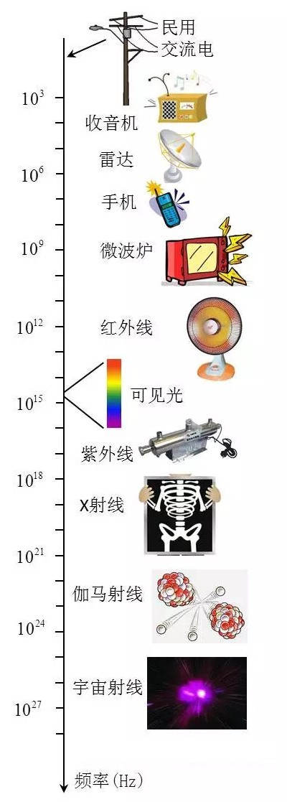

# 科学

Science is NOT a battle, it is a collaboration. We all build on each other’s ideas. Science is an act of love, not war. Love for the beauty in the world that surrounds us and love to share and build something together. That makes science a highly satisfying activity, emotionally speaking!

科学精神总结为六个字：唯一、独立、质疑。

所谓唯一，即科学的目的是发现科学规律，而科学规律是唯一的。所谓独立，即科学规律独立于发现者，不管谁来做科学研究，东方人也好，西方人也罢，在方法正确的前提下，所发现的科学规律是相同的。所谓质疑，从字面上看是最容易理解的，是科学精神中最重要的两个字。

不是中国人缺乏质疑的能力，而是我们的文化氛围不鼓励批评质疑，慢慢把大家的棱角磨平了。质疑精神的培养也要从文化入手，形成鼓励批评质疑的氛围。

真正的自信，就是既敢于接受批评质疑，正视和改正自己的不足，也敢于批评和质疑他人。

### 奥卡姆剃刀原理

奥卡姆剃刀原理（Occam's razor）是一种常见的、自然科学研究中的一个基本原则，即“若有多个假设与观察一致，则选择最简单的那个。”。

> Entities should not be multiplied unnecessarily.

剃刀理论只适用于同等解释力的模型，在同样好的模型中选择较为简单的那个，但并不保证简单的模型就是正确的。

举个的例子：
你有一条狗，你一喊坐下它就坐下，那么有两种理论:
1.狗能听懂你说话。
2.狗通过训练对相应口令产生了条件反射。
如果按奥卡姆剃刀原理判断，肯定选 1，因为 1 更简洁，但实际上是 2 正确。

再比如，老师对于没带作业的判断，没带就是没写。
对于没带，需要更多的假设， 首先是真的写了，到了学到才知道没带，忘记了今天要收作业，没有家里钥匙，家里比较远等。

# 电磁辐射

物质和光的相互作用是量子化的，一次和一个光子作用。光子的能量跟频率是成正比的，也就是说一个可见光光子比一个微波光子能量要大大约一千万倍。

电子本来被束缚在原子核周围，被打散开需要一些能量，如果光子能量比这个高就有可能作用；而如果能量不够，不论来多少个光子都没用，最多转化成热量。

把电子从原子中打出来的过程叫做电离，也就是说要比紫外线更厉害，才能把大部分物质中的电子打出来，从而破坏结构。

所以手机辐射、微波炉辐射对人体绝对是有影响的！影响…… 仅仅是是把人体加热而已。
微波辐射把 DNA 打坏从而引发癌症的概率，远远低于太阳光。
所以如果你担心微波炉致癌的话，你应该躲着不要见太阳，以及任何其他可见光。

# 相对论

不要害怕公式，公式是能让你真正理解一个理论的法门，只要你花足够多的时间去理解这个公式。

把公式绕过去，就只能理解个皮毛。没有公式，就不能计算，也就无法应用这个理论。

所以请正视和重视公式，学懂公式才是你学习的核心目标。

细细地想，你理解的越多，需要背下来的越少。

多做练习，解决一些实际的有趣的问题，或者满足你对一些古怪问题的好奇心。

找到有同好的朋友，讨论相关的话题。把你学到的东西复述出来。

保持充沛的精力。利用所学的知识创造一个新的东西。

寻找模式，发现规律，不断提升抽象的层次。

直观的形象和严谨的证明同样重要。

惯性系，是指以静止的或者做匀速直线运动的物体为参照物的坐标系。

<b>相对性原理，是说要求同一物理定律在所有惯性系中有相同的数学表达式。</b>这是一个很强的原理，是一个"管定律的定律"一一想要成为定律就必须服从这个原理的要求。

把物理定律的数学表达式从一个惯性系变到另一惯性系时必然涉及两系之间的坐标变换，不同惯性系的坐标变换关系可以由伽利略变换公式表达。

按照伽利略变换，牛顿力学的每一个定律都服从相对性原理，简言之就是"力学定律具有伽利略协变性"。

如果麦克斯韦方程服从相对性原理，亦即在任一惯性系中都应取相同的数学表达式，就会导出"电磁波相对于任一惯性系的速率都为c(光速)"的结论，即

<b>光速不变原理：真空中的光速沿任何方向、对任何惯性系都是c</b>，与光源的运动情况无关。

从1983年开始，国际单位制中定义真空光速为$c=299792458 m/s$。

光速不变与伽利略变换不符，但光速不变是通过了实验验证的。最有名的实验是迈克尔逊和莫雷在1887年的干涉仪实验，旨在测定地球相对于以太的速度，但得到的是零结果。

同时承认相对性原理和光速不变原理，就会导出一套新的坐标变换关系——**洛伦兹变换**。

利用这个两个基本假设(即相对性原理和光速不变原理)，加上对空间、时间均匀性以及空间各向同性性的默认，爱因斯坦在1905年的开创性论文中推出了这一变换。洛伦兹在1904年就发表了这个变换公式，所以被称作洛伦兹变换，但他并未给出推导过程，且不认为牛顿力学需要修改，只是视为便于计算而引入的辅助工具。

爱因斯坦的相对性原理也可表述为物理定律的数学表达式在洛伦兹变换下形式不变，简言之就是"物理定律具有洛伦兹协变性"。

采用几何单位制，速度以光速为单位，即$c=1，x'$相对于$x$以$v$匀速运动，洛伦兹变换公式为：
$$ \left\{\begin{array}{l}
   t'=γ(t-vx)\\
   x'=γ(x-vt) \\
   y'=y \\
   z'=z \\
   γ = \dfrac{1}{\sqrt{1-v^2}}
\end{array}\right.
\qquad
\left\{\begin{array}{l}
   u_x'=\dfrac{u_x-v}{1-vu_x}\cr[1em]
   u_y'=\dfrac{u_y}{γ(1-vu_x)}\cr[1em]
   u_z'=\dfrac{u_z}{γ(1-vu_x)}
\end{array}\right.$$

洛伦兹变换有以下特点：

1. 洛伦兹变换要求惯性系之间的相对速率不能超过光速。
2. $γ$的取值范围是1到无穷大，但只有在$v$接近于光速时才会明显变大。
3. 在低速情况下伽利略变换是洛伦兹变换的近似。事实上，整个牛顿力学都可看作狭义相对论力学的低速近似。
4. 麦克斯韦方程具有洛伦兹协变性，不具有伽利略协变性。

物理学上空间的一点和时间的一瞬的结合都叫做一个事件(event)，全体事件的集合称为时空(spacetime)，因此事件也称为时空点(spacetime point)。任何粒子的全部历史都是时空中的一条曲线，称为该粒子的世界线(world line) 。

如果A点在某一时刻t发生了一个事件，记作p， 则p可用如下方式表为 p=(t, A)=(t, x, y, z)，xyz是A的三维坐标。事件本身是绝对的，但事件的坐标是相对的，对于同一事件，不同坐标系会给出不同的时空坐标。

时空图中，一般把t轴画成竖直向上，代表时间的流逝。对于2维时空，在t-x面内的45°斜直线表示光子的世界线。对于3维时空，过一点p有无限多条光子世界线，以任一条为母线就扫出一个以p为顶点的圆锥面，称为p点的光锥面(2维曲面)。

一个简单的事实是，不管端点的坐标值怎么变化，线段的长度在不同的坐标系中是一样的。这里不同的坐标系指通过平移和旋转得到的坐标系，平移和旋转也称作直角坐标变换。

四维时空也有类似的性质，$s^2 = x^2+y^2+z^2-c^2t^2$是洛伦兹变换下的不变量，$s$称作时空间隔。

对于欧氏空间，人们关心曲线的长度、两点之间的距离、两直线之间的夹角等等。比如圆是平面内与某定点距离相等的动点的轨迹，不妨把这种语言称为几何语言。闵氏空间也是如此，闵氏是指闵可夫斯基，用4维几何语言对相对论做了十分优雅的改写。欧氏空间和闵氏空间都是平直空间。

每个质点都有自己的固有时

广义相对论场方程：$$ R_{μν} - \frac{1}{2}Rg_{μν} = 8πGT_{μν} - Λg_{μν} $$

$R_{μν}$ 为里奇张量，它由黎曼几何张量缩并而成，表示曲率，意味着空间的弯曲状况；$T_{μν}$为能量 - 动量张量，表示物质（质量）分布和运动状况，意味着描述的是能量流、动量流及其应力；$g_{μν}$ 为 3+1 维时空的度规张量，称为爱因斯坦张量；G 是重力常数。Λ项是暗能量在引力场中起的作用。场方程是一个二阶非线性偏微分方程组，数学上想要求得方程的解是一件非常困难的事。

## 量子力学

把牛顿力学所描写的粒子叫做经典粒子，而把我们世界中真正存在的粒子叫做量子粒子。

量子态可以用复数来描述，表示振幅和相位，复数的模表示概率。量子粒子以叠加态的形式存在。

经典粒子可能性的叠加总是概率叠加，可能性不会减少，只会增加。而量子粒子可能性的叠加是波的叠加，叠加后的可能性有时增加，有时减少，甚至有时可以变成零。

薛定谔方程描写了一个粒子的态（波函数）如何随时间变化，给出了量子力学的预言能力。

测不准关系是神奇的量子叠加原理的一个推论。

我们日常经验中所谓同时有位置和速度的粒子，其实是位置和速度都有些不确定的粒子。只不过这个不确定很小，以前没有注意到。

测量结果在实际中只能取离散的值，被称之为量子现象。

玻姆的隐函数非常复杂，隐变量存在但绝对观测不到，不能证伪。

退相干认为世界只有一个，但历史有很多个，量子态展示的是系统内部所有粒子的可能变化状态的精细历史；
观测之后的事件形成了一个粗粒历史，粗粒历史是经典历史，在宏观上显示，类似于路径积分，可计算概率。
每个粒子都处于精细历史的叠加中，一旦涉及到宏观物体，能观察到的就是粗粒化的历史，因为量子退相干了，只有一种被感知到。

## 场论

费米子是组成物质的粒子，玻色子是传递相互作用力的粒子。

在量子场论里，每一种作用力都有专门传递作用力的粒子。比如传递电磁力的是光子，传递强力的是胶子，传递弱力的是W和Z玻色子，传递引力的是引力子（不过引力子还没有找到）。两个同性电子之间为什么会相互排斥呢？因为这两个电子之间在不停的发射交换光子，然后看起来就像在相互排斥，这就跟两个人在溜冰场上互相抛篮球然后都向后退一样的道理。那么相互吸引就是朝相反的方向发射光子了，其他的力也都是一样，这些传递相互作用的玻色子在规范场里都统统被称为规范玻色子。

U(1)群的整体规范对称性对应电荷守恒，局域规范对称性产生电磁理论(麦克斯韦方程组)。1种规范玻色子，即光子。
SU(2)×U(1)群的整体规范对称性对应（弱）同位旋 —— 超荷守恒，局域规范对称性产生弱电统一理论，3种规范玻色子，W⁺、W⁻和Z。
SU(3)群的整体规范对称性对应夸克的色荷守恒，局域规范对称性产生量子色动力学，规范玻色子是8种胶子。

弱超荷等于电荷减去弱同位旋。

玻色子的质量越大，力程越短，质量越小，力程越长，如果玻色子的质量为零，那么这个力程就是无限远的。
局域规范对称性要求玻色子的质量必须为零，光子的质量为零，也是长程力，渐近自由解释了为什么胶子是零质量但是强力确是短程力。
W和Z这些传递弱力的规范玻色子本来是零质量的，由于希格斯机制获得了质量。

希格斯场是一个四分量的标量场。这个场构成一个弱同位旋SU(2)空间中的复数双重态。这个场的弱超荷为$\frac{1}{2}$。
希格斯场的数学表示就是一个1×2的矩阵，只有两个矩阵元，都是复数。
$$ \phi = \frac{1}{\sqrt{2}} \left(
\begin{array}{c}
\phi^1 + i\phi^2 \\ \phi^0+i\phi^3
\end{array}
\right) $$

希格斯场的基态就是最低的部分，不在中心而在边上。这个基态是退化的。理论家们可以选择四个变量中的三个为零，只保留一个，美其名曰 “自发对称破缺”，其真空期望值（vev）具有质量的量纲。这个具有质量量纲的 vev 与希格斯拉格朗日函数中的两个耦合常数一起给出了 W 粒子和 Z 粒子的质量。

宇宙中到处都充满了希格斯场，因为希格斯场的强度为零所需的能量高于它不为零的能量。
希格斯场是标准模型中仅有的一个标量场，在真空中具有非零的常数值。观察到的真空能量密度接近于零，但希格斯场的能量密度要高很多，尚无解释。
希格斯玻色子，简称希子，自旋为零，质量126GeV，2012年在强子对撞机实验中首次探测到，进一步证实了标准模型的理论。
由于希格斯场的存在，打破了弱电相互作用的对称性，弱力的玻色子获得了质量，弱力的力程也变得很短。
粒子如果不跟希格斯场发生作用，它的质量就是零（比如光子、胶子），如果粒子跟希格斯场发生作用，那么它就有质量，发生的作用越强，得到的质量就越大。

费米子也是因为与希格斯场相互作用而获得质量，但它们获得质量的方式不同于W玻色子和Z玻色子的方式。
费米子是通过汤川耦合，因为自发对称性破缺而获得质量。
只有希格斯玻色子不倚赖希格斯机制获得质量。

希格斯场并非凭空创造了质量，否则就违反了能量守恒。所以能量创造了质量，希格斯场给质量增加了惯性，是惯性质量的来源。
费米子与希格斯场相互作用而获得的质量是由势能转化而成的。
宇宙大爆炸刚开始的10⁻¹¹秒之前温度大于10¹⁵℃，希格斯场剧烈振荡但平均值为零，粒子有质量而无惯性。随着宇宙温度的降低，希格斯场能量降低而场强大于零。

需要说明的是，并不是所有的质量都来自于粒子和希格斯场的相互作用，还有一部分来自粒子间的相互作用。像质子、中子一类复合粒子的质量，只有约 1% 是归因于将质量赋予夸克的希格斯机制，剩余约 99% 是夸克的动能与强相互作用的零质量胶子的能量。

U(1)群相当于圆群，由所有绝对值为1的复数在乘法下组成的群，与旋量群Spin(2)同构。
SU(n)是由所有行列式为1的n×n的复数矩阵组成的群。SU(2)群同构于范数为1的四元数，与旋量群Spin(3)同构，微分同胚于三维球面。
SU(3)群与范数为1的八元数群同构，待证。

行列式(Determinant)，将一个n×n的矩阵A映射到一个标量，记作det(A)或|A|，可以看做是有向面积或体积的概念在n维欧几里得空间中的推广。若矩阵的某几行线性相关，则它的行列式为零。

2阶矩阵的行列式：
$$\begin{vmatrix}a&b\\c&d\end{vmatrix}=ad-bc$$ 当系数是实数时，2阶行列式表示的是向量${\displaystyle X=\left(a,c\right)}$ 和 ${\displaystyle X'=\left(b,d\right)}$形成的平行四边形的有向面积.

实数、复数、四元数和八元数是仅有的四种可被加减乘除的数字系统。
按照凯莱-迪克森构造法，复数由两个实数组成，四元数由两个复数组成，四元数的乘法是非交换的，八元数由两个四元数组成，八元数的乘法除了非交换，还是非结合的。
这些代数系统中，都有范数和共轭的概念。集合中的一个元素和它的共轭的乘积等于它的范数的平方。一个实数的共轭是其自身。
一维的实数一直都存在于经典物理中，复数提供了量子物理的数学基础，四元数则是爱因斯坦狭义相对论的基础。然而，最为复杂的数字形态 —— 八元数，又与现实世界存在着怎样的关系呢？
SU(3),SU(2)和U(1)分别对应着强、弱和电磁相互作用，它们作用于6种夸克和2种轻子，加上它们的反粒子。每种轻子又分别有三代，每代的粒子除了质量不一样以外其他性质都相同。
拥有 8 个自由度的八元数可以和粒子中的一代相对应：一个中微子，一个电子，三个上夸克和三个下夸克。
